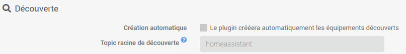
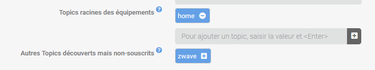
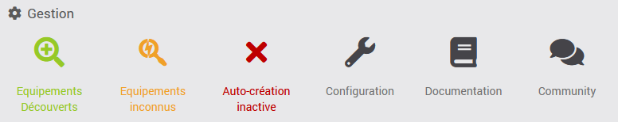
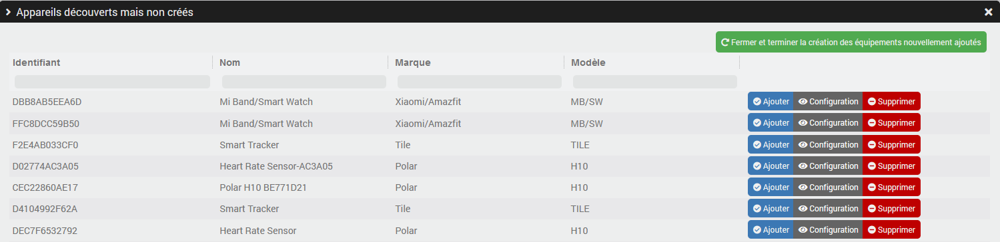
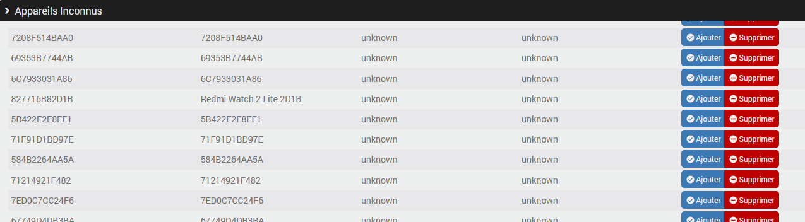
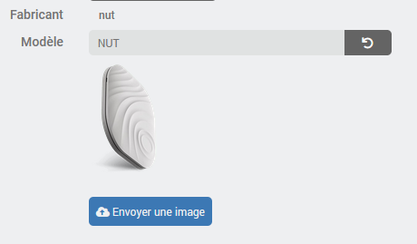
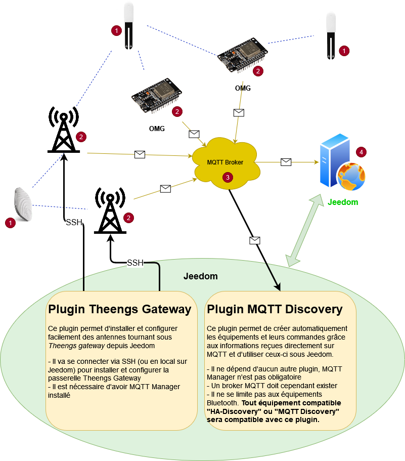
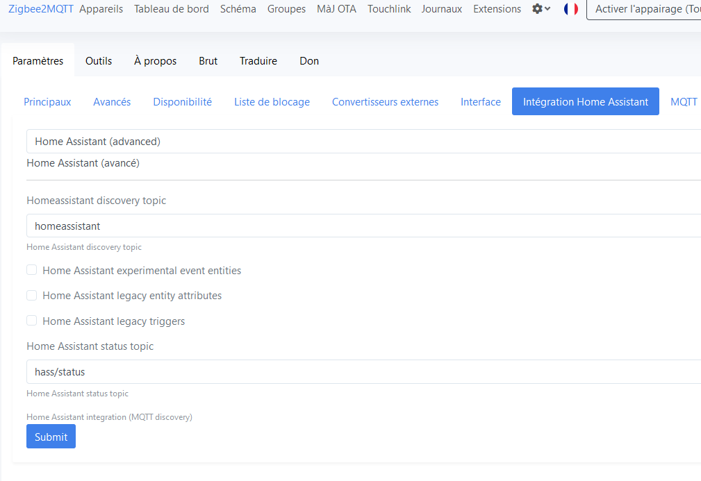

# Descripción

**MQTT Discovery** permite la detección automática de dispositivos gracias al protocolo «MQTT Discovery», también conocido como «HA Discovery».

Se basa en el principio de «MQTT Auto Discovery» que existe en Home Assistant para crear automáticamente dispositivos y sus comandos en Jeedom. Así pues, si tienes dispositivos conectados a través de MQTT y estos publican la información necesaria para la compatibilidad con «MQTT Auto Discovery», serán reconocidos automáticamente e integrados en Jeedom. Evidentemente, no es necesario instalar Home Assistant, basta con Jeedom.

Esto permite, por ejemplo, utilizar el excelente proyecto [Open MQTT Gateway](https://docs.openmqttgateway.com/) en ESP32, que gestiona [un gran número de dispositivos](https://decoder.theengs.io/devices/devices.html), o su equivalente [Theengs Gateway](https://gateway.theengs.io/) en Pi, por ejemplo; todos estos dispositivos serán compatibles automáticamente con Jeedom a través de **MQTT Discovery**, con gestión automática «multiantena». De este modo, resulta muy sencillo gestionar la presencia de etiquetas Bluetooth, como los Nuts o los Tiles.

Pero esto no se limita a los dispositivos Bluetooth, ya que se reconocerán y podrán utilizarse todos los dispositivos compatibles con «MQTT Auto Discovery». Por ejemplo, este complemento se ha probado con éxito con zwavejs-ui y zigbee2mqtt.

> **Importante**
>
> No se desarrollará ninguna opción específica para gestionar en detalle pasarelas como zwavejs-ui y zigbee2mqtt, ya que ese no es el objetivo del complemento, que solo implementa la detección automática de dispositivos.
> Por lo tanto, **MQTT Discovery** puede utilizarse, evidentemente, para crear automáticamente los dispositivos necesarios (tal y como se haría con otra integración MQTT, pero de forma más sencilla), aunque solo en el marco de un uso en modo «avanzado», teniendo en cuenta que el resto se gestiona con las herramientas que proporcionan las pasarelas correspondientes.

# Versiones compatibles

| Componente | Versión                     |
|-----------|-----------------------------|
| Debian    | Bullseye(11) & Bookworm(12) |
| Jeedom    | >= 4.5                      |

# Compatibilidad

## ¿Funcionará MQTT Discovery en mi caso?

Para saberlo, comprueba en la documentación del hardware, el programa o la pasarela que quieras utilizar si se menciona «MQTT Discovery» o «HA Discovery» para Home Assistant (una vez más, no es necesario tener instalado Home Assistant).

Otra forma de hacerlo es conectarte a tu bróker mediante MQTT Explorer (por ejemplo) y comprobar si aparece un tema llamado «homeassistant». Si es así, deberías encontrar información relativa a tu hardware en los subtemas de este. En caso de duda, siempre puedes plantear la pregunta en [community]({{site.forum}}/tag/plugin-{{page.pluginId}}).

## Lista de posibles integraciones conocidas

Esta lista dista mucho de ser exhaustiva, ya que hay tantos ejemplos que sería imposible enumerarlos todos. No obstante, puede servir para dar algunas ideas:

> **Nota**
>
> Esta lista recoge, por orden alfabético, ejemplos de integraciones que han funcionado en algún momento. No garantizo que sigan funcionando actualmente ni que se comprueben periódicamente. No dudes en probarlas, pero no me hago responsable si no funcionan.

- [Caldera Hargassner](https://community.jeedom.com/t/pilotage-chaudiere-hargassner-via-mqtt-discovery/142840)
- [Climatización Teknopoint y Airton con el módulo wifi Tuya ACW02 Wi-Fi](https://github.com/devildant/acw02_esphome), consulta este [tutorial en la comunidad](https://community.jeedom.com/t/climatisation-airton-connexion-a-jeedom-en-mqtt/142359)
- [Liebherr SmartDevice](https://github.com/ripleyXLR8/liebherr2mqtt), consulta este [tutorial en la comunidad](https://community.jeedom.com/t/passerelle-liebherr-smartdevice-vers-mqtt-frigos-et-congelateurs-connectes/150679)
- [MG iSMART](https://github.com/SAIC-iSmart-API/saic-python-mqtt-gateway), consulta este [tutorial en la comunidad](https://community.jeedom.com/t/tuto-integrer-sa-mg-dans-jeedom/118686)
- [MyFox2MQTT](https://github.com/Minims/MyFox2MQTT), ver [explicación en la comunidad](https://community.jeedom.com/t/myfox-et-jedom-4-4/111828/14)
- [Nuki Smart Lock Pro (3 y 4)](https://support.nuki.io/hc/fr/articles/12947926779409-MQTT-support)
- [Open MQTT Gateway](https://docs.openmqttgateway.com/): pasarela Bluetooth en ESP
- [Sonos2mqtt](https://sonos2mqtt.svrooij.io/), [ver en la comunidad](https://community.jeedom.com/t/sonos2mqtt/119216)
- [Theengs Gateway](https://gateway.theengs.io/): pasarela Bluetooth con Debian; consulta este [tutorial en la comunidad](https://community.jeedom.com/t/migration-de-blea-vers-mqttdiscovery-et-tgw/115358)
- [tydom2mqtt](https://tydom2mqtt.github.io/tydom2mqtt/#/introduction/)
- [zigbee2mqtt](https://www.zigbee2mqtt.io/)
- [zwave-js-ui](https://zwave-js.github.io/zwave-js-ui/#/)

También encontrarás otras aplicaciones compatibles con MQTT Discovery en la página web de [Home Assistant - Herramientas de terceros](https://www.home-assistant.io/integrations/mqtt/#support-by-third-party-tools)

# Instalación

Para utilizar el plugin, debes descargarlo, instalarlo y activarlo como cualquier otro plugin de Jeedom.
A continuación, hay que instalar las dependencias.

Debes haber instalado ya un broker MQTT, ya sea por tu cuenta o mediante otro plugin de Jeedom.

El complemento *MQTT Manager (mqtt2)* no es necesario, pero si está instalado, la configuración para conectarse al servidor se podrá recuperar automáticamente.

# Configuración del complemento

> **Importante**
>
> Después de cada cambio de configuración, es necesario reiniciar el demonio para que los cambios surtan efecto.

## Acceso al bróker MQTT

Hay que configurar la dirección IP del broker, el puerto, un nombre de usuario y su contraseña.
Si tienes instalado el plugin *MQTT Manager (mqtt2)*, verás un botón para realizar esta configuración automáticamente.

> **Consejo**
>
> No es en absoluto necesario tener instalado ni mantener *MQTT Manager (mqtt2)*. **MQTT Discovery** no depende de *MQTT Manager (mqtt2)*, ya que los mensajes nunca pasan por este complemento. **MQTT Discovery** no afecta en absoluto a la configuración de *MQTT Manager (mqtt2)* y viceversa.
>
> Esta función solo está disponible para evitar que tengas que introducir manualmente los datos de inicio de sesión.

## Autodescubrimiento

La primera opción permite crear automáticamente los dispositivos que se detecten. Esto puede resultar muy práctico si tienes muchos dispositivos, pero puede generar una gran cantidad de ellos, incluidos algunos que quizá no necesites, por lo que debes utilizarla con moderación.
Existe otra opción para seleccionar manualmente los dispositivos que se van a crear (la creación se realizará posteriormente de forma automática); consulta el apartado sobre la configuración de los dispositivos para obtener más detalles.

El tema que contiene las configuraciones de los dispositivos que hay que detectar, por defecto «homeassistant», puede modificarse si es necesario.

> **Importante**
>
> No modifiques la configuración del tema raíz de descubrimiento sin saber a qué te enfrentas; en principio, nunca tendrás que modificarla.

A continuación, habrá que configurar la lista de temas raíz para los que se deseen conectar los dispositivos. Por ejemplo, para los dispositivos gestionados por *Open MQTT Gateway* o *Theengs Gateway*, el tema predeterminado será `home`.

> **Importante**
>
> El nombre del tema distingue entre mayúsculas y minúsculas, así que ten cuidado al configurarlo y respeta las mayúsculas y minúsculas.

Tras el primer inicio del demonio y, por lo tanto, tras la primera sesión de detección, también verás la lista de temas posibles pero no configurados que el demonio ha encontrado; es posible añadirlos directamente.

Así que, si no sabes exactamente qué hay que configurar:

- inicia el demonio
- espera un minuto
- Actualiza la página si aún no lo has hecho
- Se te propondrá una lista de temas posibles => añade el que se refiera a tus dispositivos

Por ejemplo, el complemento me sugiere el tema *zwave*, que puedo añadir simplemente haciendo clic en el «+» (no olvides *guardar* y *(re)iniciar* el demonio cuando hayas terminado):

La última opción permite mostrar una lista de los dispositivos desconocidos que publican en uno de los temas raíz configurados.
Si se añade un dispositivo desconocido (consulta **Gestión de dispositivos** para saber cómo hacerlo), solo será posible gestionar la presencia; por lo tanto, en principio esto solo resulta útil para los dispositivos Bluetooth y permite utilizar un rastreador Bluetooth aunque no sea decodificado por *Open MQTT Gateway* o *Theengs Gateway*.

## Demonio

Por último, puedes configurar los siguientes datos (opcionales):

- *Ciclo* define la frecuencia, en segundos, con la que se envía la información a Jeedom: un valor numérico entre `0,1` y `10`.
- *Puerto interno* define el puerto en el que escucha el demonio. No modifiques este valor sin antes consultar en [community]({{site.forum}}/tag/plugin-{{page.pluginId}}).

> **Importante**
>
> No modifiques esta información por el momento; en principio, no es necesario.

# Gestión de equipos

El complemento se encuentra en el menú Complementos → Protocolo de domótica.

En la parte superior verás el panel de gestión, igual que en todos los complementos de Jeedom

El primer botón te permite ver una lista de los dispositivos detectados pero aún no creados (si la creación automática no estaba activada en el momento de su detección). Esto te permite seleccionar manualmente los dispositivos que deseas crear (la creación del dispositivo y de sus comandos sigue siendo automática).

Al hacer clic en este botón, se abrirá una nueva ventana:

Basta con hacer clic en el botón «Añadir» del dispositivo deseado y, a continuación, hacer clic en el botón «Cerrar y finalizar la creación de los dispositivos recién añadidos» para que se creen el dispositivo y sus comandos.

En esta pantalla también puedes ver toda la configuración de un dispositivo y eliminarlo de la lista si no lo necesitas. Ten en cuenta que esta acción también borra la información sobre tu broker MQTT.

El segundo botón de la barra de gestión, denominado «Equipos desconocidos», solo será visible si has activado la opción correspondiente (véase **Configuración del complemento**) y permite acceder a una pantalla muy similar a la anterior, salvo que no hay ninguna configuración.

Cuando hayas añadido uno de los dispositivos «desconocidos» desde esta pantalla, los comandos no se crearán de inmediato. Habrá que esperar unos segundos o incluso minutos a que el dispositivo envíe información para que el complemento cree el comando correspondiente.

El siguiente botón te permite ver el estado de la creación automática y activarla o desactivarla directamente desde esta página; se trata de la misma configuración que la que aparece en la configuración del complemento.

De vuelta en la barra de administración, verás un botón para acceder a la configuración del complemento, a la documentación y a los últimos temas relacionados con el complemento en la comunidad.

Si la creación automática está activada, el complemento creará automáticamente los dispositivos y los comandos que falten en cuanto reciba la información sobre el tema de detección (por defecto, `homeassistant`).

> **Importante**
>
> La creación automática solo se llevará a cabo para los **nuevos** dispositivos detectados tras activar la opción o tras reiniciar el demonio.
> Un dispositivo detectado cuando la opción de creación automática estaba desactivada no se creará automáticamente (a menos que se reinicie el servicio), pero, evidentemente, es posible añadirlo «manualmente».

# Configuración de los dispositivos

En la mayoría de los casos no es necesaria ninguna configuración específica, salvo en el caso de los dispositivos que dispongan de información *rssi* (normalmente los dispositivos Bluetooth). Para estos, habrá que:

- un comando **rssi** global que contiene el último valor recibido de todas las antenas,
- un comando **rssi** por cada antena que haya detectado el dispositivo,
- un comando adicional **Presente** de tipo info/binario cuyo valor es 1 si el dispositivo se considera presente y 0 en caso contrario.

En la configuración del equipo se puede definir el tiempo (en segundos) que debe transcurrir antes de que se considere que el equipo está ausente; esto resultará especialmente útil para los «trackers», como los NUT o los TILE. Se considera que un equipo está presente si se ha recibido un valor *rssi* durante los últimos x segundos.

En la parte derecha, verás información general sobre el equipo (identificador, configuración, fabricante, modelo...) y tendrás la posibilidad de subir una imagen para representar el equipo en lugar del logotipo del complemento o de la imagen predeterminada, cuando esta exista. El complemento gestiona una imagen por modelo y no una imagen por dispositivo, por lo que no es posible tener dos imágenes diferentes para dos dispositivos «Nuts» a menos que se modifique manualmente el identificador del modelo configurado; esto no tiene ningún impacto, salvo en la imagen utilizada:

En la lista de comandos, verás el tema MQTT correspondiente a cada comando, así como el valor JSON correspondiente. Es posible especificar una ruta si hay que buscar un valor en un subnodo.
En principio, no tendrás que modificar estas configuraciones; solo se puede acceder a ellas para gestionar casos excepcionales en los que el complemento no haya realizado la configuración automáticamente.

# Funcionamiento de la detección automática

La detección automática mostrará la definición completa de lo que se denomina *componentes*/*Entidad*; cada componente corresponde a una categoría, un tipo de comando. Por ejemplo: *sensor*, *interruptor*, *luz*, *botón*...

El complemento lee estas definiciones y, para cada componente, creará los comandos correspondientes de Jeedom, cada uno en su equipo respectivo, configurando los valores mínimo y máximo o la lista de opciones posibles, etc., así como el icono predeterminado del comando, su tipo genérico, etc.

## Componentes / entidades compatibles

Aún no se han integrado por completo todos los componentes/entidades. Si tu equipo necesita la compatibilidad con un componente que aún no está reconocido, no dudes en solicitarla creando una entrada en [community]({{site.forum}}/tag/plugin-{{page.pluginId}}).

- panel_de_control_de_alarma
- sensor binario
- botón
- clima
- portada
- automatización de dispositivos
- rastreador de dispositivos
- iluminación
  - brillo
- cerradura
- reproductor de música
- número
- seleccionar
- sensor
- interruptor
- texto
- actualización
- aspiradora

# Integraciones

A continuación voy a detallar algunos casos de posibles integraciones

## Bluetooth

Uno de los principales objetivos de **MQTT Discovery** es poder recopilar fácilmente la información [de los dispositivos Bluetooth compatibles](https://decoder.theengs.io/devices/devices.html) que captarán las antenas que ejecutan los pasarelas *Open MQTT Gateway* o *Theengs Gateway*. En ambos casos, será necesario instalar la pasarela y configurarla.

Aquí veremos una solución completa para integrar una gran cantidad de dispositivos Bluetooth (BLEA) en Jeedom de forma totalmente automatizada.

No se necesitan conocimientos técnicos (aparte de saber utilizar Jeedom) y no habrá que realizar ninguna configuración manualmente, aunque en cualquier momento podrás decidir gestionar manualmente toda o parte de la solución (porque «¿por qué hacerlo sencillo cuando se puede complicar?»).

### ¿Cómo funciona?

A continuación se muestra un esquema que ilustra el funcionamiento y las interacciones entre cada uno de los componentes de la solución:

En ella se pueden ver sensores (1), como por ejemplo miFlora y nut, cuyas señales Bluetooth son captadas por antenas (2) con Theengs Gateway u OMG en esp32.

Estas antenas se conectan a tu red local mediante cable o wifi y envían los mensajes Bluetooth descodificados a través de MQTT al broker (3); finalmente, el broker envía esos mismos mensajes al complemento **MQTT Discovery** instalado en Jeedom (4).

Por lo tanto, hay dos partes bien diferenciadas: las *antenas*, que transforman los mensajes Bluetooth en mensajes MQTT, y el complemento **MQTT Discovery**, que transforma los mensajes MQTT en dispositivos y comandos que se pueden utilizar en Jeedom.

### Las antenas

Puede haber una sola (instalada localmente en Jeedom o en un servidor remoto) o varias (que, por supuesto, deben estar instaladas en servidores remotos) para cubrir toda la vivienda si es necesario.

Estas antenas captarán las señales de los dispositivos que emiten por Bluetooth y enviarán los datos a Jeedom a través de MQTT; hay varias opciones para conseguir antenas, puedes combinarlas y multiplicarlas, todo es posible:

- [Theengs gateway](https://gateway.theengs.io/) para instalar localmente o de forma remota en un equipo con Debian (una Raspberry Pi u otro, da igual):
  - ya sea manualmente, siguiendo su documentación
  - ya sea a través del [complemento Jeedom Theengs Gateway]({{site.baseurl}}/tgw/{{page.lang}}) disponible en el mercado, que permite simplificar la tarea; consulta la [documentación]({{site.baseurl}}/tgw/{{page.lang}})
- [OpenMQTTGateway](https://docs.openmqttgateway.com/) para flashear en un ESP32, necesariamente de forma remota.
- o, aún más sencillo, el [Theengs Bridge](https://community.jeedom.com/t/theengs-bridge-nouvelle-version/128348).

Por lo tanto, es perfectamente posible tener:

- una única antena local (=instalada en Jeedom), por lo que funciona mediante la pasarela de Theengs
- una antena local y otra en un pi (con la pasarela de Theengs)
- una o varias antenas en pi y sin señal local
- solo antenas OMG en esp32
- una combinación de antenas OMG y Theengs

Todas las combinaciones son posibles y todo es compatible entre sí.

> **Consejo**
>
> Una ventaja de las antenas conectadas a *OpenMQTTGateway*, ya sea en modo «hazlo tú mismo» o a través del *Theengs Bridge*, es que estarán disponibles automáticamente como dispositivos de **MQTT Discovery**, ya que también publican la información de detección de sí mismas y, por lo tanto, podrás gestionarlas íntegramente desde Jeedom. Este no será el caso de las antenas que utilicen **Theengs Gateway**, pero podrás gestionarlas a través del [plugin de Jeedom Theengs Gateway]({{site.baseurl}}/tgw/{{page.lang}}) si se han instalado mediante dicho plugin.

### Los dispositivos compatibles con Jeedom

Aquí es donde entra en juego el complemento **MQTT Discovery** y, si ya has realizado la configuración del complemento descrita anteriormente, solo tienes que añadir los dispositivos que desees a tu Jeedom; el complemento se encarga del resto.

### Los dispositivos desconocidos

Si su dispositivo no se reconoce o se reconoce incorrectamente, no aparecerá en la lista de dispositivos detectados, pero es posible que se vea en la lista de dispositivos desconocidos (consulte **Gestión de dispositivos** para obtener más información), en la que solo figurará la información de presencia.

Para saber por qué no se reconoce, comprueba primero la [lista de dispositivos compatibles](https://decoder.theengs.io/devices/devices.html) y, si es necesario, plantea tu pregunta en la [comunidad de Open MQTT Gateway / Theengs Gateway](https://community.openmqttgateway.com/).

### Entonces, ¿por qué no se ha integrado la gestión de antenas en MQTT Discovery?

Porque se trata, efectivamente, de dos funciones distintas y **MQTT Discovery** no se ocupa realmente de saber de dónde procede la información que recibe a través de MQTT, y desde luego no se limita a los dispositivos Bluetooth.

Hay quien lo utiliza para integrar en Jeedom dispositivos que no disponen de Bluetooth y que, por lo tanto, no se conectan a través de los pasarelas *Theengs* u *OMG*, sino mediante otros conectores o pasarelas, por lo que es posible que ni siquiera necesiten estos últimos.

Otros pueden optar por instalar sus propias antenas o utilizar únicamente antenas en ESP32 con OMG.

Ahí radica la fuerza del sistema: cada uno se encarga de su trabajo de la forma más óptima posible, lo que permite ofrecer una mayor calidad y estabilidad del conjunto. El bróker MQTT, situado en el centro, es un componente técnico que sirve para la comunicación entre las diferentes partes.

## Zigbee

[Zigbee2mqtt](https://www.zigbee2mqtt.io/guide/getting-started/) es totalmente compatible con el protocolo MQTT Discovery, lo que facilita su integración con el complemento.

Una vez instalado [zigbee2mqtt](https://www.zigbee2mqtt.io/guide/installation/) en la plataforma que elijas, solo tienes que activar la integración *MQTT Discovery*. Puedes hacerlo directamente en [el archivo de configuración de zigbee2mqtt](https://www.zigbee2mqtt.io/guide/configuration/homeassistant.html) o a través de la interfaz, para obtener la siguiente configuración:

Recomiendo encarecidamente dejar el valor «homeassistant» como tema de descubrimiento y desactivar las integraciones heredadas que no se utilicen.

Al igual que con el resto de integraciones, lo único que tienes que hacer es añadir los dispositivos que desees a tu Jeedom; el complemento se encarga del resto.

> **Importante**
>
> La asociación de nuevos módulos o su configuración no serán gestionadas por **MQTT Discovery** (a menos que la información ya exista en el proceso de detección). Las operaciones «avanzadas» siempre deberán realizarse en la interfaz de zigbee2mqtt.

# Registro de cambios

[Ver el registro de cambios](./changelog)

# Asistencia

Si tienes algún problema, empieza por leer los últimos temas relacionados con el plugin en [community]({{site.forum}}/tag/plugin-{{page.pluginId}}).

Si, a pesar de todo, no encuentras respuesta a tu pregunta, no dudes en crear un nuevo tema sin olvidar incluir la etiqueta del plugin ([plugin-{{page.pluginId}}]({{site.forum}}/tag/plugin-{{page.pluginId}})).

Como mínimo, habrá que presentar:

- una captura de pantalla de la página de estado de Jeedom
- una captura de pantalla de la página de configuración del complemento
- Todos los registros disponibles del complemento, con nivel *INFO*, pegados en un `Texto preformateado` (botón `</>` en la comunidad), ¡sin archivos!
- según el caso, una captura de pantalla del error que se ha producido, una captura de pantalla de la configuración que da problemas...

Si la pregunta se refiere al reconocimiento o a los comandos de un dispositivo, habrá que proporcionar la *información de reconocimiento*: copia esta información mediante el botón de la página del dispositivo y pégala **sin modificar** en un bloque de `texto preformateado`.
