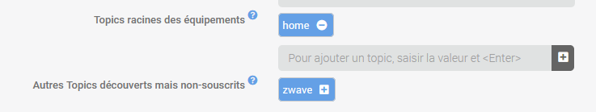
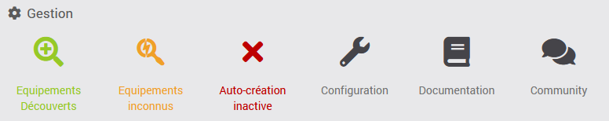
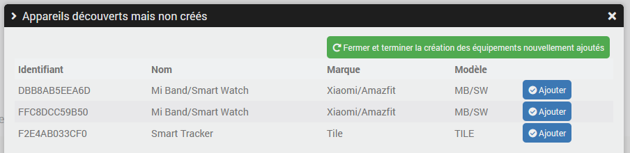

# Description

Plugin for automatic discovery of MQTT device.

The plugin is based on the principle of “MQTT Auto Discovery” which exists under Home Assistant in order to automatically create equipment and their controls under Jeedom. So if you have devices that are connected via MQTT and they publish the information necessary for “MQTT Auto Discovery” compatibility, these will be automatically recognized and integrated into Jeedom. There is obviously no point in installing Home Assistant, Jeedom is enough.

This makes it possible to use the excellent project [Open MQTT Gateway] (https://docs.openmqttgateway.com/) on esp32 which manages [a large number of devices](https://compatible.openmqttgateway.com/index.php/devices/) or the equivalent [Theengs gateway](https://gateway.theengs.io/) on pi for example, all these devices will be automatically supported under Jeedom via the plugin, with automatic “multi-antenna” management. It is becoming very easy to manage the presence of Bluetooth tags such as nuts.

But so it's not limited to that since all “MQTT Auto Discovery” compatible devices will be manageable via the plugin. For example, this plugin has been successfully tested with zwavejs-ui and zigbee2mqtt.

> **Important**
>
> This plugin is not intended to replace protocol plugins dedicated to zwavejs-ui and zigbee2mqtt for example; Existing plugins on the market will manage these protocols much better.
> No specific options will be developed to manage these in more detail, this is not the purpose of the plugin which only implements automatic discovery.
> The tests carried out with these zwavejs-ui and zigbee2mqtt are carried out only because this allows me to validate the behavior of the plugin on a large scale but absolutely not to manage the specificities of these protocols.
> So this plugin can obviously be used to easily create the devices necessary for these protocols but only in the context of use in advanced mode, knowing that you manage absolutely everything else with the tools made available by these programs.

# Compatibility

## Will this plugin work for me?

To find out, check the documentation of the hardware, program, or gateway you want to use if there is a mention of “MQTT Discovery” for Home Assistant (again, you don't need to have Home Assistant installed).

Another way is to connect to your broker using MQTT Explorer (for example) and see if you see a `homeassistant` topic. If yes, you should find information about your device in the sub-topics. In case of doubt, you can always ask the question on [community]({{site.forum}}/tags/plugin-{{page.pluginId}}).

## List of known possible integrations

This list is far from exhaustive, it would be impossible as there are so many of them. However, it may give some ideas.

- [Open MQTT Gateway](https://docs.openmqttgateway.com/)
- [Theengs Gateway](https://gateway.theengs.io/)
- [MyFox2MQTT](https://github.com/Minims/MyFox2MQTT)
- [Nuki Smart Lock 3.0 Pro](https://support.nuki.io/hc/en-us/articles/12947926779409-MQTT-support)
- [zwave-js-ui](https://zwave-js.github.io/zwave-js-ui/#/)
- [zigbee2mqtt](https://www.zigbee2mqtt.io/)

# Installation

In order to use the plugin, you must download, install and activate it like any Jeedom plugin.
Then you need to install dependencies.

You must have already installed an MQTT broker, either by yourself or through another Jeedom plugin.

If the*MQTT Manager (mqtt2)* plugin is installed, the configuration to connect to the broker managed by this plugin can be retrieved automatically.

# Plugin configuration

> **Important**
>
> After each configuration change, it is necessary to restart the daemon for the changes to take effect.

## Access to the MQTT broker

You need to configure the broker's IP address, port, username, and password.
If the *MQTT Manager (mqtt2)* plugin is installed, you will see a button to perform this configuration automatically.

## Auto-discovery

The first option allows you to automatically create the devices that will be discovered. This can be very practical if you have a lot of devices but it will potentially create a lot of devices, including maybe devices that you don't need so use sparingly.
There is another option to manually choose the devices to be created (the creation will then be automatic), see the paragraph on configuring devices for more details.

The topic containing the configurations of the devices to be discovered, by default `homeassistant`, can possibly be modified if necessary.

> **Important**
>
> Don't change the discovery root topic configuration without knowing, in principle you will never need to change this.

You will then have to configure the list of root topics for which you want to manage devices. For example, for devices managed by *Open MQTT Gateway* or *Theengs Gateway* this will be the `home` topic by default.

> **Important**
>
> The topic name is case sensitive, be careful to configure the name taking into account upper and lower case letters.

After the first start of the daemon and therefore after the first discovery session, you will also see the list of possible but unconfigured topics that the daemon has found, it is possible to add them directly.

So if you don't know exactly what to configure:

- Start the daemon
- Wait 1 minute
- Refresh the page if this has not been done
- A list of possible topics will be listed => add the one that concerns your devices

For example, the plugin show me the topic *zwave* that I can simply  add by clicking on the “+” (don't forget to*Save* and *(Re)Start* the daemon when finished):

## Daemon

Finally, you can configure the following information (optional):

- *Cycle* defines the frequency of sending information to Jeedom, in seconds: a numerical value between `0.5` and `10`
- *Internal socket port* defines the port on which the daemon is listening. Do not change this value without asking the question on [community]({{site.forum}}/tags/plugin-{{page.pluginId}}).

> **Important**
>
> Do not modify this information at first, in principle it is not necessary.

# Devices management

The plugin can be found in the Plugins → Home automation protocol menu.

On the upper part, you will see the management panel, as on all Jeedom plugins

The first button allows you to list devices discovered but not yet created (if auto-creation was not active at the time of their discovery). This leaves the choice of manually selecting the devices to be created (the creation of the device and its commands remains automatic).

By clicking on this button, a new window will open:

Simply click on the “Add” button for the desired device and then click on the “Close and finish creating newly added device” button for the device and its commands to be created.

The last button allows you to view the status of the automatic creation and to activate or deactivate it directly from this page, this is the same configuration as the one in the plugin configuration.

In the event that automatic creation is active, the plugin will create missing devices and commands automatically as soon as it receives information on the discovery topic (by default `homeassistant`).

> **Important**
>
> Automatic creation will only be performed for **new** devices discovered after activating the option or after restarting the daemon.
> Device discovered when the automatic creation option was disabled will not be automatically created (unless the daemon is restarted) but it is obviously possible to add it "manually".

# Devices configuration

There is no specific configuration in most cases except for devices with a *rssi* info (typically Bluetooth devices). For those, there will be an additional command *Present* and it will be possible to define in the device configuration the duration (in seconds) before considering the device as absent; this will be particularly useful for “trackers” such as nuts.

In the list of commands, you will see the corresponding MQTT topic as well as the value of the json if relevant. It is possible to encode a path if you have to search for a value in a subnode.
In principle, you will not have to modify these configurations, they are only accessible to manage borderline cases if the plugin did not perform the configuration automatically.

# How automatic discovery works

Automatic discovery will publish the configurations of what are called *components*/*entity*, each component corresponds to a category, a type of command. For example: *sensor*, *switch*, *light*, *button*...

The plugin reads these configurations and for each component will create the corresponding Jeedom commands, each under their respective device.

When all your devices have been discovered, you can deactivate discovery to prevent the plugin from creating devices that you do not want.

## Supported component

Not all components are fully or completely integrated yet. If your hardware needs support for a component that is not yet recognized, do not hesitate to request it by creating a post on [community]({{site.forum}}/tags/plugin-{{page.pluginId}}).

- alarm_control_panel
- binary_sensor
- button
- cover
- device_tracker
- light
  - brightness
- number
- sensor
- switch
- text
- update

# Bluetooth device detections

One of the first objectives of this plugin is to be able to easily retrieve information from compatible Bluetooth devices that will be decoded by antennas runing *Open MQTT Gateway* or *Theengs Gateway*. In both cases, you will have to install the tool and configure it to connect to the same Mosquitto broker that the plugin uses.

## Open MQTT Gateway installation

Everything is already explained in detail here: <https://docs.openmqttgateway.com/>.

You can also find help on [community]({{site.forum}}).

## Theengs Gateway installation

All the explanations needed to install an antenna manually are available here: <https://gateway.theengs.io/install/install.html>.

You can also use the plugin <a href="{{site.market}}/index.php?v=d&plugin_id=4441" target="_blank">Theengs Gateway</a> available on the market which simplifies the task, see [Documentation]({{site.baseurl}}/tgw/{{page.lang}})

# Changelog

[See the changelog](./changelog)

# Support

If you have a problem, start by reading the latest plugin-related topics on [community]({{site.forum}}/tags/plugin-{{page.pluginId}}).

If despite this you do not find an answer to your question, do not hesitate to create a new topic, with the tag of the plugin ([plugin-{{page.pluginId}}]({{site.forum}}/tags/plugin-{{page.pluginId}})).

At a minimum, you will need to provide:

- a screenshot of the Jeedom health page
- all available plugin logs
- depending on the case, a screenshot of the error encountered, a screenshot of the configuration causing the problem...
