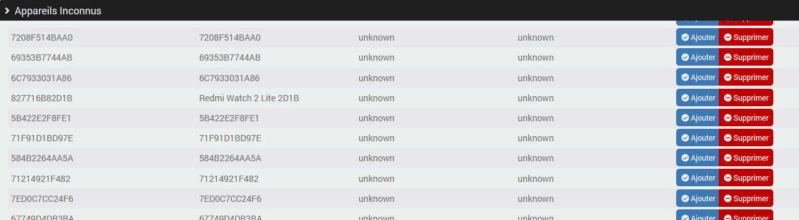
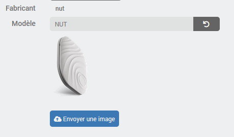
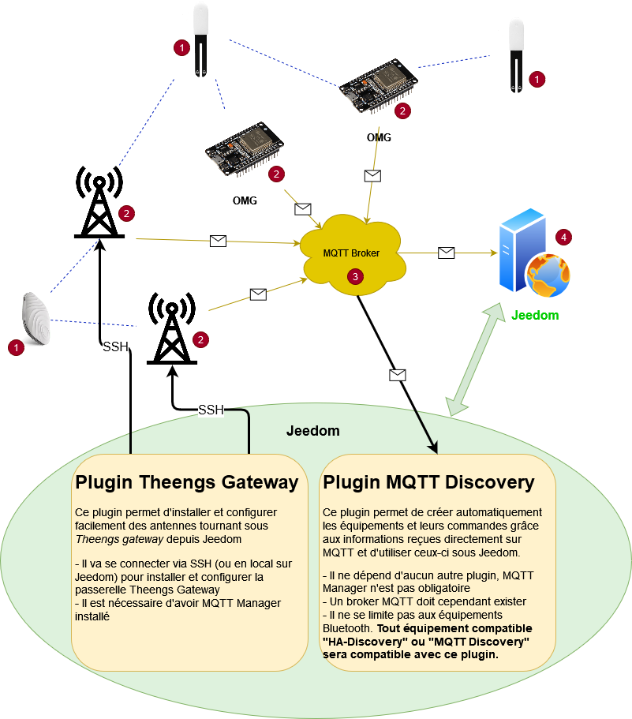
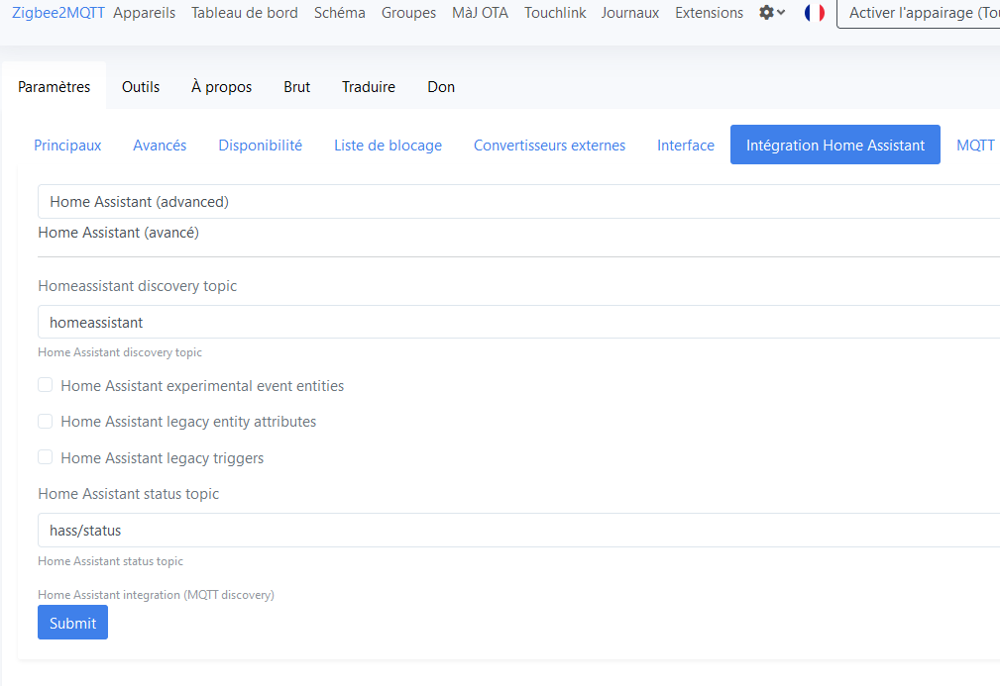

# Description

**MQTT Discovery** allows the automatic discovery of MQTT devices thanks to the “MQTT Discovery” protocol, also called “HA Discovery”.

It is based on the principle of “MQTT Auto Discovery” which exists under Home Assistant in order to automatically create devices and their commands under Jeedom. So if you have devices that are connected via MQTT and if they publish the information necessary for the “MQTT Auto Discovery” compatibility, these will be automatically recognized and integrated into Jeedom. There is obviously no point in installing Home Assistant, Jeedom is enough.

This makes it possible, for example, to use the excellent [Open MQTT Gateway](https://docs.openmqttgateway.com/) project on esp32, which manages [a large number of devices](https://decoder.theengs.io/devices/devices.html), or the equivalent [Theengs Gateway](https://gateway.theengs.io/) on pi for example, all of which will be automatically supported in Jeedom via **MQTT Discovery**, with automatic "multi-antenna" management. This makes it very easy to manage the presence of Bluetooth tags such as nuts or tiles.

But so it's not limited to Bluetooth devices since all “MQTT Auto Discovery” compatible devices will be recognized and manageable. For example, this plugin has been successfully tested with zwavejs-ui and zigbee2mqtt.

> **Important**
>
> No specific options will be developed to manage gateways such as zwavejs-ui and zigbee2mqtt in detail, as this is not the aim of the plugin, which only implements automatic device discovery.
> So **MQTT Discovery** can of course be used to automatically create the necessary equipment (as you would with any other MQTT integration, but more easily), but only when used in "advanced" mode, in the knowledge that you manage everything else with the tools provided by the corresponding gateways.

# Supported versions

| Component | Version                     |
|-----------|-----------------------------|
| Debian    | Bullseye(11) & Bookworm(12) |
| Jeedom    | >= 4.4                      |

# Compatibility

## Will MQTT Discovery work for me?

To find out, check the documentation of the hardware, program, or gateway you want to use if there is a mention of “MQTT Discovery” or "HA Discovery" for Home Assistant (again, you don't need to have Home Assistant installed).

Another way is to connect to your broker using MQTT Explorer (for example) and see if you see a `homeassistant` topic. If yes, you should find information about your device in the sub-topics. In case of doubt, you can always ask the question on [community]({{site.forum}}/tag/plugin-{{page.pluginId}}).

## List of known possible integrations

This list is far from exhaustive - there are so many that it would be impossible. However, it may give you some ideas:

> **Note**
>
> This list presents, in alphabetical order, examples of integrations that have worked at one time or another. I do not guarantee that they will work or that they will be tested regularly. Feel free to try, but I can't be held responsible if it doesn't work.

- [Chaudière Hargassner](https://community.jeedom.com/t/pilotage-chaudiere-hargassner-via-mqtt-discovery/142840)
- [MG iSMART](https://github.com/SAIC-iSmart-API/saic-python-mqtt-gateway), see [tutorial on community](https://community.jeedom.com/t/tuto-integrer-sa-mg-dans-jeedom/118686)
- [MyFox2MQTT](https://github.com/Minims/MyFox2MQTT), see [explanation on community](https://community.jeedom.com/t/myfox-et-jedom-4-4/111828/14)
- [Nuki Smart Lock Pro (3 & 4)](https://support.nuki.io/hc/fr/articles/12947926779409-MQTT-support)
- [Open MQTT Gateway](https://docs.openmqttgateway.com/): Bluetooth gateway on ESP
- [Sonos2mqtt](https://sonos2mqtt.svrooij.io/), [see on community](https://community.jeedom.com/t/sonos2mqtt/119216)
- [Theengs Gateway](https://gateway.theengs.io/): Bluetooth gateway under Debian, see this [tutorial on community](https://community.jeedom.com/t/migration-de-blea-vers-mqttdiscovery-et-tgw/115358)
- [tydom2mqtt](https://tydom2mqtt.github.io/tydom2mqtt/#/introduction/)
- [zigbee2mqtt](https://www.zigbee2mqtt.io/)
- [zwave-js-ui](https://zwave-js.github.io/zwave-js-ui/#/)

You can also find other applications compatible with MQTT Discovery on the [Home Assistant - Third-party tools](https://www.home-assistant.io/integrations/mqtt/#support-by-third-party-tools) website.

# Installation

In order to use the plugin, you must download, install and activate it like any Jeedom plugin.
Then you need to install dependencies.

You must have already installed an MQTT broker, either by yourself or through another Jeedom plugin.

The *MQTT Manager (mqtt2)* plugin is not required but if it is installed, the configuration to connect to the broker can be retrieved automatically.

# Plugin configuration

> **Important**
>
> After each configuration change, it is necessary to restart the daemon for the changes to take effect.

## Access to the MQTT broker

You need to configure the broker's IP address, port, username, and password.
If the *MQTT Manager (mqtt2)* plugin is installed, you will see a button to perform this configuration automatically.

> **Tip**
>
> There is absolutely no need to have *MQTT Manager (mqtt2)* installed or maintained. **MQTT Discovery** does not depend on *MQTT Manager (mqtt2)*, messages never transit via this plugin. **MQTT Discovery** has no impact on the configuration of *MQTT Manager (mqtt2)* and vice versa.
>
> This feature is only present to prevent you from having to manually fill in connection information.

## Auto-discovery

The first option allows you to automatically create the devices that will be discovered. This can be very practical if you have a lot of devices but it will potentially create a lot of devices, including maybe devices that you don't need so use sparingly.
There is another option to manually choose the devices to be created (the creation will then be automatic), see the paragraph on configuring devices for more details.

The topic containing the configurations of the devices to be discovered, by default `homeassistant`, can possibly be modified if necessary.

> **Important**
>
> Don't change the discovery root topic configuration without knowing, in principle you will never need to change this.

You will then have to configure the list of root topics for which you want to manage devices. For example, for devices managed by *Open MQTT Gateway* or *Theengs Gateway* this will be the `home` topic by default.

> **Important**
>
> The topic name is case sensitive, be careful to configure the name taking into account upper and lower case letters.

After the first start of the daemon and therefore after the first discovery session, you will also see the list of possible but unconfigured topics that the daemon has found, it is possible to add them directly.

So if you don't know exactly what to configure:

- Start the daemon
- Wait 1 minute
- Refresh the page if this has not been done
- A list of possible topics will be listed => add the one that concerns your devices

For example, the plugin show me the topic *zwave* that I can simply  add by clicking on the “+” (don't forget to*Save* and *(Re)Start* the daemon when finished):

The last option allows you to list unknown devices that publish on one of the configured root topics.
If an unknown device is added (see **Devices Management** to find out how), only presence management will be possible; this is therefore only useful for Bluetooth device in principle and it allows you to use a Bluetooth tracker even if it is not decoded by *Open MQTT Gateway* or *Theengs Gateway*.

## Daemon

Finally, you can configure the following information (optional):

- *Cycle* defines the frequency, in seconds, at which information is sent to Jeedom: a numerical value between `0.1` and `10`.
- *Internal socket port* defines the port on which the daemon is listening. Do not change this value without asking the question on [community]({{site.forum}}/tag/plugin-{{page.pluginId}}).

> **Important**
>
> Do not modify this information at first, in principle it is not necessary.

# Devices management

The plugin can be found in the Plugins → Home automation protocol menu.

On the upper part, you will see the management panel, as on all Jeedom plugins

The first button allows you to list devices discovered but not yet created (if auto-creation was not active at the time of their discovery). This leaves the choice of manually selecting the devices to be created (the creation of the device and its commands remains automatic).

By clicking on this button, a new window will open:

Simply click on the “Add” button for the desired device and then click on the “Close and finish creating newly added device” button for the device and its commands to be created.

In this screen you can also view the entire configuration of a device and also remove it from the list if you do not need it. Attention this action also deletes the information on your mqtt broker.

The second button on the management panel, named “Unknown devices”, will only be visible if you have activated the corresponding option (see **Plugin configuration**) and it allows access to a screen very similar to the previous one except that there is no configuration.

Once you have added one of the “unknown” devices from this screen, the commands will not be created immediately. You will have to wait a few seconds or even minutes for it to emit information so that the plugin creates the corresponding command.

The next button allows you to view the status of the automatic creation and to activate or deactivate it directly from this page, this is the same configuration as the one in the plugin configuration.

Back on the management banner, you will see a button to access the plugin configuration, documentation and the latest topics about the plugin on community.

In the event that automatic creation is active, the plugin will create missing devices and commands automatically as soon as it receives information on the discovery topic (by default `homeassistant`).

> **Important**
>
> Automatic creation will only be performed for **new** devices discovered after activating the option or after restarting the daemon.
> Device discovered when the automatic creation option was disabled will not be automatically created (unless the daemon is restarted) but it is obviously possible to add it "manually".

# Devices configuration

There is no specific configuration in most cases except for devices with a *rssi* info (typically Bluetooth devices). For those, there will be:

- a global **rssi** command that contains the last value received whatever the antenna,
- a **rssi** command per antenna that report the device,
- an additional command **Present** of type info/binary which is equal to 1 if the device is considered present and 0 otherwise.

It is possible to define in the device configuration the delay (in seconds) before considering the device absent; this will be especially useful for “trackers” such as nuts or tiles. A device is considered present if a *rssi* value has been received within the last x seconds.

On the right side, you will see general information about the device (identifier, configuration, manufacturer, model...) and you can upload an image to be used to represent the device instead of the plugin logo or the default image when it exists. The plugin manages one image per model and not one image per device, so it is not possible to have two different images for two nuts unless you manually modify the identifier of the configured model, this has no impact except for the image used:

In the list of commands, you will see the MQTT topic corresponding to each command as well as the value of the json if relevant. It is possible to encode a path if you have to search for a value in a subnode.
In principle, you will not have to modify these configurations, they are only accessible to manage borderline cases if the plugin did not perform the configuration automatically.

# How automatic discovery works

Automatic discovery will publish the complete definition of what are called *Components*/*Entity*, each component corresponds to a category, a type of command. For example: *sensor*, *switch*, *light*, *button*...

The plugin reads these definitions and for each component will create the corresponding Jeedom commands, each under their respective device, configuring the min/max values or the list of possible choices etc., but also the default icon on the command, the generic type of the command, etc.

## Supported components/entities

Not all components/entities are fully or completely integrated yet. If your hardware needs support for a component that is not yet recognized, feel free to request it by creating a post on [community]({{site.forum}}/tag/plugin-{{page.pluginId}}).

- alarm_control_panel
- binary_sensor
- button
- climate
- cover
- device_automation
- device_tracker
- light
  - brightness
- lock
- music_player
- number
- select
- sensor
- switch
- text
- update
- vacuum

# Integrations

Here are a few examples of possible integrations

## Bluetooth

One of the first objectives of **MQTT Discovery** is to be able to easily retrieve information from [compatible Bluetooth devices](https://decoder.theengs.io/devices/devices.html) that will be decoded by antennas running *Open MQTT Gateway* or *Theengs Gateway*. In both cases, you will have to install the tool and configure it.

Here we will see a complete solution to integrate a lot of Bluetooth equipment (BLEA) into Jeedom in a fully automated way.

There is no need for any technical knowledge (other than knowing how to use Jeedom) and there will be no need to perform any configuration manually even if at any time you can decide to take care of all or part of the solution manually (because “why make it simple when you can make it complicated?”).

### How does it work?

Here is a diagram that illustrates how each component of the solution works and how they interact:

We can see sensors (1), for example MiFlora and nut, whose Bluetooth emissions are received by antennas (2) with Theengs Gateway or OMG on esp32.

These antennas are connected to your local network via cable or wifi and send the decoded Bluetooth messages via MQTT to the broker (3) and finally the broker sends these same messages to the **MQTT Discovery** plugin installed on Jeedom (4).

So there are two very distinct parts: *antennas* that transform Bluetooth messages into MQTT messages, and the**MQTT Discovery** plugin that will transform MQTT messages into devices and commands that can be used on Jeedom.

### Antennas

There may be a single one (installed locally on Jeedom or on a remote host) or several (necessarily installed on remote hosts) to cover the home if necessary.

These antennas will pick up devices transmitting via Bluetooth and send the data via MQTT to Jeedom; there are several options for antennas, you can combine and multiply them, anything is possible:

- [Theengs gateway](https://gateway.theengs.io/) to be installed locally or remotely on a Debian machine (a pi or other, not important):
  - either manually by following their documentation
  - or via the [Jeedom plugin Theengs Gateway]({{site.baseurl}}/tgw/{{page.lang}}) available on the market which simplifies the task, see [Documentation]({{site.baseurl}}/tgw/{{page.lang}})
- [OpenMQTTGateway](https://docs.openmqttgateway.com/) to flash on an esp32, necessarily remotely.
- or even simpler, the [Theengs Bridge](https://community.jeedom.com/t/theengs-bridge-nouvelle-version/128348).

It is therefore perfectly possible to have:

- a single local antenna (=installed on Jeedom), therefore using Theengs gateway
- a local antenna and another on a pi (with Theengs gateway)
- one or more antennas on pi and no local antenna
- Only OMG antennas on esp32
- a mix of OMG and Theengs antennas

All combinations are possible and everything is inter-compatible.

> **Tip**
>
> An advantage for antennas under *OpenMQTTGateway*, whether DIY or via the *Theengs Bridge*, is that they will be automatically available as a device of **MQTT Discovery** because they also publish discovery info for themselves, so you'll be able to manage them entirely from Jeedom. This will not be the case for **Theengs gateway** antennas, but you will be able to manage them via the [Jeedom Theengs Gateway plugin]({{site.baseurl}}/tgw/{{page.lang}}) if they are installed using the plugin.

### The devices under Jeedom

This is where the **MQTT Discovery** plugin comes into play and if you have already configured the plugin as described above, you don't have to do anything more than add the devices you whish to your Jeedom, the plugin does the rest.

### Unknown equipment

If your device is unrecognized or poorly recognized, it will not be displayed in the list of discovered equipment, but may be visible in the list of unknown equipment (see **Equipment management** for more information), for which only the presence information will exist.

To find out why it is not recognized, please first check the [list of compatible devices](https://decoder.theengs.io/devices/devices.html) and, if necessary, ask your question on the [Open MQTT Gateway / Theengs Gateway community](https://community.openmqttgateway.com/).

### So why isn't antenna management integrated into MQTT Discovery?

Because these are very two distinct roles and that **MQTT Discovery** does not really care about where the information received via MQTT comes from and it is certainly not limited to Bluetooth devices.

Some people use it to integrate devices that are not Bluetooth into Jeedom and are therefore not sent back by *Theengs* or *OMG* gateways but by other connectors or gateways, so they may not even need these.

Others may decide to install their antennas themselves or to use only antennas on esp32 with OMG.

This is where the strength of the system lies: everyone does their work in the most optimal way possible and this makes it possible to offer greater quality and overall stability. The MQTT broker in the middle is a technical brick used for communication between the different parties.

## Zigbee

[Zigbee2mqtt](https://www.zigbee2mqtt.io/guide/getting-started/) fully supports the MQTT Discovery protocol, making it easy to integrate with the plugin.

Once you've installed [zigbee2mqtt](https://www.zigbee2mqtt.io/guide/installation/) on the platform of your choice, all you need to do is enable *MQTT Discovery* integration. You can do this either directly in [zigbee2mqtt config file](https://www.zigbee2mqtt.io/guide/configuration/homeassistant.html), or via the interface, to obtain the following configuration:

I strongly recommend leaving `homeassistant` as the discovery topic and disabling legacy integrations that are not used.

As with the other integrations, all you have to do is add the equipment you want to your Jeedom, and the plugin takes care of the rest.

> **Important**
>
> Associating new modules or configuring them will not be handled by **MQTT Discovery** (unless the info exists in Discovery). Advanced" operations will always be carried out in the zigbee2mqtt interface.

# Changelog

[See the changelog](./changelog)

# Support

If you have a problem, start by reading the latest plugin-related topics on [community]({{site.forum}}/tag/plugin-{{page.pluginId}}).

If despite this you do not find an answer to your question, do not hesitate to create a new topic, with the tag of the plugin ([plugin-{{page.pluginId}}]({{site.forum}}/tag/plugin-{{page.pluginId}})).

At a minimum, you will need to provide:

- a screenshot of the Jeedom health page
- a screenshot of the plugin's configuration page
- all available plugin logs, at *INFO* level, pasted into a `Preformatted Text` (button `</>` on community), no files!
- depending on the case, a screenshot of the error encountered, a screenshot of the configuration causing the problem...

If the question concerns the discovery or commands of a device, then you'll need to provide the *Discovery info*: copy this info via the button on the device page and paste **without modification** into a `Preformatted text` block.
