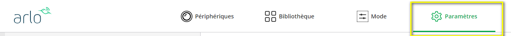
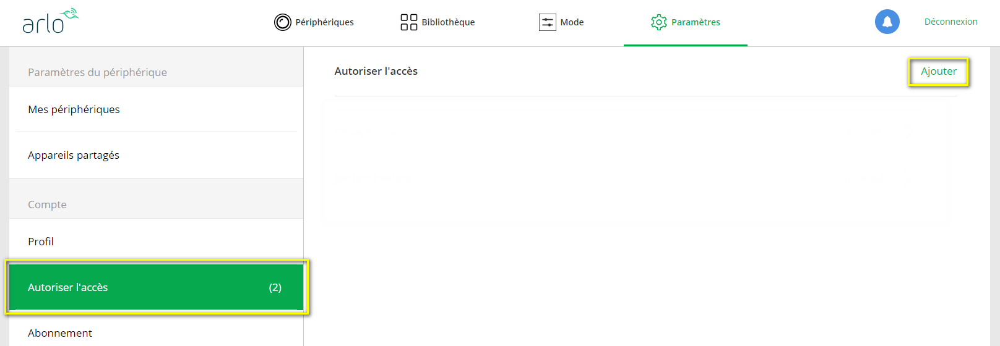
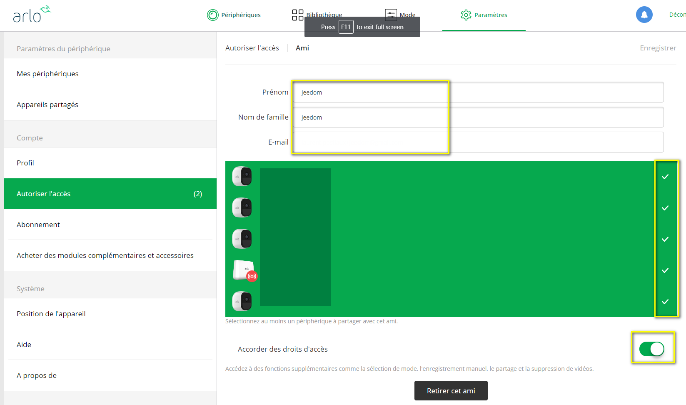
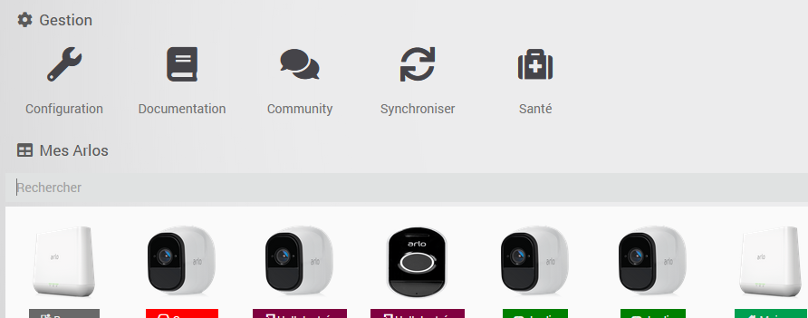
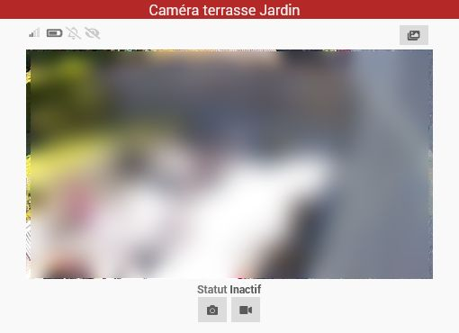
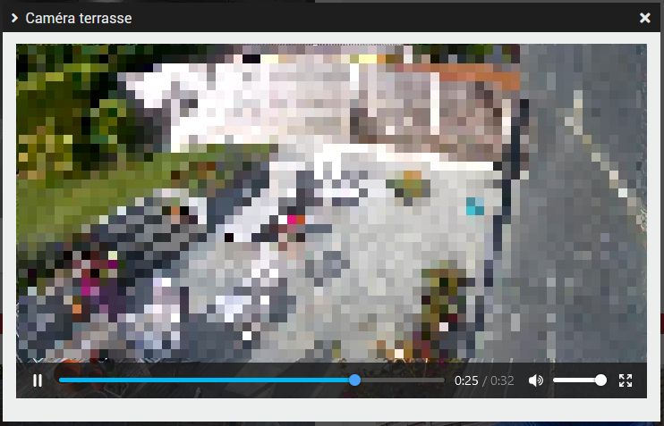
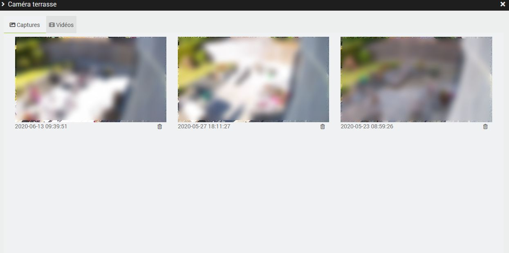
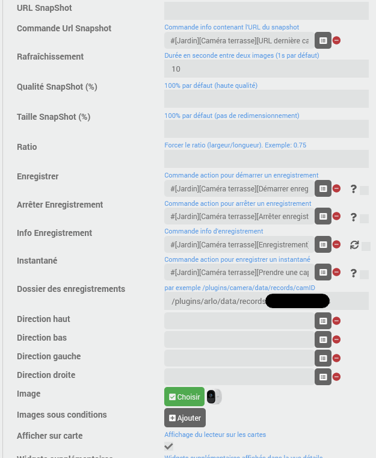
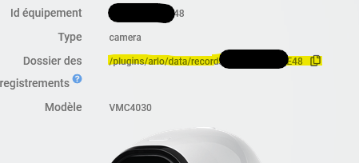

# Descripción

Complemento que permite controlar los dispositivos de la gama Arlo, como las cámaras, la estación base y la sirena integrada.
Es posible controlar el modo de funcionamiento, activar y desactivar las cámaras, visualizar la transmisión en directo de las cámaras, activar capturas y grabaciones de vídeo, activar la sirena...

Todos los modelos actuales compatibles con la aplicación Arlo (web o móvil) son compatibles con el complemento: Arlo, Arlo Pro (todas las versiones), Ultra (todas las versiones), Arlo Floodlight, Arlo Essential, Arlo Q, Arlo Go, Arlo Baby, Arlo Security Bridge & Light, Arlo Doorbell y Video Doorbell...

A continuación te ofrecemos un resumen de las posibilidades del complemento:

- seleccionar el modo: activado, desactivado o programación, así como todos los modos personalizados;
- activar o desactivar cada cámara de forma independiente (independientemente del modo en el que se encuentre);
- activar la sirena integrada en la estación base (o en el Pro3 y el Ultra) y conocer su estado;
- Conocer el estado de cada cámara:
  - conectada o no
  - estado general (inactivo, alerta, etc.)
  - nivel de batería (y si se está cargando)
  - potencia de la señal
  - si la detección de sonido o de movimiento está activa
  - si se detecta sonido o movimiento
- realizar una captura instantánea (almacenada localmente)
- realizar una grabación (almacenada localmente)
- ver las capturas y los vídeos grabados
- iniciar/detener una grabación almacenada en la nube de Arlo
- ver la retransmisión en directo de tus cámaras
- controlar la luz integrada en las cámaras compatibles
- controlar la sirena integrada en las cámaras y bases compatibles

> **Importante**
>
> No se recomienda utilizar las cámaras y timbres de la gama Essentials o Wire-free (es decir, todas las cámaras conectadas directamente a través de wifi) si no hay ninguna base en el sistema, salvo que estén alimentadas de forma permanente (con corriente eléctrica o mediante un panel solar si hay suficiente luz solar), ya que su batería no ofrece suficiente autonomía. Si hay una base, no hay ningún problema.

# Versiones compatibles

| Componente | Versión                     |
|-----------|-----------------------------|
| Debian    | Bullseye(11) & Bookworm(12) |
| Jeedom    | >= 4.4                      |

> **Importante**
>
> Este complemento no es compatible con sistemas de 32 bits, en particular con las instalaciones de Raspberry Pi 3B que utilizan un sistema operativo de 32 bits.

# Instalación

Para utilizar el plugin, debes descargarlo, instalarlo y activarlo como cualquier otro plugin de Jeedom.
A continuación, hay que instalar las dependencias.

# Configuración

Arlo no permite que un mismo usuario se conecte simultáneamente a varias interfaces: si estás conectado a la aplicación desde un móvil, no podrás conectarte al mismo tiempo desde otro móvil ni desde la interfaz web. Si, por ejemplo, te conectas a la interfaz web, se te desconectará automáticamente de la aplicación móvil.
El complemento se conecta al sistema Arlo como un usuario estándar, por lo que estará sujeto a las mismas restricciones.

Por lo tanto, es necesario crear un usuario específico para el complemento; de lo contrario, no funcionará correctamente.

## Autenticación en dos pasos

Arlo está implantando progresivamente el uso de la autenticación en dos pasos.

Antes de crear un nuevo usuario de Arlo, es importante conocer la siguiente información:

- El plugin gestiona esto a través del correo electrónico, pero solo es compatible con IMAP, por lo que necesitarás una cuenta de correo con acceso IMAP (a veces está bloqueado o es de pago, así que compruébalo antes) y solo admite la autenticación mediante _nombre de usuario_/_contraseña_; ¡no admite autenticación multifactorial (MFA) en el correo electrónico!
- El complemento debe tener acceso directo al correo electrónico del usuario de Arlo, ya que Arlo solicita el código de autenticación de dos factores (TFA) cada vez que se inicia sesión. Por lo tanto, si el servicio tiene que reiniciarse, debe poder recuperar el código por sí mismo.
- el complemento solo leerá los correos procedentes de «<do_not_reply@arlo.com>»; por lo tanto, aunque se recomienda disponer de una cuenta de correo dedicada y no de un alias de una cuenta ya existente, esto no debería suponer ningún problema; marcará los correos como «leídos» en la bandeja de entrada una vez que lo haya hecho (y no volverá a intentar leerlos en el siguiente inicio)
- El complemento solo buscará entre los correos no leídos del día actual, en orden cronológico inverso (del más reciente al más antiguo), y omitirá todos los correos enviados antes de su último inicio de sesión.
- El idioma del correo electrónico no importa: la búsqueda del código TFA funcionará independientemente del idioma del correo electrónico.

> **Consejo**
>
> A partir de ahora, para poder iniciar sesión en una cuenta de correo electrónico de Gmail (Google) o Microsoft, deberás crear una _contraseña de aplicación_, que no requerirá la autenticación multifactorial (MFA) para iniciar sesión, ya que ya no está permitida la activación de la opción «aplicaciones no seguras».
> Más detalles sobre el procedimiento para Google aquí: <https://community.jeedom.com/t/google-applications-moins-securisees-mot-de-passe-dapplication/85617>.
> Para las cuentas de Microsoft (Outlook, Hotmail...), lee esto <https://support.microsoft.com/en-us/account-billing/how-to-get-and-use-app-passwords-5896ed9b-4263-e681-128a-a6f2979a7944>

Una vez que hayas creado una cuenta de correo electrónico para el complemento, puedes pasar al siguiente paso.

## Creación de un usuario de Arlo específico para el complemento

- Para ello, abre <https://my.arlo.com> o abre la aplicación móvil;
- Haz clic en «Configuración», en la esquina superior derecha;

- Haz clic en «Permitir acceso» en el menú de la izquierda y, a continuación, en «Añadir» a la derecha.

- Introduce la información solicitada, incluida una nueva dirección de correo electrónico (un alias de Gmail añadiendo «+jeedom» antes de «@gmail.com», por ejemplo, funcionará; sin embargo, para la autenticación en dos pasos, te recomiendo que utilices una dirección de correo electrónico dedicada al complemento);
- **Selecciona los dispositivos Arlo** a los que tendrá acceso el complemento;
- **Activa la opción «Conceder derechos de acceso»** para poder cambiar de modo, iniciar una grabación, realizar capturas, etc., desde Jeedom.

- Haz clic en «Enviar una invitación»
- Recibirás un correo electrónico de confirmación para crear tu nueva cuenta de Arlo; solo tienes que seguir los pasos indicados.

> **Consejo**
>
> Cierra sesión en «My Arlo», abre una «ventana privada» en tu navegador o utiliza otro navegador para poder crear tu segunda cuenta de Arlo.

## Configuración del complemento

En la página de configuración del complemento:

- Introduce tu nombre de usuario (la nueva dirección de correo electrónico) y la contraseña de Arlo asociada.
- Si has activado la autenticación en dos pasos, introduce la dirección IMAP del servidor de correo en el formato _imap.server.com_, así como el nombre de usuario y la contraseña del correo electrónico asociado (o la contraseña de la aplicación en el caso de una cuenta de Gmail, en lugar de tu contraseña personal) (no es necesario si la autenticación de dos factores (TFA) no está activa en tu cuenta de Arlo).
- Inicia el demonio (si no se inicia solo)

Si los datos de conexión son correctos, el estado debería cambiar a verde y el complemento comenzará a sincronizar los dispositivos que habías compartido anteriormente.

En esta página también es posible configurar las reglas de retención de capturas y grabaciones; estas reglas permiten que el complemento elimine automáticamente los archivos multimedia (guardados localmente) más antiguos.

# Uso

Si el complemento está correctamente configurado (véase el paso anterior), deberías ver la lista de dispositivos Arlo que has compartido al crear la cuenta dedicada al complemento.

No es posible crear un dispositivo manualmente. Los dispositivos se crean o actualizan automáticamente mediante el complemento durante la sincronización con el sistema Arlo. La sincronización se realiza automáticamente al menos una vez al día; si es necesario, se puede iniciar una sincronización manualmente a través de la pantalla de gestión de dispositivos.

El complemento nunca eliminará automáticamente un dispositivo; si ya no dispones de dicho dispositivo o si has eliminado los derechos de acceso del complemento, se recomienda eliminar manualmente el dispositivo correspondiente en Jeedom.
Si añades un nuevo dispositivo o modificas los modos a través de la aplicación Arlo, se recomienda realizar una sincronización manual para actualizar la configuración del complemento de inmediato; de lo contrario, esto se hará durante la próxima sincronización automática.

> **Consejo**
>
> Evidentemente, esto no afecta a los valores de los comandos, como el modo seleccionado o la detección de movimiento o de sonido, que se actualizan en tiempo real.

Para la mayoría de los dispositivos no es necesaria ninguna configuración específica; el nombre del dispositivo será el definido en el sistema Arlo, pero no olvides asignarle un dispositivo principal, una categoría y activarlo.

En el caso de los dispositivos de tipo cámara, es posible configurar un comando de acción/mensaje (hay muchos complementos compatibles). Si se configura, el complemento enviará un mensaje, que incluirá la captura, en cuanto se reciba una nueva captura.

# Las instalaciones

> **Importante**
>
> No se recomienda utilizar dispositivos que funcionen con batería (salvo que se recarguen periódicamente, por ejemplo, mediante un panel solar si hay suficiente luz solar) y que estén conectados directamente a la red wifi si no hay ninguna base en el sistema, ya que su batería no ofrece suficiente autonomía para enviar los eventos a Jeedom. Si hay una base, no hay ningún problema, aunque algunos dispositivos estén conectados directamente a la red wifi.

Es posible que algunos comandos específicos de ciertos modelos no estén (todavía) disponibles; en ese caso, ponte en contacto conmigo a través del foro para obtener más información.

> **Consejo**
>
> Si se añade un dispositivo (hub, cámara, timbre...), es necesario reiniciar el demonio para que funcione correctamente en Jeedom.

## Cambio de modo

En función de tu instalación y de la configuración de tu cuenta en Arlo, puedes elegir el modo de funcionamiento de tus dispositivos, lo que determina si estos detectarán el sonido y/o el movimiento o si estarán desactivados.

Parece que, para las cuentas creadas hasta finales de 2023, esto es posible en todos los dispositivos de tipo base o hub, es decir: las bases, las cámaras o los timbres autónomos como Arlo Go, Arlo Q, Arlo Baby, Essential...
Cada uno de estos dispositivos dispone de un control de acción por modo definido: activado, desactivado y cada modo personalizado, así como de un control de información que indica el modo activo.

Algunos usuarios, en principio aquellos que hayan creado su cuenta a partir de finales de 2023, dispondrán de un dispositivo adicional de tipo «ubicación» que también habrás configurado en tu aplicación Arlo.
Al igual que con los equipos mencionados anteriormente, habrá disponible un comando de acción por modo existente. Si este es tu caso, no sirve de nada modificar los modos en los equipos, ya que solo se tiene en cuenta el modo de este equipo «ubicación» y, por lo tanto, es este el que debe utilizarse.

## Sirena

Los dispositivos que cuentan con una sirena integrada (Hub, Essential, Pro, Ultra...) disponen de los siguientes controles que permiten gestionarla:

- **Estado de la sirena**: Indica si la sirena está activa
- **Sirena activada**: Para activar manualmente la sirena
- **Sirena desactivada**: Para desactivar la sirena

## Lámpara

Los dispositivos que cuentan con iluminación integrada (Essential, Pro, Floodlight, Ultra...) disponen de los siguientes controles para gestionar el estado de la iluminación:

- **Estado de la lámpara**: Indica si la lámpara está encendida o apagada en este momento
- **Lámpara encendida**: Para encender manualmente la lámpara (durante el tiempo predeterminado configurado en la aplicación Arlo)
- **Apagar la lámpara**: Para apagar la lámpara manualmente

## Las cámaras

Los siguientes comandos están disponibles en todos los modelos:

- **Conexión**: indica si la conexión con la cámara está operativa
- **Actividad**: ofrece una descripción de la actividad actual de la cámara
- **Activa**: indica si la cámara está activa en este momento
- **On**: Activa la cámara; se verá afectada por los cambios de modo
- **Desactivado**: Desactiva la cámara; no se verá afectada por los cambios de modo
- **Batería**: nivel de batería en %
- **Señal**: intensidad de la señal (entre 0 y 4) con la base para los modelos Arlo Pro, Pro 2 y Ultra, e intensidad de la señal móvil para el ArloGo
- **Cargando**: indica si la cámara se está cargando
- **Detección de movimiento**: indica si la detección de movimiento está activa
- **Detección de sonido**: indica si la detección de sonido está activa
- **Se ha detectado movimiento**: si se detecta movimiento
- **Se ha detectado sonido**: si se detecta sonido
- **Última imagen**: ruta (local) a la última imagen captada por la cámara
- **URL de la última captura**: URL (local) de la última imagen capturada por la cámara
- **Hacer una captura**: permite hacer una captura (que se guarda localmente) con la cámara
- **Enviar una captura**: permite enviar una captura (que se guardará localmente) desde un escenario, seleccionando el comando de notificación que se desea utilizar
- **Enviar una grabación**: permite enviar una grabación de vídeo (que se guardará localmente) desde un escenario, seleccionando el comando de notificación que se desea utilizar
- **Iniciar grabación**: permite iniciar la grabación de vídeo (que se guarda localmente)
- **Detener grabación**: permite detener una grabación local
- **Iniciar grabación en la nube**: permite iniciar la grabación en la nube de Arlo
- **Detener la grabación en la nube**: permite detener la grabación en la nube de Arlo

El widget tiene algunas características específicas. En la parte superior, de izquierda a derecha, verás:

- la intensidad de la señal con la estación base
- el nivel de la batería
- El indicador de sonido, con tres estados posibles: detección desactivada, vigilancia activa, sonido detectado.
- El sensor de movimiento, de nuevo con tres estados posibles: detección desactivada, vigilancia activa, movimiento detectado.
- un botón para abrir la biblioteca, en la que podrás ver las capturas y las grabaciones guardadas localmente.

A continuación se muestra la última imagen captada por la cámara; al hacer clic en ella, podrás ver la transmisión de la cámara casi en tiempo real (con unos segundos de retraso).

Y debajo, un botón para hacer una captura instantánea e iniciar la grabación (local).

## Arlo Baby

La integración de Arlo Baby es completa; es posible gestionar íntegramente la cámara y todas sus funciones desde el complemento: la luz nocturna, la nana y la lectura de los datos de los sensores de calidad del aire.

A continuación se ofrece una descripción general de los comandos disponibles:

- **IP**: la dirección IP de la cámara
- **Iluminación**: nivel de iluminación de la habitación
- **Temperatura**: temperatura de la habitación
- **Humedad**: en porcentaje
- **Calidad del aire**: en porcentaje; menos del 30 % se considera «normal», entre el 30 % y el 65 % se considera «anormal» y más del 65 % se considera «muy anormal» (según la documentación de Arlo)
- **Luz de noche**: Indica si la luz de noche está encendida o apagada en este momento.
- **Luz de noche encendida** y **Luz de noche apagada**: para encender y apagar la luz de noche
- **Modo luz nocturna**: los modos disponibles son: _Blanco_, _Color_, _Juego de luces_
- **Intensidad de la luz nocturna**: controles de información y acción, y para ajustar la intensidad de la luz nocturna
- **Color de la luz nocturna**: comandos de información y acción, y para cambiar el color de la luz nocturna (en modo _Color_)
- **Temperatura de color**: comandos de información y acción para cambiar la temperatura de color (en modo _Blanco_), valor entre 2500 K y 9000 K
- **Temporizador de la luz de noche**: comandos de información y acción para configurar el temporizador, así como para conocer el tiempo restante (en minutos) antes de que la luz de noche se apague automáticamente
- **Lectura**: un comando binario y un comando de cadena que indican el estado de lectura de la nana
- **Reproducir**, **Pausa**, **Siguiente**: comando que permite modificar el estado de reproducción
- **Pista**: muestra la pista seleccionada y **Lista de reproducción** muestra la lista de pistas disponibles
- **Repetición**: comandos de información y acción para activar y desactivar el modo de repetición: reproducción continua o de una sola pista
- **Aleatorio**: comandos de información y acción para activar y desactivar el modo aleatorio
- **Volumen**: permite consultar y modificar el volumen de la nana (en %)
- **Temporizador de la nana**: comandos de información y acción para configurar el temporizador, así como para conocer el tiempo restante (en minutos) antes de que la nana se apague automáticamente

## Arlo Go

En la Arlo GO también están disponibles los siguientes controles:

- **Nombre de la red**: Indica el nombre de la red móvil
- **IP**: la dirección IP actual
- **Red activa**: indica la red activa actual (wifi o móvil)

## Arlo Security Bridge y luz

El equipo «light» dispone de los siguientes mandos:

- **Estado de la lámpara**: Indica si la lámpara está encendida o apagada en este momento
- **Lámpara encendida**: Para encender manualmente la lámpara (durante el tiempo predeterminado configurado en la aplicación Arlo)
- **Apagar la lámpara**: Para apagar la lámpara manualmente
- **Detección de movimiento**: indica si la detección de movimiento está activa
- **Se ha detectado movimiento**: si se detecta movimiento
- **Conexión**: indica si la conexión está operativa
- **Batería**: nivel de batería en %
- **Cargando**: indica si el equipo se está cargando

## Arlo Doorbell y Video Doorbell

El timbre dispone de los siguientes controles:

- **Conexión**: indica si la conexión está operativa
- **Batería**: nivel de batería en %
- **Señal**: intensidad de la señal (entre 0 y 4) con la estación base
- **Se ha detectado movimiento**: si se detecta movimiento
- **Botón**: si se ha pulsado el botón del timbre (permanecerá activo durante 1 minuto tras la última pulsación)
- **Modo silencioso**: Indica si el modo silencioso está activado
- **Modo silencioso activado**: Permite activar el modo silencioso
- **Modo silencioso desactivado**: Permite desactivar el modo silencioso

### Timbre con cámara Arlo

Además de los controles mencionados anteriormente, el Video Doorbell cuenta con algunos controles comunes a las cámaras:

- **Actividad**: ofrece una descripción de la actividad actual de la cámara
- **Cargando**: indica si la cámara se está cargando
- **Se ha detectado movimiento**: si se detecta movimiento
- **Última imagen**: URL (local) de la última imagen captada por la cámara
- **Hacer una captura**: permite hacer una captura (que se guarda localmente) con la cámara
- **Iniciar grabación**: permite iniciar la grabación de vídeo (que se guarda localmente)
- **Detener grabación**: permite detener una grabación local
- **Iniciar grabación en la nube**: permite iniciar la grabación en la nube de Arlo
- **Detener la grabación en la nube**: permite detener la grabación en la nube de Arlo

# Visualización de la señal de vídeo de las cámaras: retransmisión en directo

Al hacer clic en la miniatura del widget, puedes iniciar la transmisión de la cámara.
El vídeo se abrirá en una nueva ventana y, por supuesto, es posible verlo a pantalla completa:

Se trata de una transmisión de vídeo en directo; la cámara y la transmisión se interrumpirán al cerrar la ventana.

# La biblioteca

Cuando se realiza una grabación de vídeo local o cuando el complemento captura una imagen o se recibe una desde Arlo tras la detección de movimiento, estas se pueden consultar a través de la herramienta «Biblioteca» de cada cámara.

En esta pantalla, que muestra un resumen de las capturas y los vídeos grabados, puedes eliminar los archivos de forma directa y definitiva si lo deseas; de lo contrario, el complemento se encargará de ello automáticamente según las reglas definidas en la configuración.
También puedes hacer clic en las capturas de pantalla para verlas en una ventana más grande o en los vídeos para iniciar la reproducción.

# Integración con Jeedom Connect

Es posible utilizar el widget de cámara de [Jeedom Connect]({{site.market}}/index.php?v=d&p=market_display&id=4077) para integrar las cámaras Arlo con esta aplicación móvil.

Para ello, recomiendo la siguiente configuración:

- la URL de control **última captura** de la cámara (la que devuelve una información de texto que empieza por http y que apunta a tu Jeedom, no la que muestra la imagen de Arlo) para la configuración _URL de control de instantánea_ del widget
- los comandos **Iniciar grabación**, **Detener grabación** y **Grabación** para las configuraciones _Grabar_, _Detener grabación_ e _Información de grabación_ del widget
- En la configuración de la carpeta «_Dossier des enregistrements_», debes copiar la ruta que aparece en la página de configuración de la cámara Arlo, tal y como se muestra en esta captura de pantalla:

Puedes utilizar el pequeño botón «copiar» situado a la derecha de la ruta para copiarla en el portapapeles y, a continuación, solo tienes que pegar la información en la configuración del widget en Jeedom Connect.

Actualmente, no es posible ver la transmisión de vídeo en directo desde la aplicación Jeedom Connect.

# Registro de cambios

[Ver el registro de cambios](./changelog)

# Asistencia

Si tienes algún problema, empieza por leer los últimos temas relacionados con el plugin en [community]({{site.forum}}/tag/plugin-{{page.pluginId}}).

Si, a pesar de todo, no encuentras respuesta a tu pregunta, no dudes en crear un nuevo tema sin olvidar incluir la etiqueta del plugin ([plugin-{{page.pluginId}}]({{site.forum}}/tag/plugin-{{page.pluginId}})).

Como mínimo, habrá que presentar:

- una captura de pantalla de la página de estado de Jeedom
- una captura de pantalla de la página de configuración del complemento
- Todos los registros disponibles del complemento, con nivel _INFO_, pegados en un `Texto preformateado` (botón `</>` en la comunidad), ¡sin archivos!
- según el caso, una captura de pantalla del error que se ha producido, una captura de pantalla de la configuración que da problemas...
