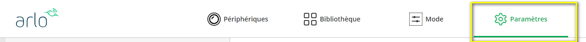
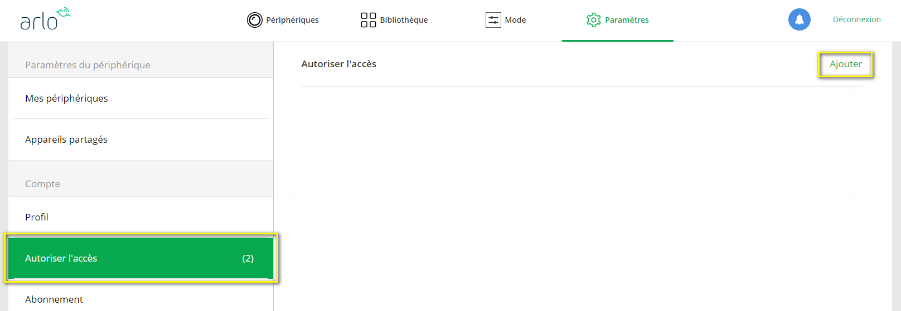
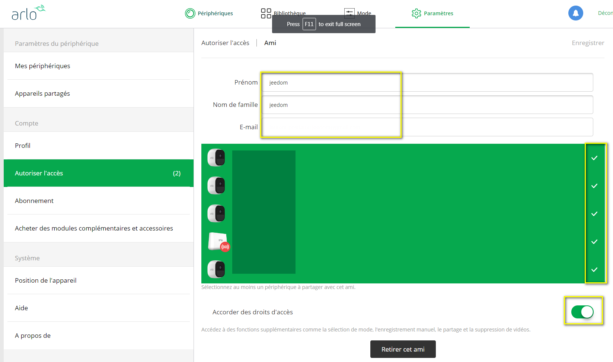
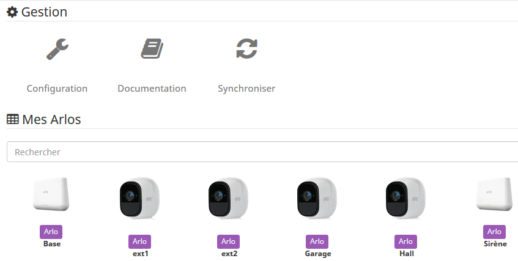
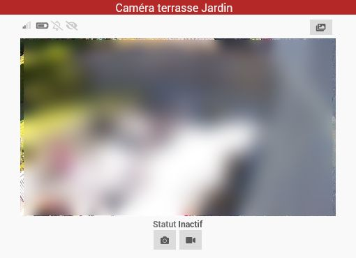
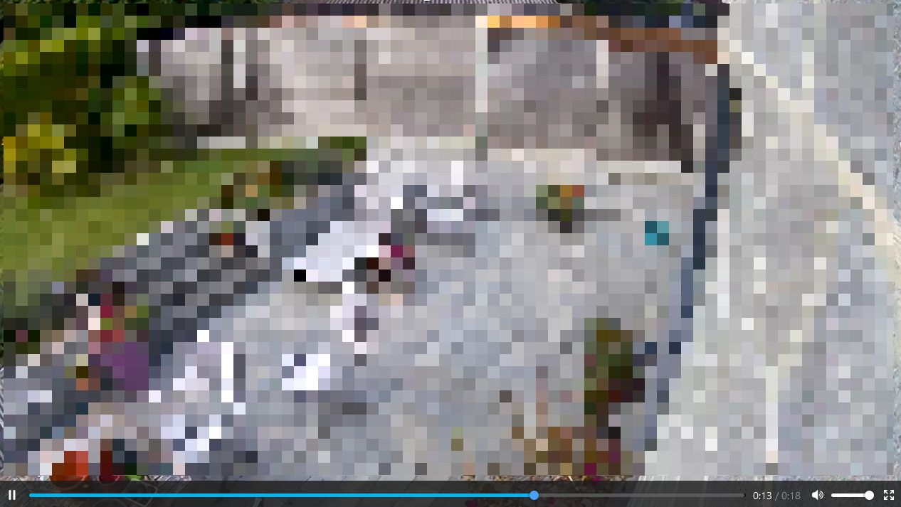
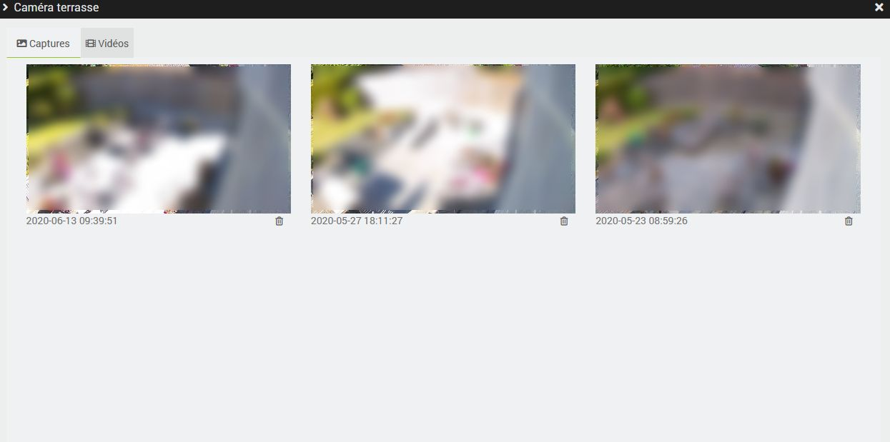
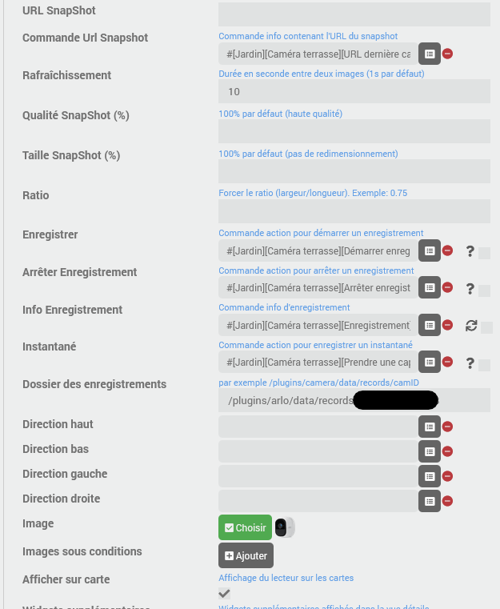
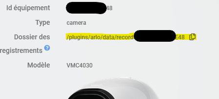

# Beschreibung

Plugin zur Steuerung von Geräten der Arlo-Reihe wie Kameras, Basisstation und integrierter Sirene.
Es ist möglich, den Modus sowie das Ein- und Ausschalten der Kameras zu steuern, den Live-Stream der Kameras anzusehen, Bildaufnahmen und Videoaufzeichnungen auszulösen sowie die Sirene zu aktivieren...

Alle aktuellen Modelle, die von der Arlo-App (Web oder Mobil) unterstützt werden, werden auch vom Plugin unterstützt: Arlo, Arlo Pro (alle Versionen), Ultra (alle Versionen), Arlo Floodlight, Arlo Essential, Arlo Q, Arlo Go, Arlo Baby, Arlo Security Bridge & Light, Arlo Doorbell und Video Doorbell...

Hier ein Überblick über die Funktionen des Plugins:

- Modus auswählen: Ein, Aus oder Zeitplan sowie alle benutzerdefinierten Modi;
- jede Kamera unabhängig voneinander aktivieren/deaktivieren (unabhängig vom aktuellen Modus);
- die in die Basisstation (oder in den Pro3 und Ultra) integrierte Sirene auslösen und deren Status abfragen;
- den Status jeder Kamera abrufen:
  - online oder offline
  - Allgemeiner Status (inaktiv, Alarm, ...)
  - Akkustand (und ob gerade aufgeladen wird)
  - Signalstärke
  - wenn die Ton- oder Bewegungserkennung aktiviert ist
  - wenn Geräusche oder Bewegungen erkannt werden
- einen Screenshot erstellen (lokal speichern)
- eine Aufzeichnung erstellen (lokal gespeichert)
- die aufgenommenen Screenshots und Videos anzeigen
- Eine in der Arlo-Cloud gespeicherte Aufzeichnung starten/beenden
- den Live-Stream Ihrer Kameras anzeigen
- die integrierte Lampe an kompatiblen Kameras überprüfen
- die integrierte Sirene an kompatiblen Kameras und Basisstationen steuern

> **Wichtig**
>
> Es wird nicht empfohlen, Kameras und Türklingeln der Serien Essentials oder Wire-free (also alle Kameras, die direkt über WLAN verbunden sind), wenn keine Basisstation im System vorhanden ist, es sei denn, diese werden ständig mit Strom versorgt (über das Stromnetz oder über ein Solarpanel bei ausreichender Sonneneinstrahlung), da ihre Batterie nicht genügend Autonomie bietet. Wenn eine Basisstation vorhanden ist, gibt es kein Problem.

# Unterstützte Versionen

| Komponente | Version |
|-----------|-----------------------------|
Debian | Bullseye (11) & Bookworm (12)
| Jeedom    | >= 4.4 |

> **Wichtig**
>
> Die Kompatibilität mit 32-Bit-Systemen (Raspbian 32-Bit auf Pi 3) wird in einer kommenden Version eingestellt.

# Installation

Um das Plugin zu nutzen, müssen Sie es wie jedes andere Jeedom-Plugin herunterladen, installieren und aktivieren.
Anschließend müssen die Abhängigkeiten installiert werden.

# Konfiguration

Arlo erlaubt keine gleichzeitigen Verbindungen eines Benutzers zu mehreren Schnittstellen: Wenn Sie über die App auf einem Mobilgerät angemeldet sind, können Sie sich nicht gleichzeitig auf einem anderen Mobilgerät oder über die Weboberfläche anmelden. Wenn Sie sich beispielsweise über die Weboberfläche anmelden, werden Sie automatisch von der mobilen App abgemeldet.
Das Plugin meldet sich als Standardbenutzer beim Arlo-System an und unterliegt daher denselben Einschränkungen.

Es ist daher erforderlich, einen eigenen Benutzer für das Plugin anzulegen; andernfalls funktioniert es nicht ordnungsgemäß.

## Zweistufige Authentifizierung

Arlo führt schrittweise die Verwendung der Zwei-Faktor-Authentifizierung ein.

Bevor Sie einen neuen Arlo-Benutzer anlegen, sollten Sie folgende Informationen bereithalten:

- Das Plugin verwaltet diese ausschließlich per E-Mail mit IMAP-Unterstützung. Sie benötigen daher ein E-Mail-Konto mit IMAP-Zugriff (dieser ist manchmal gesperrt oder kostenpflichtig, bitte prüfen Sie dies vorher) und es wird nur die Authentifizierung per _Benutzername_/_Passwort_ unterstützt; keine MFA für die E-Mail!
- Das Plugin muss direkten Zugriff auf das E-Mail-Konto des Arlo-Benutzers haben, da Arlo bei jeder Anmeldung den Code für die TFA anfordert! Sollte der Daemon also neu gestartet werden müssen, muss er den Code selbst abrufen können.
- Das Plugin liest nur E-Mails, die von „<do_not_reply@arlo.com>“ stammen; auch wenn es empfehlenswert ist, ein eigenes E-Mail-Konto zu verwenden und keinen Alias eines bestehenden Kontos, sollte dies kein Problem darstellen; Es markiert die E-Mails im Postfach als „gelesen“, sobald dies geschehen ist (und versucht beim nächsten Start nicht mehr, sie erneut zu lesen).
- Das Plugin durchsucht nur die ungelesenen E-Mails des aktuellen Tages in umgekehrter chronologischer Reihenfolge (von den neuesten bis zu den ältesten) und überspringt alle E-Mails, die vor dem letzten Login gesendet wurden.
- Die Sprache der E-Mail spielt keine Rolle: Die Suche nach dem TFA-Code funktioniert unabhängig von der Sprache der E-Mail.

> **Typ**
>
> Um sich künftig bei einem Gmail- (Google) oder Microsoft-E-Mail-Konto anzumelden, müssen Sie ein _App-Passwort_ erstellen, da die MFA-Authentifizierung für die Anmeldung nicht mehr erforderlich ist und die Option „Unsichere Apps“ nicht mehr aktiviert werden darf.
> Weitere Informationen zum Verfahren für Google finden Sie hier: <https://community.jeedom.com/t/google-applications-moins-securisees-mot-de-passe-dapplication/85617>.
> Für Microsoft-Konten (Outlook, Hotmail ...), lesen Sie bitte hier <https://support.microsoft.com/en-us/account-billing/how-to-get-and-use-app-passwords-5896ed9b-4263-e681-128a-a6f2979a7944>

Nachdem Sie ein E-Mail-Konto für das Plugin eingerichtet haben, können Sie mit dem nächsten Schritt fortfahren.

## Erstellen eines speziellen Arlo-Benutzers für das Plugin

- Öffnen Sie dazu <https://my.arlo.com> oder die mobile App;
- Klicken Sie oben rechts auf „Einstellungen“;

- Klicken Sie im Menü auf der linken Seite auf „Zugriff gewähren“ und anschließend rechts auf „Hinzufügen“.

- Geben Sie die erforderlichen Informationen ein, einschließlich einer neuen E-Mail-Adresse (ein Gmail-Alias, bei dem Sie beispielsweise „+jeedom“ vor „@gmail.com“ einfügen, funktioniert zwar, für die Zwei-Faktor-Authentifizierung empfehle ich jedoch die Verwendung einer E-Mail-Adresse, die ausschließlich für das Plugin bestimmt ist);
- **Wählen Sie die Arlo-Geräte** aus, auf die das Plugin zugreifen soll;
- **Aktivieren Sie die Option „Zugriffsrechte gewähren“**, um über Jeedom den Modus zu wechseln, eine Aufzeichnung zu starten, Screenshots zu machen usw.

- Klicken Sie auf „Einladung senden“
- Sie erhalten eine Bestätigungs-E-Mail, um Ihr neues Arlo-Konto einzurichten. Folgen Sie einfach den Anweisungen.

> **Typ**
>
> Melden Sie sich bei „My Arlo“ ab, öffnen Sie in Ihrem Browser ein „inkognito-Fenster“ oder verwenden Sie einen anderen Browser, um Ihr zweites Arlo-Konto zu erstellen.

## Einrichtung des Plugins

Auf der Konfigurationsseite des Plugins:

- Geben Sie Ihren Benutzernamen (die neue E-Mail-Adresse) und das zugehörige Arlo-Passwort ein.
- Wenn Sie die Zwei-Faktor-Authentifizierung aktiviert haben, geben Sie die IMAP-Adresse des Mail-Servers im Format _imap.server.com_ sowie den Benutzernamen und das Passwort des zugehörigen E-Mail-Kontos ein (oder das Anwendungspasswort im Falle eines Gmail-Kontos anstelle Ihres persönlichen Passworts) (nicht erforderlich, wenn die Zwei-Faktor-Authentifizierung für Ihr Arlo-Konto nicht aktiviert ist)
- Starten Sie den Daemon (falls er nicht automatisch startet)

Wenn die Anmeldedaten korrekt sind, sollte der Status auf „Grün“ wechseln und das Plugin beginnt mit der Synchronisierung Ihrer zuvor freigegebenen Geräte.

Auf dieser Seite können Sie auch die Aufbewahrungsregeln für Aufzeichnungen und Aufnahmen konfigurieren. Diese Regeln ermöglichen es dem Plugin, die ältesten (lokal gespeicherten) Medien automatisch zu löschen.

# Verwendung

Wenn das Plugin korrekt konfiguriert ist (siehe vorheriger Schritt), sollte die Liste der Arlo-Geräte angezeigt werden, die Sie bei der Erstellung des für das Plugin bestimmten Kontos freigegeben haben.

Es ist nicht möglich, ein Gerät manuell anzulegen. Geräte werden beim Abgleich mit dem Arlo-System automatisch vom Plugin angelegt oder aktualisiert. Ein Abgleich erfolgt mindestens einmal täglich automatisch; bei Bedarf kann ein Abgleich manuell über den Bildschirm zur Geräteverwaltung gestartet werden.

Das Plugin löscht niemals automatisch ein Gerät; wenn Sie das Gerät nicht mehr besitzen oder die Zugriffsrechte für das Plugin entfernt haben, wird empfohlen, das entsprechende Gerät manuell in Jeedom zu löschen.
Wenn Sie ein neues Gerät hinzufügen oder die Modi über die Arlo-App ändern, wird empfohlen, eine manuelle Synchronisierung durchzuführen, um die Konfiguration des Plugins sofort zu aktualisieren; andernfalls erfolgt dies bei der nächsten automatischen Synchronisierung.

> **Typ**
>
> Dies gilt natürlich nicht für Befehlswerte wie den ausgewählten Modus oder die Bewegungs- oder Geräuscherkennung, die in Echtzeit aktualisiert werden.

Für die meisten Geräte ist keine spezielle Konfiguration erforderlich; der Gerätename entspricht dem im Arlo-System festgelegten Namen. Denken Sie jedoch daran, das übergeordnete Gerät und die Kategorie zuzuweisen und das Gerät zu aktivieren.

Für Kameras und ähnliche Geräte kann ein Aktions-/Meldungsbefehl konfiguriert werden (viele Plugins unterstützen dies). Ist dieser konfiguriert, sendet das Plugin eine Meldung einschließlich des Bildes, sobald ein neues Bild empfangen wird.

# Die Ausstattung

> **Wichtig**
>
> Es wird nicht empfohlen, batteriebetriebene Geräte zu verwenden (es sei denn, sie werden regelmäßig aufgeladen, z. B. über ein Solarpanel bei ausreichender Sonneneinstrahlung) und direkt mit dem WLAN zu verbinden, wenn keine Basisstation im System vorhanden ist, da deren Akku nicht über eine ausreichende Laufzeit verfügt, um Ereignisse an Jeedom zu übermitteln. Wenn eine Basisstation vorhanden ist, gibt es kein Problem, auch wenn einige Geräte direkt mit dem WLAN verbunden sind.

Es kann sein, dass bestimmte modellbezogene Bestellungen (noch) nicht verfügbar sind. In diesem Fall kontaktiere mich bitte über das Forum, um weitere Informationen zu erhalten.

> **Typ**
>
> Wenn ein Gerät (Hub, Kamera, Türklingel...) hinzugefügt wird, muss der Daemon neu gestartet werden, damit es unter Jeedom ordnungsgemäß funktioniert.

## Wechsel des Modus

Je nach Ihrer Installation und der Konfiguration Ihres Arlo-Kontos können Sie den Betriebsmodus Ihrer Geräte festlegen, der bestimmt, ob diese Geräusche und/oder Bewegungen erkennen oder deaktiviert sind.

Es scheint, dass dies für Konten, die bis Ende 2023 erstellt wurden, auf allen Geräten vom Typ „Basisstation/Hub“ möglich ist, d. h.: Basisstationen, eigenständige Kameras oder Türklingeln wie Arlo Go, Arlo Q, Arlo Baby, Essential...
Jedes dieser Geräte verfügt über eine Steuerung mit festgelegten Betriebsmodi: Ein, Aus und benutzerdefinierte Modi sowie eine Info-Anzeige, die den aktiven Modus anzeigt.

Bestimmte Nutzer – vermutlich diejenigen, die ihr Konto ab Ende 2023 erstellt haben – verfügen über ein zusätzliches Gerät vom Typ „Standort“, das Sie ebenfalls in Ihrer Arlo-App konfiguriert haben.
Wie bei den oben genannten Geräten wird eine Steuerung nach dem jeweils aktiven Modus verfügbar sein. Wenn dies bei Ihnen der Fall ist, hat es keinen Sinn, die Modi an den Geräten zu ändern, da nur der Modus dieses „Standort“-Geräts berücksichtigt wird und daher dieser verwendet werden muss.

## Sirene

Geräte mit integrierter Sirene (Hub, Essential, Pro, Ultra...) verfügen über folgende Bedienelemente zur Steuerung der Sirene:

- **Sirenenstatus**: Zeigt an, ob die Sirene aktiv ist
- **Sirene ein**: Zum manuellen Auslösen der Sirene
- **Sirene aus**: Zum Ausschalten der Sirene

## Lampe

Geräte mit integrierter Beleuchtung (Essential, Pro, Floodlight, Ultra...) verfügen über folgende Bedienelemente zur Steuerung des Beleuchtungsstatus:

- **Lampenstatus**: Zeigt an, ob die Lampe derzeit ein- oder ausgeschaltet ist
- **Lampe ein**: Zum manuellen Einschalten der Lampe (während der in der Arlo-App festgelegten Standardzeit)
- **Lampe aus**: Zum manuellen Ausschalten der Lampe

## Die Kameras

Die folgenden Befehle sind bei allen Modellen verfügbar:

- **Verbindung**: Zeigt an, ob die Verbindung zur Kamera besteht
- **Aktivität**: Gibt eine Beschreibung der aktuellen Aktivität der Kamera an
- **Aktiv**: Zeigt an, ob die Kamera derzeit aktiv ist
- **Ein**: Schaltet die Kamera ein; sie wird von Moduswechseln beeinflusst
- **Aus**: Schaltet die Kamera aus; sie ist von Moduswechseln nicht betroffen
- **Akku**: Akkustand in %
- **Signal**: Signalstärke (zwischen 0 und 4) bei der Basisstation für Arlo Pro, Pro 2 und Ultra sowie Mobilfunk-Signalstärke bei ArloGo
- **Ladevorgang**: Zeigt an, ob die Kamera gerade geladen wird
- **Bewegungserkennung**: Zeigt an, ob die Bewegungserkennung aktiviert ist
- **Geräuscherkennung**: Zeigt an, ob die Geräuscherkennung aktiviert ist
- **Bewegung erkannt**: Wenn eine Bewegung erkannt wird
- **Ton erkannt**: Wenn ein Ton erkannt wird
- **Letztes Bild**: (lokaler) Pfad zum zuletzt von der Kamera aufgenommenen Bild
- **URL des letzten Bildes**: (Lokale) URL zum letzten von der Kamera aufgenommenen Bild
- **Bild aufnehmen**: Ermöglicht es, mit der Kamera ein Bild aufzunehmen (das lokal gespeichert wird)
- **Screenshot senden**: Ermöglicht es, einen Screenshot (der lokal gespeichert wird) aus einem Szenario heraus zu senden, indem der zu verwendende Benachrichtigungsbefehl ausgewählt wird
- **Aufzeichnung senden**: Ermöglicht das Senden einer Videoaufzeichnung (die lokal gespeichert wird) aus einem Szenario heraus, indem der zu verwendende Benachrichtigungsbefehl ausgewählt wird
- **Aufnahme starten**: Hiermit wird die Videoaufnahme gestartet (lokal gespeichert)
- **Aufnahme beenden**: Hiermit können Sie eine lokale Aufnahme beenden
- **Cloud-Aufzeichnung starten**: Hiermit starten Sie die Aufzeichnung in der Arlo-Cloud
- **Cloud-Aufzeichnung beenden**: Hiermit können Sie die Aufzeichnung in der Arlo-Cloud beenden

Das Widget weist einige Besonderheiten auf. Oben von links nach rechts sehen Sie:

- die Signalstärke der Basisstation
- der Ladezustand des Akkus
- die Geräuschanzeige, 3 mögliche Zustände: Erkennung deaktiviert, Überwachung aktiv, Geräusch erkannt.
- Der Bewegungsmelder, wiederum mit drei möglichen Zuständen: Erkennung deaktiviert, Überwachung aktiv, Bewegung erkannt.
- eine Schaltfläche zum Öffnen der Bibliothek, in der Sie die lokal gespeicherten Aufnahmen und Aufzeichnungen anzeigen können.

Anschließend wird das zuletzt von der Kamera aufgenommene Bild angezeigt. Wenn Sie darauf klicken, können Sie den Kamerastream nahezu in Echtzeit ansehen (mit einer Verzögerung von wenigen Sekunden).

Und darunter eine Schaltfläche, um einen Screenshot zu machen und die (lokale) Aufzeichnung zu starten.

## Arlo Baby

Die Integration der Arlo Baby ist abgeschlossen. Die Kamera und alle ihre Funktionen lassen sich nun vollständig über das Plugin steuern: das Nachtlicht, das Schlaflied und das Abrufen der Daten der Luftqualitätssensoren.

Hier ein Überblick über die verfügbaren Befehle:

- **IP**: die IP-Adresse der Kamera
- **Helligkeit**: Helligkeit im Raum
- **Temperatur**: Raumtemperatur
- **Feuchtigkeit**: in Prozent
- **Luftqualität**: in Prozent; wobei weniger als 30 % als „normal“, 30 % bis 65 % als „anormal“ und mehr als 65 % als „sehr abnormal“ gelten (gemäß den Unterlagen von Arlo)
- **Zündflamme**: Zeigt an, ob die Zündflamme derzeit brennt oder erloschen ist.
- **Nachtlicht Ein** und **Nachtlicht Aus**: zum Ein- und Ausschalten des Nachtlichts
- **Nachtlichtmodus**: Die verfügbaren Modi sind: _Weiß_, _Farbe_, _Lichtspiel_
- **Helligkeit des Nachtlichts**: Info- und Aktionsbefehle sowie zum Anpassen der Helligkeit des Nachtlichts
- **Standby-Farbe**: Befehle für Info und Aktion sowie zum Ändern der Standby-Farbe (im Modus _Farbe_)
- **Farbtemperatur**: Befehle „Info“ und „Aktion“ sowie zum Ändern der Farbtemperatur (im Modus „Weiß“), Wert zwischen 2500 K und 9000 K
- **Zündflammen-Timer**: Info- und Aktionsbefehle zum Einstellen des Timers sowie zum Ablesen der verbleibenden Zeit (in Minuten) bis zum automatischen Erlöschen der Zündflamme
- **Lesen**: Ein Binärbefehl und ein String-Befehl, die den Lesestatus des Wiegenlieds angeben
- **Wiedergabe**, **Pause**, **Weiter**: Befehle zur Steuerung des Wiedergabestatus
- **Titel**: Zeigt den ausgewählten Titel an, und **Wiedergabeliste** zeigt die Liste der verfügbaren Titel an
- **Wiederholung**: Befehle „Info“ und „Aktion“ zum Aktivieren und Deaktivieren des Wiederholungsmodus: Endloswiedergabe oder Wiedergabe eines einzelnen Titels
- **Zufällig**: Befehle „Info“ und „Aktion“ zum Aktivieren und Deaktivieren des Zufallsmodus
- **Lautstärke**: Hier können Sie die Lautstärke des Schlafliedes anzeigen und ändern (in %)
- **Schlaflied-Timer**: Info- und Aktionsbefehle zum Einstellen des Timers sowie zum Abfragen der verbleibenden Zeit (in Minuten) bis zum automatischen Ausschalten des Schlaflieds

## Zum Bereich gehen

Auf der Arlo GO stehen außerdem folgende Steuerungsmöglichkeiten zur Verfügung:

- **Netzwerkname**: Zeigt den Namen des Mobilfunknetzes an
- **IP**: die aktuelle IP-Adresse
- **Aktives Netzwerk**: Zeigt das derzeit aktive Netzwerk an (WLAN oder Mobilfunk)

## Arlo Security Bridge & Light

Die „Light“-Ausstattung verfügt über folgende Bedienelemente:

- **Lampenstatus**: Zeigt an, ob die Lampe derzeit ein- oder ausgeschaltet ist
- **Lampe ein**: Zum manuellen Einschalten der Lampe (während der in der Arlo-App festgelegten Standardzeit)
- **Lampe aus**: Zum manuellen Ausschalten der Lampe
- **Bewegungserkennung**: Zeigt an, ob die Bewegungserkennung aktiviert ist
- **Bewegung erkannt**: Wenn eine Bewegung erkannt wird
- **Verbindung**: Zeigt an, ob die Verbindung besteht
- **Akku**: Akkustand in %
- **Ladevorgang**: Zeigt an, ob das Gerät gerade geladen wird

## Arlo-Türklingel und Video-Türklingel

Die Klingel verfügt über folgende Bedienelemente:

- **Verbindung**: Zeigt an, ob die Verbindung besteht
- **Akku**: Akkustand in %
- **Signal**: Signalstärke (zwischen 0 und 4) gegenüber der Basisstation
- **Bewegung erkannt**: Wenn eine Bewegung erkannt wird
- **Taste**: ob die Klingeltaste betätigt wurde (sie bleibt nach dem letzten Tastendruck noch 1 Minute lang aktiv)
- **Stummschaltung**: Zeigt an, ob die Stummschaltung aktiviert ist
- **Stummschaltung ein**: Zum Aktivieren der Stummschaltung
- **Stummschaltung aus**: Hiermit wird die Stummschaltung deaktiviert

### Arlo Video-Türklingel

Zusätzlich zu den oben genannten Funktionen verfügt die Video-Türklingel über einige Funktionen, die auch bei Kameras üblich sind:

- **Aktivität**: Gibt eine Beschreibung der aktuellen Aktivität der Kamera an
- **Ladevorgang**: Zeigt an, ob die Kamera gerade geladen wird
- **Bewegung erkannt**: Wenn eine Bewegung erkannt wird
- **Letztes Bild**: URL (lokal) zum zuletzt von der Kamera aufgenommenen Bild
- **Bild aufnehmen**: Ermöglicht es, mit der Kamera ein Bild aufzunehmen (das lokal gespeichert wird)
- **Aufnahme starten**: Hiermit wird die Videoaufnahme gestartet (lokal gespeichert)
- **Aufnahme beenden**: Hiermit können Sie eine lokale Aufnahme beenden
- **Cloud-Aufzeichnung starten**: Hiermit starten Sie die Aufzeichnung in der Arlo-Cloud
- **Cloud-Aufzeichnung beenden**: Hiermit können Sie die Aufzeichnung in der Arlo-Cloud beenden

# Anzeige des Videostreams der Kameras – Live-Streaming

Wenn Sie auf das Miniaturbild im Widget klicken, können Sie den Kamerastream starten.
Das Video wird in einem neuen Fenster geöffnet, und natürlich kann man auf Vollbild umschalten:

Es handelt sich um einen Live-Videostream; die Kamera und der Stream werden beendet, sobald das Fenster geschlossen wird.

# Die Bibliothek

Wenn eine lokale Videoaufzeichnung erfolgt oder wenn das Plugin ein Bild aufnimmt oder bei Bewegungserkennung ein Bild von Arlo empfängt, können diese über die Bibliothek jeder Kamera abgerufen werden.

Auf diesem Bildschirm, der eine Übersicht über die aufgenommenen Screenshots und Videos anzeigt, können Sie die Dateien auf Wunsch direkt und endgültig löschen; andernfalls übernimmt das Plugin dies automatisch gemäß den in den Einstellungen festgelegten Regeln.
Sie können auch auf die Screenshots klicken, um sie in einem größeren Fenster anzuzeigen, oder auf die Videos, um die Wiedergabe zu starten.

# Integration mit Jeedom Connect

Sie können das Kamera-Widget von [Jeedom Connect]({{site.market}}/index.php?v=d&p=market_display&id=4077) verwenden, um Arlo-Kameras in diese mobile App zu integrieren.

Dazu empfehle ich folgende Konfiguration:

- den Befehl **URL der letzten Aufnahme** der Kamera (der eine Textinformation zurückgibt, die mit „http“ beginnt und auf Ihr Jeedom verweist, nicht der, der das Arlo-Bild liefert) für die Konfiguration „_Befehl URL Snapshot_“ des Widgets
- die Befehle **Aufnahme starten**, **Aufnahme beenden** und **Aufnahme** für die Konfigurationen _Aufnahme_, _Aufnahme beenden_ und _Aufnahme-Info_ des Widgets
- In der Konfiguration unter „Aufzeichnungsordner“ müssen Sie den Pfad kopieren, der auf der Konfigurationsseite der Arlo-Kamera angezeigt wird, wie auf diesem Screenshot zu sehen ist:

Sie können die kleine Schaltfläche „Kopieren“ rechts neben dem Pfad verwenden, um diesen in die Zwischenablage zu kopieren. Anschließend müssen Sie die Informationen nur noch in die Widget-Einstellungen auf Jeedom Connect einfügen.

Derzeit ist es nicht möglich, den Live-Videostream über die Jeedom Connect-App anzusehen.

# Änderungsprotokoll

[Siehe Änderungsprotokoll](./changelog)

# Support

Wenn Sie ein Problem haben, lesen Sie zunächst die neuesten Beiträge zum Plugin unter [Community]({{site.forum}}/tag/plugin-{{page.pluginId}}).

Sollten Sie dennoch keine Antwort auf Ihre Frage finden, zögern Sie nicht, ein neues Thema zu erstellen, und vergessen Sie dabei nicht, das Plugin-Tag ([plugin-{{page.pluginId}}]({{site.forum}}/tag/plugin-{{page.pluginId}})) anzugeben.

Es müssen mindestens folgende Angaben gemacht werden:

- ein Screenshot der Jeedom-Seite „Gesundheit“
- ein Screenshot der Konfigurationsseite des Plugins
- alle verfügbaren Protokolle des Plugins, auf der Stufe _INFO_, als `vorformatierter Text` eingefügt (Schaltfläche `</>` in der Community), keine Dateien!
- je nach Fall einen Screenshot des aufgetretenen Fehlers, einen Screenshot der problematischen Konfiguration...
