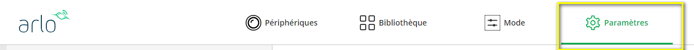
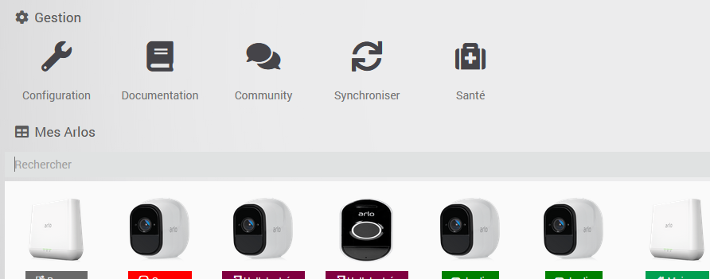
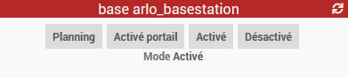
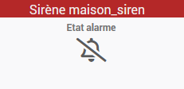
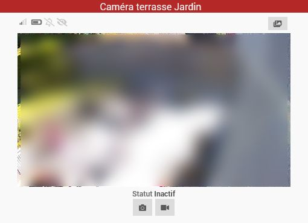
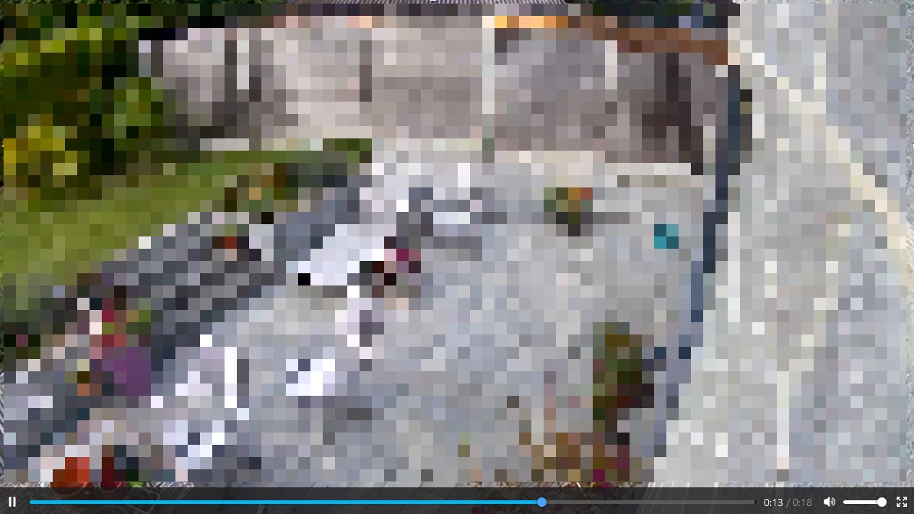
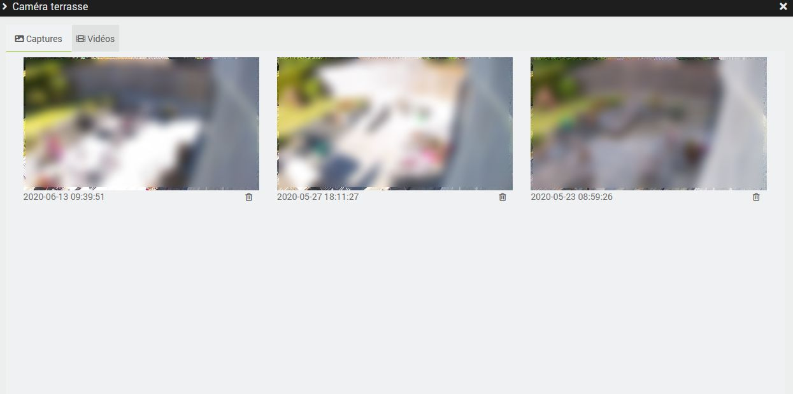
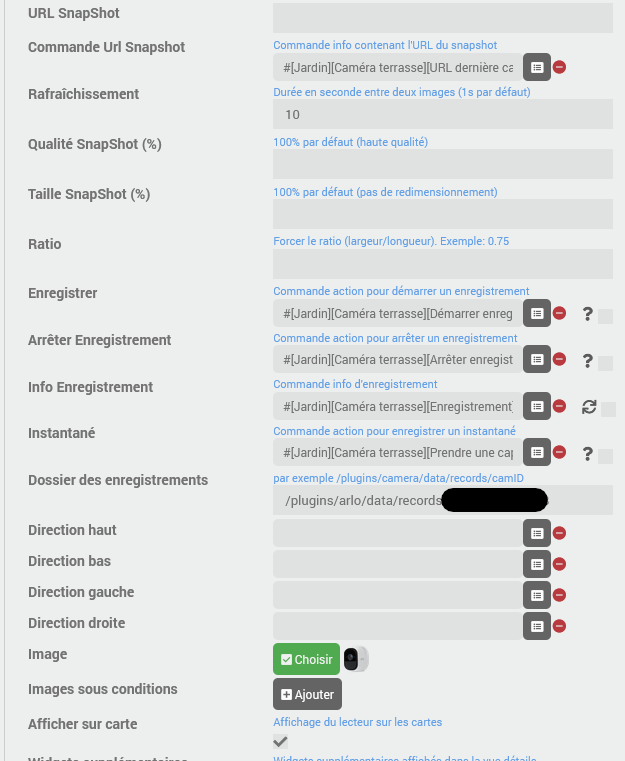
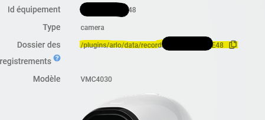

# Description

Plugin for controlling Arlo equipment such as cameras, base station and doorbells.
It is possible to control the mode, the activation and deactivation of the cameras, view the live stream of the cameras, trigger video captures and recordings, trigger the siren ...

All current models supported by the Arlo application (web or mobile) are supported by the plugin: Arlo, Arlo Pro, Pro2, Pro3, Pro4, Ultra, Arlo Floodlight, Arlo Essential, Arlo Q, Arlo Go, Arlo Baby, Arlo Doorbell and Video Doorbell...

Here is an overview of the possibilities of the plugin:

- select mode: Activated, Deactivated or schedule but also all custom modes;
- Enable / disable each camera independently of each other (regardless of the current mode);
- trigger the siren integrated to the base station (or Pro3 and Ultra camera) and know its status;
- get the status of each camera:
  - connected or not
  - general status (inactive, alert, ...)
  - battery level (and if charging is in progress)
  - signal strength
  - if sound or motion detection is active
  - if sound or motion is detected
- take a snapshot (stored locally)
- record video (stored locally)
- view snapshots and videos
- start/stop recording stored in Arlo cloud
- view live streaming of your cameras
- control the light on compatible cameras
- control de siren on compatible cameras

> **Important**
>
> It is not recommended to use Essentials cameras and doorbells if no base exists in the system, except if they have power supply (from grid or from a solar panel if sufficient sunlight) because their battery does not provide sufficient autonomy. If a base exists then no problem.

# Installation

> **Important**
>
> It is essential to be under Debian 10 Buster minimum to run the plugin.

In order to use the plugin, you must download, install and activate it like any Jeedom plugin.
Then you need to install dependencies.

# Configuration

Arlo does not allow simultaneous connections from one user to multiple interfaces: if you are logged into the app on one mobile, you will not be able to be on another mobile at the same time or on the web interface. If you connect to the web interface for example you will be automatically disconnected from the mobile app.
The plugin connects to the Arlo system as a standard user and will therefore be subject to the same constraint.

It is therefore necessary to create a user dedicated to the plugin, otherwise it will not work properly.

## 2-step authentication

Arlo is gradually enforcing the use of 2-step authentication.

> **Tip**
>
> Nowadays, it is still possible to not enable 2-step authentication in Arlo, so this step is optional.

Before creating a new Arlo user, it is important to know the following information:

- The plugin manages this via email with IMAP support only, so you will need a mailbox with IMAP access (it is sometimes blocked or not free so check before) and only supports authentication by _username_ /_password_ ; no MFA on the mail!
- The plugin must have direct access to the arlo user's mailbox, indeed the code for the TFA is requested by Arlo at each login! So if the daemon has to restart it must be able to retrieve the code itself.
- the plugin will only read the mail coming from *do_not_reply@arlo.com*; so even though it is recommended to have a dedicated mailbox and not an alias of an existing mailbox, this shouldn't be a problem; it will flag the emails as "read" in the box when done (and will no longer try to read them on the next start)
- the plugin will only search among the unread mails of the current day, in reverse chronological order (from the most recent to the oldest) and will skip all the mails sent before its last login.
- the language of the email is not important: the search for the TFA code will work regardless of the language of the email.

> **Tip**
>
> for Gmail, you must:
>
> - either activate _nonsecure_ applications if MFA is not active on the account
> - or create an _application password_ which will not require the MFA

After creating an email box for the plugin, you can go to the next step.

## Creating a Arlo user dedicated to the plugin

- For this, open <https://my.arlo.com> or open the mobile app;
- Click on &quot;Settings&quot; at the top right;

- Click on &quot;Allow access&quot; in the left menu and then on &quot;Add&quot; on the right.

- Enter the requested information including a new email address (a gmail alias by adding +jeedom before @gmail.com for example will work however for 2-step authentication I recommend to use a dedicated email address for the plugin);
- **Select the Arlo devices** that the plugin will access;
- **Enable the option "Grant access rights"** to be able to change modes, start recording, take snapshots etc from Jeedom.

- Click on "Send an invitation"
- You will receive a confirmation email to create your new Arlo account, simply follow the procedure.

> **Tip**
>
> Log out of &quot;My Arlo&quot;, open a &quot;private window&quot; on your browser or use another browser to create your second Arlo account.

## Plugin configuration

On the plugin configuration page:

- Enter your user (the new email address) and the associated Arlo password.
- If you have enabled 2-step authentication, enter the IMAP address of the mail server in the form _imap.server.com_ as well as the username and password of the associated mailbox (not necessary if TFA is not active)
- Start the daemon (if it does not start on its own)

If the credentials are correct, the status should turn green and the plugin will start to synchronize devices that you shared on previous step.

On this page, it is also possible to configure the retentions rules of snapshots and records, these rules allow the plugin to automatically delete the oldest medias (saved locally).

# Usage

If the plugin is correctly configured (see previous step), you should see the list of Arlo devices that you shared when creating the plugin account.

It is not possible to manually create a device. The devices are automatically created or updated by the plugin during synchronization with the Arlo system. Synchronization will be done automatically at least once a day, if necessary it is possible to start a synchronization manually via the device management screen.

The plugin will never automatically delete a device; if you no longer have the device or if you have removed the access rights for the plugin, it is recommended to manually delete the corresponding device in Jeedom.
If you add a new device or change the modes via the Arlo application, it is recommended to do a manual synchronization to update the plugin configuration immediately; otherwise, this will be done during the next automatic synchronization.

> **Tip**
>
> This obviously does not affect the values of the commands such as the selected mode or motion or sound detection which are updated in real time.

For most of the devices there is no specific configuration, the name of the device will be the one defined in Arlo platform, but remember to assign the parent object, the category and activate it.

For camera devices, it is possible to configure an action command of the Mail or Telegram plugin. If this one is configured, the plugin will send a message, including the snapshot, as soon as a new one is available.

# Compatible devices

It is possible that some specific commands to certain models are not (yet) available, in this case please contact me via the forum for more information.

## The base station for Arlo pro, pro2, pro3 & ultra

The base station has one action command by available mode: Activated, Deactivated and each custom mode and an info command for the active mode.

The widget is Jeedom's default one:

> **Tip**
>
> When adding a base station, it is necessary to restart the daemon so the events related to this station are correctly received.

## The siren (integrated in the base station)

This device has the following commands to control the siren:

- **Siren status**: Indicates if the siren is active
- **Siren On**: To manually turn on the siren
- **Siren Off**: To turn off the siren

The widget is also the default one:

## Cameras

The following models are currently supported by the plugin:

- Baby
- pro, pro2, pro3, ultra
- Floodlight
- Essential
- Go
- Arlo Q

The following commands are available on all model:

- **Connection**: true if the camera is actually connected
- **Activity**: description of current activity of the camera
- **Active**: indicates if the camera is currently active
- **On**: Enable the camera, it will be affected by the mode changes
- **Off**: Disable camera, it will not be affected by mode changes
- **Battery**: battery level in %
- **Signal**: signal strength (between 0 and 4) with base for Arlo pro, pro2 and ultra and mobile signal strength for ArloGo
- **Charging**: true if camera battery is charging
- **Motion detection**: Indicates if motion detection is active
- **Sound detection**: indicates if sound detection is active
- **Motion detected**: if motion is detected
- **Sound detected**: if sound is detected
- **Last image**: URL (local) to the last image taken by the camera
- **Take a snapshot**: take a snapshot (saved locally) with the camera
- **Start record**: to start recording video (saved locally)
- **Stop record**: to stop recording video
- **Start cloud record**: to start recording a video in Arlo cloud
- **Stop cloud record**: to stop recording video in Arlo cloud

The widget has some specificity. On the top from left of right you will see:

- the signal strength with the base station
- the level of the battery
- sound indicator, 3 states possible: detection deactivated, detection activated, sound detected.
- the motion indicator, again 3 possible states: detection deactivated, detection activated, motion detected.
- a button to open the library, in it you will be able to see the captures and videos saved locally.

Then the last snapshot taken by the camera is displayed, by clicking on it you will be able to see the live stream (with few seconds delay)

And below a button to take a snapshot and start (local) video record

## Arlo Q

On top of common commands to all cameras, the Arlo Q have an action command for each existing mode as for the base station: enabled, disabled and each custom mode and also an info command indicating the active mode.

## Arlo Baby

On top of common commands to all cameras, the Arlo Baby have an action command for each existing mode as for the base station: enabled, disabled and each custom mode and also an info command indicating the active mode.

The integration of the Arlo Baby is complete, it is possible to fully manage the camera and all of its functions from the plugin: the night light, the lullaby and retrieve information from the air quality sensors.

Here is an overview of the available commands:

- **IP**: camera IP
- **Brightness**: brightness of the room
- **Temperature**: room temperature
- **Humidity**: in percent
- **Air quality**: in percent; less than 30% being "normal", 30% to 65% being "abnormal" and more than 65% being "Very abnormal" (according to Arlo documentation)
- **Nightlight**: Indicates whether the nightlight lamp is currently on or off.
- **Nightlight On** and **Nightlight Off**: to switch the nightlight on and off
- **Nightlight mode**: the possible modes are: _White_, _Color_, _Rainbow_
- **Nightlight brightness**: info and action commands to change the nightlight brightness
- **Nightlight color**: info and action commands to change the nightlight color (in _Color_ mode)
- **Color temperature**: info and action commands to change the color temperature (in _White_ mode), value between 2500K and 9000K
- **Nightlight timer**: info and action commands to set the timer as well as to know the remaining time (in minute) before the automatic switch-off of the nightlight
- **Playing**: a binary command and a string command giving the reading status of the lullaby
- **Play**, **Pause**, **Next**: command to act on the playback status
- **Track**: gives the selected track and **Playlist** gives the list of available tracks
- **Repeat**: info and action commands to activate and deactivate repeat mode: continuous or single track playback
- **Random**: info and action commands to activate and deactivate random mode
- **Volume**: allows you to know and change the volume of the lullaby (in %)
- **Lullaby timer**: info and action commands to set the timer as well as to know the remaining time (in minute) before the automatic shutdown of the lullaby

## Arlo Go

On top of common commands to all cameras, the Arlo Go have an action command for each existing mode as for the base station: enabled, disabled and each custom mode and also an info command indicating the active mode.

On top, following commands are also available:

- **Network Name**: Gives the name of the mobile network
- **IP**: current IP address
- **Active network**: indicates the current active network (wifi or mobile)

> **Tip**
>
> When adding a Arlo Go, Arlo Q or Arlo Baby camera, it is necessary to restart the daemon so the related events are correctly received.

## Arlo Essential

On top of common commands to all cameras, the Arlo Essential cameras have commands to control the integrated light.

- **Lamp status**: Indicates whether the lamp is currently on or off
- **Lamp On**: To turn on the lamp manually (during the default delay set in the Arlo app)
- **Lamp Off**: To manually turn off the lamp

## Arlo Essential Indoor

On top of common commands to all cameras, the Arlo Essential indoor cameras have commands to control the integrated siren.

- **Siren status**: Indicates if the siren is active
- **Siren On**: To manually turn on the siren
- **Siren Off**: To turn off the siren

## Arlo Pro3, Pro3 Floodlight, Pro4 & Ultra

On top of common commands to all cameras, the Arlo Pro3, Pro3 Floodlight, Pro4 and Ultra have commands to control the siren and the light integrated in the camera.

- **Lamp status**: Indicates whether the lamp is currently on or off
- **Lamp On**: To turn on the lamp manually (during the default delay set in the Arlo app)
- **Lamp Off**: To manually turn off the lamp
- **Siren status**: Indicates if the siren is active
- **Siren On**: To manually turn on the siren
- **Siren Off**: To turn off the siren

## Arlo security bridge & light

As for the base station (see above), the bridge device has an action command by defined mode: activated, deactivated and each personalized mode as well as an info command indicating the active mode but also a info command &quot;IP&quot; and a &quot;Signal&quot;.

> **Tip**
>
> When adding a Arlo bridge, it is necessary to restart the daemon so the events related to this bridge (and all connected lights) are correctly received.

The &quot;light&quot; device has the following commands:

- **Lamp status**: Indicates whether the lamp is currently on or off
- **Lamp On**: To turn on the lamp manually (during the default delay set in the Arlo app)
- **Lamp Off**: To manually turn off the lamp
- **Motion detection**: Indicates if motion detection is active
- **Motion detected**: if motion is detected
- **Connection**: indicates if the connection is operational
- **Battery**: battery level in %
- **Charging**: true if device battery is charging

## Arlo Doorbell and Video Doorbell

The doorbell has the following commands:

- **Connection**: indicates if the connection is operational
- **Battery**: battery level in %
- **Signal**: signal strength (between 0 and 4) with base station
- **Motion detected**: if motion is detected
- **Button**: if the button has been pressed (it will remain active for 1 min after the last press)
- **Silent mode**: Indicates if silent mode is enabled
- **Silent mode On**: Enable silent mode
- **Silent mode Off**: Disable silent mode

### Arlo Video Doorbell

In addition to the above commands, the Video Doorbell has some of the commands common to the cameras:

- **Activity**: description of current activity of the camera
- **Charging**: true if camera battery is charging
- **Motion detected**: if motion is detected
- **Last image**: URL (local) to the last image taken by the camera
- **Take a snapshot**: take a snapshot (saved locally) with the camera
- **Start record**: to start recording video (saved locally)
- **Stop record**: to stop recording video
- **Start cloud record**: to start recording a video in Arlo cloud
- **Stop cloud record**: to stop recording video in Arlo cloud

### Arlo Video doorbell wire-free

I do not recommend using this doorbell from the Arlo Essentials range with Jeedom without having connected it to an Arlo hub. Indeed, although it is connected to power to recharge it the battery does not hold the charge if you want to use it "normally".

For this reason, event management is disabled on this doorbell when it is the only device you have, the information will therefore not be updated automatically under Jeedom, i.e. mainly no motion detection and no information if someone rings.

Nevertheless, this doorbell has a **Refresh** command to update its status "manually", so you are free to call this command when you need it or regularly via scenario... You have to find the compromise between your use and battery life.

All the action commands will work normally but you may notice a small additional delay of maximum 10s on this doorbell compared to another device. Indeed, before performing the action, the plugin will have to reestablish the connection which is not maintained permanently to save battery.

After performing the action, the plugin will remain connected to the doorbell for about 30 seconds before cutting the link, so information may be sent back to Jeedom during this time.

Each time the daemon is started, the plugin will also refresh the state once.

# Viewing the video stream from the cameras - live streaming

By clicking on the thumbnail on the widget, you can start the streaming.
The video will open in a new window and it is obviously possible to switch to full screen:

It is a continuous video stream, the camera and the stream will stop when the window will be closed.

# The library

When a local video recording is made or when a capture is taken by the plugin or received from Arlo in the event of motion detection, these can be viewed via the library tools of each camera.

In this screen showing an overview of the captures and videos taken, you can directly and permanently delete the files if you wish, otherwise the plugin will take care of them automatically according to the rules defined in the configuration.
You can also click on the captures to view them in a larger window or on the videos to start playback.

# Jeedom Connect integration

It is possible to use the camera widget of [Jeedom Connect]({{site.market}}/index.php?v=d&p=market_display&id=4077) to integrate Arlo cameras with this mobile application.

For this, I recommend the following configuration:

- the command **Last capture URL** of camera device (the one that returns a text info starting with http pointing to your jeedom, not the one giving the Arlo image) for the _Snapshot Url command_ config of the widget
- the commands **Start recording**, **Stop recording** and **Recording** for the _Save_, _Stop recording_ and _Recording info_ configs of the widget
- In the _Records folder_ config, you must copy the path displayed in the Arlo camera configuration page as visible in this capture:

You can use the small "copy" button to the right of the path to copy it to the clipboard and you just have to paste the information in the configuration of the widget on Jeedom Connect

Currently, it is not possible to view the live video stream from Jeedom Connect application.

# Changelog

[See the changelog](./changelog)

# Support

If despite this documentation and after having read the topics related to the plugin on [community]({{site.forum}}/tags/plugin-{{page.pluginId}}) you do not find an answer to your question, do not hesitate to create a new topic with the tag of the plugin ([plugin-{{page.pluginId}}]({{site.forum}}/tags/plugin-{{page.pluginId}})).
