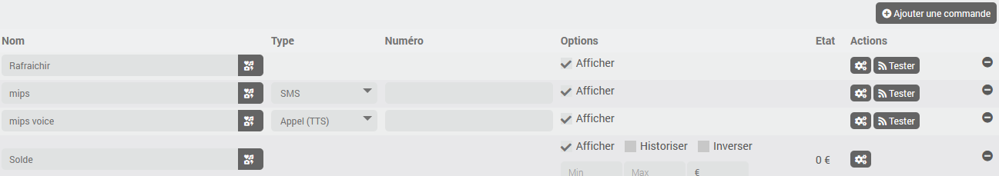

# Description

Plugin to integrate the [ClickSend](https://www.clicksend.com) platform, which allows you to send text messages (SMS) or voice messages (TTS)

# Supported Versions

| Component | Version                     |
|-----------|-----------------------------|
| Debian    | Bullseye(11) & Bookworm(12) |
| Jeedom    | >= 4.5 |

# Installation

To use the plugin, you must download, install, and activate it just like any other Jeedom plugin.

# Plugin Configuration

There is no configuration required here.

# Device Setup

Start by creating a [ClickSend](https://www.clicksend.com) account and make sure you have credit on it.

Next, in the Developers > API Credentials section, you need to add a new "subaccount," choose a username, and generate an API key.

In Jeedom, after creating a new device, the usual options are available.
You'll also need to set up the username and API key for your Clicksend account.

## Commands

In the "Controls" tab, you'll see a **Refresh** command that updates the remaining balance; this information is also updated automatically every night, along with a **Balance** info command.

You can add commands to send messages using the *Add a Command* button. You'll need to enter a name, select the type (*SMS* or *Call (TTS)*), and enter the phone number in international format.

# Change log

[View the changelog](./changelog)

# Support

If you're having a problem, start by reading the latest threads related to the plugin on [community]({{site.forum}}/tag/plugin-{{page.pluginId}}).

If you still can't find an answer to your question, feel free to create a new thread—and don't forget to include the plugin tag ([plugin-{{page.pluginId}}]({{site.forum}}/tag/plugin-{{page.pluginId}})).

At a minimum, you must provide:

- a screenshot of the Jeedom Health page
- a screenshot of the plugin's settings page
- All available plugin logs at the *INFO* level, pasted into `Preformatted Text` (use the `</>` button on the community), no files!
- Depending on the situation, a screenshot of the error encountered, a screenshot of the problematic configuration...
