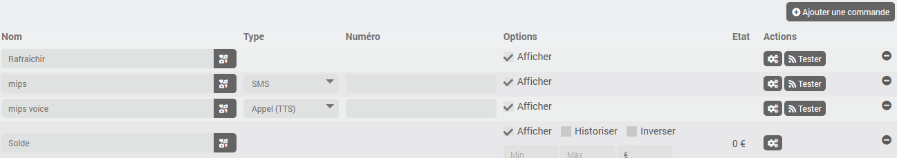

# Description

Plugin pour intégrer la plateforme [ClickSend](https://www.clicksend.com) qui permet l'envoi de message texte (SMS) ou vocaux (TTS)

# Versions supportées

| Composant | Version                     |
|-----------|-----------------------------|
| Debian    | Bullseye(11) & Bookworm(12) |
| Jeedom    | >= 4.4                      |

# Installation

Afin d’utiliser le plugin, vous devez le télécharger, l’installer et l’activer comme tout plugin Jeedom.

# Configuration du plugin

Il n'y a aucune configuration à effectuer ici.

# Configuration des équipements

Commencez par créer une compte [ClickSend](https://www.clicksend.com) et assurez-vous de disposer de crédit sur celui-ci.

Ensuite, dans la section Developers > API Credentials vous devez ajouter un nouveau "subaacount", choisir un nom d'utilisateur et générer une api key.

Sous Jeedom, après avoir créé un nouvel équipement, les options habituelles sont disponibles.
Vous devrez également configurer le nom d'utilisateur et la clé API de votre compte clicksend.

## Commandes

Dans l'onglet commande vous verrez une commande **Rafraichir** qui permet d'actualiser le solde restant; cette information est également actualisée automatiquement chaque nuit et une commande info **Solde**.

Vous pouvez ajouter des commandes pour envoyer des messages via le bouton *Ajouter une commande*. Il faudra donner un nom, choisir le type *SMS* ou *Appel (TTS)* et renseigner le numéro de téléphone au format international.

# Changelog

[Voir le changelog](./changelog)

# Support

Si vous avez un problème, commencez par lire les derniers sujets en rapport avec le plugin sur [community]({{site.forum}}/tag/plugin-{{page.pluginId}}).

Si malgré tout vous ne trouvez pas de réponse à votre question, n'hésitez pas à créer un nouveau sujet en n'oubliant pas de mettre le tag du plugin ([plugin-{{page.pluginId}}]({{site.forum}}/tag/plugin-{{page.pluginId}})).

Il faudra au minimum fournir:

- une capture d'écran de la page santé Jeedom
- une capture d'écran de la page de config du plugin
- tous les logs disponibles du plugin collés dans un `Texte préformaté` (bouton `</>` sur community), pas de fichiers!
- selon les cas, une capture d'écran de l'erreur rencontrée, une capture d'écran de la configuration posant problème...
