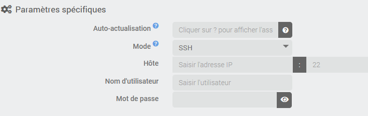

# Descripción

Complemento para supervisar fail2ban. Permite recopilar toda la información en tiempo real de una instancia de fail2ban local o remota (a través de SSH), pero también mantiene recuentos diarios de las direcciones IP bloqueadas, así como un recuento por país de origen de la dirección IP (país determinado mediante la geolocalización de la dirección IP).

También permite bloquear y desbloquear una dirección IP.

> **Importante**
>
> Este complemento no permite instalar ni configurar fail2ban en el sistema.

# Versiones compatibles

| Componente | Versión                     |
|-----------|-----------------------------|
| Debian    | Bullseye(11) & Bookworm(12) |
| Jeedom    | >= 4.5                      |

# Instalación

Para utilizar el plugin, debes descargarlo, instalarlo y activarlo como cualquier otro plugin de Jeedom.

# Configuración del complemento

Aquí no hay que realizar ninguna configuración.

El complemento utiliza el cron de Jeedom para actualizar los dispositivos (véase la configuración de los dispositivos) y el cronDaily para reiniciar los contadores diarios.

# Las instalaciones

Cada equipo del complemento corresponderá a una instancia de fail2ban en un equipo. Por lo tanto, debes empezar por añadir un equipo y asignarle un nombre.

En la configuración del equipo, verás los parámetros habituales comunes a todos los equipos de Jeedom y, debajo, los parámetros específicos de este complemento:

Lo primero es elegir el modo: *local* o *SSH*. El modo *local* permite recuperar la información de fail2ban instalado en el dispositivo Jeedom, mientras que el modo *SSH* permite conectarse a un dispositivo remoto a través de SSH. En este caso, hay que introducir el nombre de host (o la dirección IP), el puerto (si no es el 22), el nombre de usuario (que debe pertenecer al grupo sudoers) y su contraseña.

También puedes configurar la frecuencia con la que se deben actualizar los datos; por defecto, será cada 10 minutos.

# Los pedidos

Tras guardar la configuración del equipo, si esta es correcta y el equipo está activado, el complemento recuperará la lista de *jails* configuradas y, para cada una de ellas, creará los siguientes comandos:

- **Actualizar**: comando de acción para actualizar los contadores correspondientes
- **Banip**: comando de acción/mensaje para bloquear la dirección IP indicada en el mensaje
- **Unbanip**: comando de acción/mensaje para anular el bloqueo de la IP indicada en el mensaje
- **Error actual**: información que indica el número de intentos fallidos en este momento
- **Fracaso total**: información que indica el número total de intentos fallidos
- **Bloqueados**: información que indica el número de direcciones IP bloqueadas actualmente
- **Total de direcciones bloqueadas**: información que indica el número total de direcciones IP bloqueadas
- **Última IP bloqueada**: información que indica la última IP bloqueada
- **Lista de direcciones IP bloqueadas**: información con la lista de direcciones IP bloqueadas actualmente
- **Lista de direcciones IP bloqueadas durante el día**: información con la lista de direcciones IP bloqueadas durante el día

Además de estos comandos, en cada actualización, si se bloquea una nueva dirección IP, el complemento realizará una búsqueda de geolocalización de dicha dirección IP y creará un nuevo comando por país de origen que contenga el número de visitas únicas (por dirección IP) (solo para direcciones IP públicas).

# Registro de cambios

[Ver el registro de cambios](./changelog)

# Asistencia

Si tienes algún problema, empieza por leer los últimos temas relacionados con el plugin en [community]({{site.forum}}/tag/plugin-{{page.pluginId}}).

Si, a pesar de todo, no encuentras respuesta a tu pregunta, no dudes en crear un nuevo tema sin olvidar incluir la etiqueta del plugin ([plugin-{{page.pluginId}}]({{site.forum}}/tag/plugin-{{page.pluginId}})).

Como mínimo, habrá que presentar:

- una captura de pantalla de la página de estado de Jeedom
- una captura de pantalla de la página de configuración del complemento
- Todos los registros disponibles del complemento, con nivel *INFO*, pegados en un `Texto preformateado` (botón `</>` en la comunidad), ¡sin archivos!
- según el caso, una captura de pantalla del error que se ha producido, una captura de pantalla de la configuración que da problemas...
