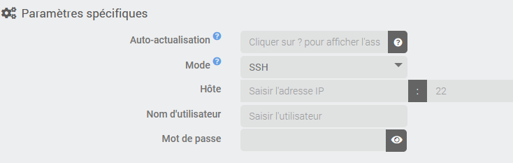

# Description

Plugin pour monitorer fail2ban. Il permet de remonter toutes les infos instantanées d'une instance de fail2ban locale ou distante (via SSH) mais il garde également des compteurs journaliers des IP bloquées ainsi qu'un compteur par pays d'origine de l'adresse IP (pays récupéré par géolocalisation de l'adresse IP).

Il permet également de bannir et de débannir une adresse ip.

# Installation

Afin d’utiliser le plugin, vous devez le télécharger, l’installer et l’activer comme tout plugin Jeedom.

# Configuration du plugin

Il n'y a aucune configuration à effectuer ici.

Le plugin utilise le cron Jeedom pour actualiser les équipements (voir configuration des équipements) et le cronDaily pour réinitialiser les compteurs journaliers.

# Les équipements

Chaque équipement du plugin correspondra à une instance de fail2ban sur une machine. Donc vous devez commencer par ajouter un équipement et donner un nom.

Dans la configuration de l'équipement, vous verrez les paramètres habituels commun à tous les équipements Jeedom et en dessous les paramètres spécifiques à ce plugin:

La première chose est de choisir le mode: *local* ou *SSH*. Le mode *local* permet de récupérer les informations de fail2ban installé sur la machine Jeedom alors que le mode *SSH* permet de se connecter sur une machine distante via SSH. Dans ce cas il faut saisir le nom d'hôte (ou l'adresse IP), le port (si différent que 22), le nom d'utilisateur (qui doit être dans le groupe sudoers) et son mot de passe.

Vous pouvez également paramétrer à quelle fréquence les données doivent être actualisées.

# Les commandes

Après la sauvegarde de l'équipement, si la configuration est correcte et que l'équipement est activé, le plugin va récupérer la liste des *jails* configurées et pour chacune il va créer les commandes suivantes:

- **Rafraichir** commande action pour actualiser les compteurs correspondant
- **Banip** commande action/message pour bannir l'IP donnée en message
- **Unbanip** commande action/message pour annuler le bannissement l'IP donnée en message
- **Echec actuel** info donnant le nombre de tentative en échec actuellement
- **Echec total** info donnant le nombre de tentative en échec au total
- **Banni** info donnant le nombre d'IP bannie actuellement
- **Total banni** info donnant le nombre d'IP bannie au total
- **Dernière IP bannie** info donnant la dernière IP bannie
- **Liste des IP bannies** info donnant la liste des ips bannies actuellement
- **Liste des IP bannies sur la journée** info donnant la liste des ips bannies sur la journée

En plus de ces commandes, lors de chaque actualisation, si une nouvelle IP est bannie, le plugin fera une recherche de géolocalisation de l'adresse IP et créera une nouvelle commande par pays d'origine contenant le nombre de visite distincte (par adresse IP) (uniquement pour les adresses IP publiques)

# Changelog

[Voir le changelog](./changelog)

# Support

Si vous avez un problème, commencez par lire les derniers sujets en rapport avec le plugin sur [community]({{site.forum}}/tags/plugin-{{page.pluginId}}).

Si malgré tout vous ne trouvez pas de réponse à votre question, n'hésitez pas à créer un nouveau sujet en n'oubliant pas de mettre le tag du plugin ([plugin-{{page.pluginId}}]({{site.forum}}/tags/plugin-{{page.pluginId}})).

Il faudra au minimum fournir:

- une capture d'écran de la page santé Jeedom
- tous les logs disponibles du plugin
- selon les cas, une capture d'écran de l'erreur rencontrée, une capture d'écran de la configuration posant problème...
