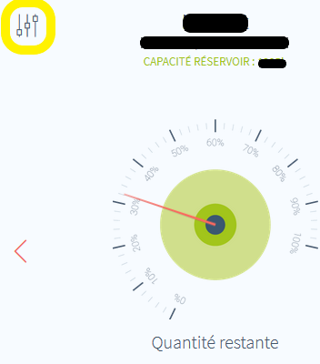
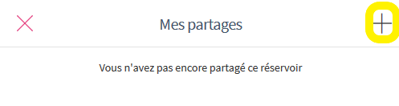

# Description

Plugin permettant la lecture des donées des jauges connectées <a href="https://fullup.be/" target="_blank">Fullup</a>. Le plugin rafraîchit les données toutes les heures via un cron.

# Configuration

## Installation

Afin d’utiliser le plugin, vous devez le télécharger, l’installer et l’activer comme tout plugin Jeedom.

> **Tip**
> le plugin utilise le "cron hourly" pour actualiser les données toutes les heures, vous pouvez choisir de le désactiver et d'actualiser vos équipements manuellement ou via un autre moyen mais il n'est pas nécessaire de le faire plus fréquemment.

## Création d'un utilisateur dédié au plugin dans l'application Fullup

Cette étape n'est pas obligatoire, vous pouvez utiliser votre identifiant actuel/principal de Fullup pour ce plugin mais par principe je recommande de créer un nouveau utilisateur auquel vous partagerez l'accès (en lecture uniquement) à vos jauges.

> **Tip**
>
> Le plugin ne fait que lire les données fournies par les jauges (volume, température...).
> Aucune données personnelles n'est récoltées et aucun changement ne sera effectué sur la configuration de vos jauges/citernes même si vous utilisez votre identifiant principal.

- Rendez-vous sur votre compte à l'adresse <https://app.fullup.be> ou via l'app mobile, vous devez voir vos jauges déjà connectées.
- Affichez la jauge que vous voulez visualiser via le plugin dans Jeedom ensuite cliquez sur le menu "paramètre", encadré en jaune dans la capture:

> **Important**
>
> Vous devrez partager chaque jauges que vous avez si vous voulez les visualiser dans Jeedom (en réutilisant la même adresse email).

- Cliquez sur le menu "Gérer les partages"

- Cliquez sur le "+" pour ajouter un utilisateur

- Entrez un nouvelle adresse email (ou, si vous utilisez une adresse gmail, un alias gmail en rajoutant +jeedom avant @gmail.com par exemple)

- Vous allez recevoir un email de confirmation afin de créer votre nouveau compte sur l'application Fullup, suivez simplement la procédure.

> **Tip**
>
> Déconnectez-vous de Fullup, ouvrez une "fenêtre privée" sur votre navigateur ou utilisez un autre navigateur pour pouvoir créer votre deuxième compte Fullup sinon vous serez automatiquement connecté en suivant le lien dans le mail reçu.

## Configuration du plugin et découverte des jauges

- Retournez sur la page de configuration du plugin et entrez votre utilisateur (adresse email) et le mot de passe (du compte Fullup).

- Sauvegardez la configuration.
- Cliquez sur "Rechercher les jauges Fullup".
- Si les identifiants sont correctes, vous devriez voir le message "Synchronisation réussie..."

- En cas d'erreur un message expliquera la raison de celle-ci, par exemple de vérifier l'utilisateur et le mot de passe

> **Tip**
>
> Il n'est pas possible de créer des équipements manuellement.
> Si vous voulez rajouter des nouvelles jauges dans le future il suffit de revenir sur cette page et de cliquer sur "Rechercher les jauges Fullup".
> Le plugin ne recréera pas les équipements déjà existant donc il n'y a aucun risque à effectuer cette synchronisation plusieurs fois.

- Il n'y a pas de configuration supplémentaire à effectuer au niveau de l'équipement excepté d'assigner l'objet parent à votre équipement. Celui-ci devrait être déjà actif et avoir ses informations à jour.

# Changelog

[Voir le changelog](./changelog)

# Support

Si malgré cette documentation et après voir lu les sujets en rapport avec le plugin sur [community]({{site.forum}}/tags/plugin-{{page.pluginId}}) vous ne trouvez pas de réponse à votre question, n'hésitez pas à créer un nouveau sujet en n'oubliant pas de mettre le tag du plugin ([plugin-{{page.pluginId}}]({{site.forum}}/tags/plugin-{{page.pluginId}})).
