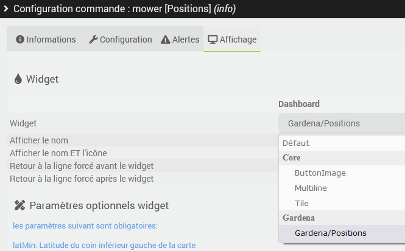
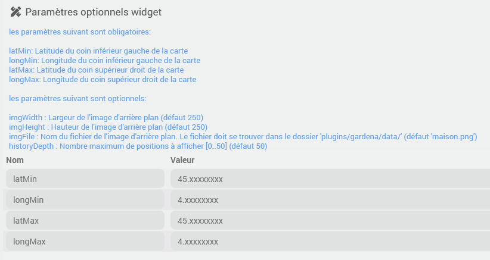
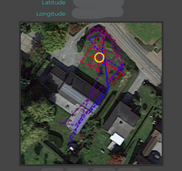

# Descripción

Complemento que permite integrar todos los dispositivos de la gama Gardena Smart System (Water Control, sensor, control de riego, toma de corriente y cortacésped Sileno), así como los robots Husqvarna Automower Connect con conexión a Internet (por lo tanto, no los modelos Connect@Home ni cualquier otro modelo con conexión exclusiva por Bluetooth, por ejemplo).
Es posible acceder a los datos de los dispositivos, supervisarlos y realizar determinadas acciones (dependiendo del dispositivo; consulta más abajo para obtener más detalles).

> **Importante**
>
> Independientemente del equipo que se utilice (Gardena y Husqvarna), es necesaria una conexión a Internet. Este complemento no funcionará con ninguna otra tecnología de conexión local, como, por ejemplo, aunque no solo, el Bluetooth.

# Versiones compatibles

| Componente | Versión                     |
|-----------|-----------------------------|
| Debian    | Bullseye(11) & Bookworm(12) |
| Jeedom    | >= 4.4                      |

# Instalación

Para utilizar el plugin, debes descargarlo, instalarlo y activarlo como cualquier otro plugin de Jeedom.

> **Importante**
>
> Si has intentado instalar el complemento «Gardena Smart System», es necesario desactivarlo antes de activar este. De hecho, un problema en el complemento «Gardena Smart System» provoca un conflicto con este complemento que podría hacer que Jeedom dejara de funcionar. Este problema debe solucionarse en el otro complemento; lamentablemente, no puedo evitarlo.

# Configuración del complemento

En la configuración del complemento, habrá que introducir la clave de la aplicación y el secreto de la aplicación que permiten el acceso a las API.
También debes seleccionar las API que deseas activar entre las dos opciones disponibles (se pueden activar las dos a la vez):

- Sistema inteligente Gardena
- Husqvarna Automower

Encontrarás más información disponible directamente en la página de configuración del complemento.

# Sincronización y configuración de los dispositivos

En cuanto la configuración del complemento esté completa y sea correcta, el complemento sincronizará los dispositivos según las API activadas.
Creará los dispositivos que falten junto con sus controles y actualizará los controles de todos los dispositivos conectados.

Los controles de todos los equipos, ya sean de la gama Gardena Smart System o los robots Husqvarna, se actualizarán en tiempo real, por lo que no es necesario realizar ninguna configuración adicional.

Existe un comando **Actualizar** para solicitar una actualización manual adicional para los cortacéspedes robóticos Husqvarna Automower, pero, en principio, no es necesario, ya que cualquier cambio de estado se actualizará en tiempo real. **Atención**: hay un límite de 10 000 actualizaciones al mes para las actualizaciones manuales; este límite lo impone Husqvarna.

> **Consejo**
>
> El complemento nunca eliminará un equipo de tu Jeedom. Si, efectivamente, un equipo de Jeedom ya no se corresponde con ningún dispositivo que tengas, elimínalo manualmente.

En la página de configuración de un dispositivo, hay un botón para crear los comandos que faltan en él (por ejemplo, en caso de que hayas eliminado un comando por error).

# Los equipos y sus controles

## Los controles comunes a todos los dispositivos del Gardena Smart System

Cada dispositivo del Gardena Smart System dispone de los siguientes controles:

- **Batería** indica el nivel de carga de la batería (si procede) en porcentaje
- **Estado de la batería** ofrece una descripción del estado de la batería: *OK*, *LOW*, *REPLACE_NOW*, *OUT_OF_OPERATION*, *CHARGING*, *NO_BATTERY*, *UNKNOWN*
- **Nivel de conexión** indica el nivel de conexión con el gateway en porcentaje
- **Estado de conexión** ofrece una descripción del estado de conexión: *ONLINE*, *OFFLINE*, *UNKNOWN*

## Sensor inteligente Gardena

- **Temperatura** indica la temperatura ambiente
- **Luminosidad** indica la luminosidad en lux
- **Humedad del suelo** indica el porcentaje de humedad del suelo
- **Temperatura del suelo** indica la temperatura del suelo

## Gardena Smart Water Control

- **Estado** indica el estado general de la válvula: *OK*, *WARNING*, *ERROR*, *UNAVAILABLE*
- **Último error** muestra el último error, si lo hay; solo es válido si el comando **Estado** tiene el valor *WARNING* o *ERROR* (véase más abajo la lista de valores posibles)
- **Actividad** indica la actividad actual: *CLOSED*, *MANUAL_WATERING*, *SCHEDULED_WATERING*
- **Estado**: comando de información binaria que indica si la válvula está abierta o cerrada
- **Iniciar**: comando de acción para iniciar el riego, que solicita opcionalmente el número de minutos (enteros) de riego
- **Detener**: comando para detener el riego
- **Tiempo restante**: comando informativo que indica el tiempo restante (en minutos) mientras se está realizando el riego
- **Pausa en la programación**: comando de acción que solicita, de forma opcional, el número de minutos
- **Reanudación de la programación** comando de acción

## Enchufe inteligente Gardena Smart Power Socket

- **Estado** indica el estado general del enchufe: *OK*, *ADVERTENCIA*, *ERROR*, *NO DISPONIBLE*
- **Último error** muestra el último error, si lo hay; solo es válido si el comando **Salud** tiene el valor *WARNING* o *ERROR*; puede tener los siguientes valores: *TIMER_CANCELLED*, *UNKNOWN*
- **Se** activa la acción para encender el enchufe
- **Apagar**: comando para apagar la toma de corriente
- **Temporizador**: acción de comando para encender el enchufe con apagado automático tras x minutos (enteros) transcurridos, como opción del comando
- **Actividad** indica la actividad actual: *OFF*, *FOREVER_ON*, *TIME_LIMITED_ON*, *SCHEDULED_ON*
- **Estado**: comando de información binaria que indica si el enchufe está encendido o apagado
- **Tiempo restante**: comando informativo que indica el tiempo restante del temporizador (si procede)
- **Pausa en la programación**: comando de acción que solicita, de forma opcional, el número de minutos
- **Reanudación de la programación** comando de acción

## Cortacésped inteligente Gardena

- **Estado** indica el estado general de la cortadora: *OK*, *ADVERTENCIA*, *ERROR*, *NO DISPONIBLE*
- **Actividad** indica la actividad en curso: *PAUSED*, *OK_CUTTING*, *OK_CUTTING_TIMER_OVERRIDDEN*, *OK_SEARCHING*, *OK_SALIENDO*, *OK_CARGANDO*, *TEMPORIZADOR_APARCADO*, *APARCADO_PARQUING_SELECCIONADO*, *TEMPORIZADOR_AUTOMÁTICO_APARCADO*, *NINGUNA*
- **Activo**: comando binario que indica si el cortacésped está activo o no; se indicará como activo durante las siguientes actividades: *OK_CUTTING*, *OK_CUTTING_TIMER_OVERRIDDEN*, *OK_SEARCHING*, *OK_LEAVING*, *OK_CHARGING*
- **Último error** muestra el último error, si lo hay; solo es válido si el comando **Estado** tiene el valor *WARNING* o *ERROR* (véase más abajo la lista de valores posibles)
- **Horas de trabajo**: comando de información que indica el número de horas de trabajo
- **Tiempo restante**: comando informativo que indica el tiempo restante del temporizador (si procede)
- **Inicio en modo manual**: comando de acción para iniciar en modo manual, que solicita opcionalmente el número de minutos de actividad
- **Inicio en modo automático**: comando para iniciar el sistema en modo automático (siguiendo la programación)
- **Cancelación y vuelta a la base**: al ejecutar este comando, el cortacésped se pondrá en marcha de nuevo en la siguiente tarea
- **«Parada y vuelta a la base»**: comando de acción; el cortacésped no se pondrá en marcha de nuevo para la siguiente tarea

## Control inteligente de riego Gardena

El equipo permite controlar hasta 6 válvulas de 24 V. Dispone de los siguientes mandos:

- **Estado del controlador** indica el estado general del controlador: *OK*, *WARNING*, *ERROR*, *UNAVAILABLE*
- **Último error** muestra el último error, si lo hay; solo es válido si el comando **Estado** tiene el valor *WARNING* o *ERROR* (véase más abajo la lista de valores posibles)
- **Cerrar todas las válvulas** permite detener el riego de todas las válvulas con un solo comando; el riego se reanudará en la próxima programación

Así como los siguientes comandos para cada una de las válvulas (donde X tendrá un valor comprendido entre 1 y 6):

- **Actividad de la válvula X** indica la actividad actual: *CLOSED*, *MANUAL_WATERING*, *SCHEDULED_WATERING*
- **Estado de la válvula X**: señal binaria que indica si la válvula está abierta o cerrada
- **Estado de la válvula X** indica el estado general de la toma: *OK*, *ADVERTENCIA*, *ERROR*, *NO DISPONIBLE*
- **Poner en marcha la válvula X**: comando para iniciar el riego, que solicita opcionalmente el número de minutos (enteros) de riego
- **Cerrar la válvula X**: comando para detener el riego
- **Tiempo restante de la válvula X**: mensaje informativo que indica el tiempo restante (en minutos) mientras se está realizando el riego
- **Pausa en la programación de la válvula X**: comando de acción que requiere, opcionalmente, indicar el número de minutos
- **Reanudación de la programación de la válvula X** comando de acción

## Husqvarna Automower

- **Conectado**: comando binario que indica si el cortacésped está conectado
- **Batería** indica el nivel de carga de la batería (si procede) en porcentaje
- **Modo** tendrá uno de los siguientes valores: *MAIN_AREA*, *DEMO*, *SECONDARY_AREA*, *HOME*, *UNKNOWN* (véase más abajo la descripción de los valores)
- **Estado** tendrá uno de los siguientes valores: *UNKNOWN*, *NOT_APPLICABLE*, *PAUSED*, *IN_OPERATION*, *WAIT_UPDATING*, *WAIT_POWER_UP*, *RESTRICTED*, *OFF*, *STOPPED*, *ERROR*, *FATAL_ERROR*, *ERROR_AT_POWER_UP* (véase más abajo la descripción de los valores)
- **Actividad** tendrá uno de los siguientes valores: *UNKNOWN*, *NOT_APPLICABLE*, *MOWING*, *GOING_HOME*, *CHARGING*, *LEAVING*, *PARKED_IN_CS*, *STOPPED_IN_GARDEN* (véase más abajo la descripción de los valores)
- **Latitud**: comando de información que indica la latitud de la última posición
- **Longitud**: comando de información que indica la longitud de la última posición
- **Última posición**: comando de información que proporciona la última posición GPS con el formato *latitud, longitud*
- **Posiciones** que contienen el historial de las últimas 50 posiciones del robot en el formato *posición1,posición2,posición3,...*
- **Altura de corte** y **Ajuste de la altura de corte**, que permiten conocer y definir la altura de corte (entre 1 y 9)
- **Faros** y **Configuración de los faros**, que permiten conocer y definir el modo de encendido de los faros; valores posibles: *ALWAYS_ON*, *ALWAYS_OFF*, *EVENING_ONLY*, *EVENING_AND_NIGHT*
- **Hora del último informe** y **Hora de la próxima salida**: los valores son marcas de tiempo en milisegundos (para facilitar su uso en un escenario) y se mostrarán en formato de fecha y hora en el widget
- **Restricción de programación** que indica el motivo de la excepción en la programación habitual
- **Código de error** y **Descripción del error**: muestra el código y la descripción del error, si procede
- **Tiempo restante**: comando informativo que indica el tiempo restante de actividad; válido únicamente cuando se utilizan los comandos **Inicio del modo manual** o **Regreso a la base**
- **Inicio en modo manual** Inicia el corte y corta el césped durante el tiempo (en minutos) especificado en la opción del comando
- **Pausa**
- **Reanudar** Se reanuda según la programación
- **Vuelta a la base** Vuelve a la base durante el número de minutos especificado en la opción del comando y, a continuación, reanuda la programación
- **Cancelación y vuelta a la base**: al ejecutar este comando, el cortacésped se pondrá en marcha de nuevo en la siguiente tarea
- **«Parada y vuelta a la base»**: comando de acción; el cortacésped no se pondrá en marcha de nuevo para la siguiente tarea
- **Tiempo de uso de las lamas** control digital
- **Ciclos de carga** control digital
- **Colisiones**: control de información digital
- **Tiempo total de carga**: control de información digital
- **Tiempo total de corte** control digital
- **Tiempo total de funcionamiento**: control digital de información
- **Tiempo total de búsqueda** comando de información digital

# Posiciones de los widgets

El plugin ofrece un widget *Posiciones* que se puede aplicar al comando **Posiciones** de los cortacéspedes Husqvarna (los cortacéspedes Gardena aún no disponen de localización por GPS).

Para que el widget funcione correctamente, debes realizar las siguientes configuraciones:

1. En la configuración avanzada del comando **Posiciones**, pestaña *Visualización*, selecciona el widget *Gardena/Posiciones*:

1. Haz una captura de pantalla de la zona de corte (por ejemplo, en Google Maps), guarda el archivo con el nombre *casa.png* y, a continuación, copia la imagen en la carpeta *plugins/gardena/data/* de tu Jeedom (por ejemplo, mediante el explorador de archivos integrado en Jeedom).
2. Identifica las coordenadas geográficas (latitud y longitud) de la esquina inferior izquierda y de la esquina superior derecha del área correspondiente a la captura.
3. Introduce los datos de coordenadas indicados anteriormente en la lista de parámetros del widget: *latMin*, *longMin*, *latMax* y *longMax* son obligatorios.
Si has nombrado tu archivo de forma distinta a *casa.png* o si quieres probar otra captura, introduce el nombre del archivo en el parámetro *imgFile*
4. El resto de parámetros son opcionales:

Guarda y deberías ver el minimapa con el historial de posiciones en el mosaico del equipo:

# Anexos

## Descripción de los errores de las válvulas del sistema Gardena Smart System (Water Control o Irrigation Control)

- *NO_MESSAGE* - sin errores
- *CONCURRENT_LIMIT_REACHED* - No se puede abrir la válvula; solo se pueden abrir un máximo de 2 válvulas a la vez
- *NOT_CONNECTED* - No hay ninguna válvula conectada
- *VALVE_CURRENT_MAX_EXCEEDED* - La válvula se ha cerrado debido a un consumo eléctrico excesivo
- *TOTAL_CURRENT_MAX_EXCEEDED* - Se ha cerrado la válvula porque el consumo eléctrico total era demasiado elevado
- *WATERING_CANCELED* - Riego cancelado
- *MASTER_VALVE* - La válvula principal no está conectada
- *WATERING_DURATION_TOO_SHORT* - Duración del riego demasiado corta, riego cancelado
- *VALVE_BROKEN* - Se ha interrumpido la conexión eléctrica con la válvula
- *FROST_PREVENTS_STARTING* - La escarcha impide que se abra la válvula
- *LOW_BATTERY_PREVENTS_STARTING* - Batería baja, no se puede abrir la válvula
- *VALVE_POWER_SUPPLY_FAILED* - Problema de alimentación eléctrica, no se puede abrir la válvula
- *DESCONOCIDO* - Desconocido

## Descripción de los errores del Gardena Smart Mower

- *NO_MESSAGE* - sin errores
- *OUTSIDE_WORKING_AREA* - Fuera de la zona de trabajo
- *NO_LOOP_SIGNAL* - No hay señal del cable perimetral
- *WRONG_LOOP_SIGNAL* - Señal incorrecta del cable perimetral
- *LOOP_SENSOR_PROBLEM_FRONT* - Problema en el sensor del cable delantero
- *LOOP_SENSOR_PROBLEM_REAR* - Problema en el sensor del cable trasero
- *LOOP_SENSOR_PROBLEM_LEFT* - Problema en el sensor del cable izquierdo
- *LOOP_SENSOR_PROBLEM_RIGHT* - Problema en el sensor del cable derecho
- *WRONG_PIN_CODE* - Código PIN incorrecto
- *TRAPPED* - Atrapado
- *UPSIDE_DOWN* - Al revés.
- *EMPTY_BATTERY* - Batería descargada
- *NO_DRIVE* - Sin cable guía
- *TEMPORARILY_LIFTED* - Cortacésped levantado
- *LIFTED* - Elevado
- *STUCK_IN_CHARGING_STATION* - Atrapado en la estación de carga
- *CHARGING_STATION_BLOCKED* - Estación de carga bloqueada
- *COLLISION_SENSOR_PROBLEM_REAR* - Problema con el sensor de colisión trasero
- *COLLISION_SENSOR_PROBLEM_FRONT* - Problema con el sensor de colisión delantero
- *WHEEL_MOTOR_BLOCKED_RIGHT* - Rueda del motor derecha bloqueada
- *WHEEL_MOTOR_BLOCKED_LEFT* - Rueda del motor izquierdo bloqueada
- *WHEEL_DRIVE_PROBLEM_RIGHT* - Problema en la rueda motriz derecha
- *WHEEL_DRIVE_PROBLEM_LEFT* - Problema en la rueda motriz izquierda
- *CUTTING_MOTOR_DRIVE_DEFECT* - Fallo en el accionamiento del motor del sistema de corte
- *CUTTING_SYSTEM_BLOCKED* - Sistema de corte bloqueado
- *INVALID_SUB_DEVICE_COMBINATION* -
- *MEMORY_CIRCUIT_PROBLEM* - Problema con el circuito de memoria
- *CHARGING_SYSTEM_PROBLEM* - Problema con el sistema de carga
- *STOP_BUTTON_PROBLEM* - Problema con el botón STOP
- *TILT_SENSOR_PROBLEM* - Problema con el sensor de inclinación
- *MOWER_TILTED* - Cortacésped inclinado
- *WHEEL_MOTOR_OVERLOADED_RIGHT* -
- *WHEEL_MOTOR_OVERLOADED_LEFT* -
- *CORRIENTE_DE_CARGA_DEMASIADO_ALTA* -
- *ELECTRONIC_PROBLEM* - Problema electrónico.
- *PROBLEMA_DEL_MOTOR_DE_CORTE* -
- *LIMITED_CUTTING_HEIGHT_RANGE* -
- *CUTTING_HEIGHT_PROBLEM_DRIVE* -
- *CUTTING_HEIGHT_PROBLEM_CURR* -
- *CUTTING_HEIGHT_PROBLEM_DIR* -
- *CUTTING_HEIGHT_BLOCKED* -
- *PROBLEMA DE ALTURA DE CORTE* -
- *BATTERY_PROBLEM* - Problema con la batería
- *TOO_MANY_BATTERIES* - Demasiadas pilas
- *ALARM_MOWER_SWITCHED_OFF* - Alarma: cortacésped apagado
- *ALARM_MOWER_STOPPED* - Alarma: cortacésped parado
- *ALARM_MOWER_LIFTED* - Alarma: cortacésped levantado
- *ALARM_MOWER_TILTED* - Alarma: cortacésped inclinado
- *ALARM_MOWER_IN_MOTION* - Alarma: cortacésped en movimiento
- *ALARM_OUTSIDE_GEOFENCE* - Alarma: cortacésped fuera de la barrera virtual
- *SE HA DESLIZADO* - El cortacésped se ha deslizado
- *INVALID_BATTERY_COMBINATION* - Combinación de baterías de diferentes tipos no válida
- *NO INICIALIZADO* - Estado del cortacésped desconocido
- *WAIT_UPDATING* - Cortacésped a la espera de instalar el firmware
- *WAIT_POWER_UP* - El cortacésped se enciende
- *OFF_DISABLED* - Cortacésped desactivado mediante el interruptor principal
- *OFF_HATCH_OPEN* - Cortacésped en espera con la cubierta abierta
- *OFF_HATCH_CLOSED* - Cortacésped en espera con la cubierta cerrada
- *PARKED_DAILY_LIMIT_REACHED* - Cortacésped aparcado, se ha alcanzado el límite diario de corte

## Descripción de los errores del Gardena Smart Irrigation Control

- *NO_MESSAGE* - sin errores
- *VOLTAGE_DROP* - Se ha detectado una caída de tensión en la fuente de alimentación (VDD_IN)
- *WRONG_POWER_SUPPLY* - Fuente de alimentación incorrecta
- *NO_MCU_CONNECTION* - Problema de comunicación con el MCU secundario
- *DESCONOCIDO* - Desconocido

## Descripción de los modos de funcionamiento del Husqvarna Automower

- *MAIN_AREA* - El robot cortacésped va a cortar el césped y volverá a la base para recargarse según su programa.
- *DEMO* - Igual que *MAIN_AREA*, pero de menor duración. Las lamas no se mueven.
- *SECONDARY_AREA* - Sin programación, el cortacésped está en modo manual.
- *HOME* - El robot cortacésped está en su base y la programación no se está aplicando.
- *DESCONOCIDO* - Desconocido.

## Descripción de los estados del Husqvarna Automower

- *EN PAUSA* - El cortacésped está en pausa.
- *IN_OPERATION* - En funcionamiento, consulta el valor **Actividad**.
- *WAIT_UPDATING* - El cortacésped está descargando y actualizando el firmware.
- *WAIT_POWER_UP* - El cortacésped se enciende.
- *RESTRINGIDO*: el cortacésped no puede cortar el césped debido a la programación o a una parada manual.
- *OFF* - El cortacésped está apagado.
- *DETENIDO*: el cortacésped se ha detenido y requiere una intervención manual.
- *ERROR*, *FATAL_ERROR*, *ERROR_AT_POWER_UP*: se ha producido un error; consulta el valor de **Error**. El cortacésped requiere una intervención manual.
- *NOT_APPLICABLE* - No aplicable.
- *DESCONOCIDO* - Desconocido.

## Descripción de las actividades de Husqvarna Automower

- *CORTE DE CÉSPED* - Se está cortando el césped
- *GOING_HOME* - Se dirige a la base
- *CARGANDO* - En la base, en proceso de carga.
- *LEAVING* - Abandona la base.
- *PARKED_IN_CS* - En la base.
- *STOPPED_IN_GARDEN* - Cortacésped parado en el jardín. Se requiere intervención manual.
- *NO APLICABLE* - Se requiere una intervención manual.
- *DESCONOCIDO* - Desconocido.

# Registro de cambios

[Ver el registro de cambios](./changelog)

# Asistencia

Si tienes algún problema, empieza por leer los últimos temas relacionados con el plugin en [community]({{site.forum}}/tag/plugin-{{page.pluginId}}).

Si, a pesar de todo, no encuentras respuesta a tu pregunta, no dudes en crear un nuevo tema sin olvidar incluir la etiqueta del plugin ([plugin-{{page.pluginId}}]({{site.forum}}/tag/plugin-{{page.pluginId}})).

Como mínimo, habrá que presentar:

- una captura de pantalla de la página de estado de Jeedom
- una captura de pantalla de la página de configuración del complemento
- Todos los registros disponibles del complemento, con nivel *INFO*, pegados en un `Texto preformateado` (botón `</>` en la comunidad), ¡sin archivos!
- según el caso, una captura de pantalla del error que se ha producido, una captura de pantalla de la configuración que da problemas...
