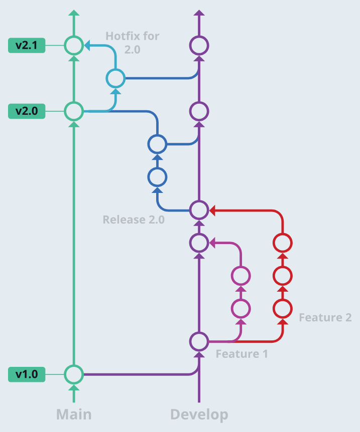
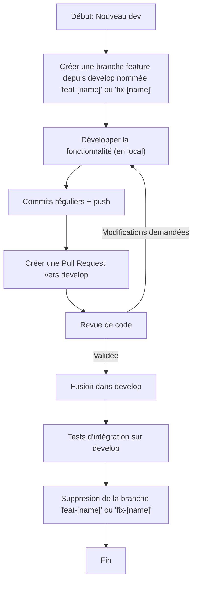
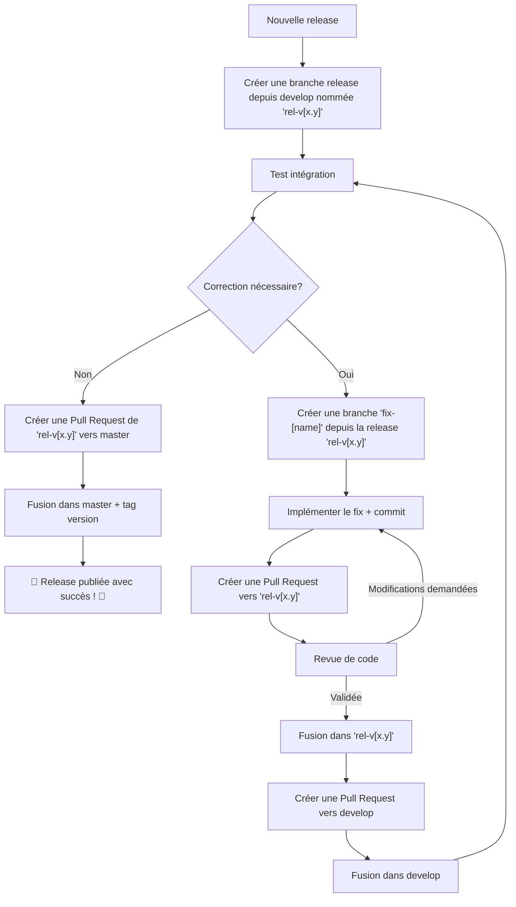
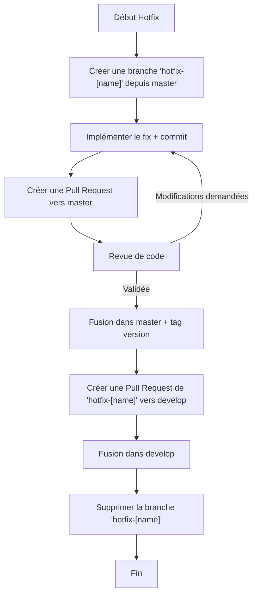

# Proposition pour adopter le modèle “GitFlow” pour le repo jeedom/core

## Structure générale du modèle GitFlow

La structure GitFlow est un standard d’organisation de repo git, comme l’est “Trunk-based”, l’autre grand standard qui se démarque.

Gitflow repose sur deux branches principales:

- La branche **master** sert de référence pour les versions destinées à la production. Elle peut être taguée à différents moments pour identifier des versions ou des releases. Les autres branches ne sont fusionnées dans **master** qu’après validation et tests complets.
- La branche **develop** est l’environnement de travail quotidien, où les fonctionnalités en cours de développement sont intégrées. Lorsqu’une nouvelle fonctionnalité est ajoutée, on crée une branche de courte durée à partir de **develop** (une branche feature). Une fois la fonctionnalité revue et validée, elle est fusionnée dans **develop**.

> **ATTENTION**
>
> Jamais aucun commit directement dans une de ses deux branches

Gitflow définit également deux types de branches de support:

- Les branches **release** servent à finaliser une version ou corriger des bugs mineurs avant une mise en production. Elles sont généralement créées à partir de **develop**. Une fois stabilisées, elles sont fusionnées dans **master**. Attention, il ne faut plus ajouter de nouvelles fonctionnalités dans les branches **release** mais uniquement des corrections ou des changements en préparation de la release telle que par exemple la mise à jour du numéro de version.
- Les branches **hotfix** sont destinées aux correctifs *urgents*. Elles sont créées à partir de **master** et, une fois le correctif prêt, elles sont fusionnées à la fois dans **master** et dans **develop** afin de garantir que la correction soit présente dans les futures versions.

### Vue générale

## Avantages du modèle Gitflow

### Workflow clair et prévisible

Le modèle Gitflow définit un flux de travail structuré pour:

- gérer les fonctionnalités et fix non-urgent: branches **develop**, feature et fix
- les releases: branches **release**
- et les correctifs urgents: branches **hotfix**

### Développement parallèle & gestion des releases

Gitflow permet aux développeurs de travailler en parallèle sur différentes fonctionnalités (branche feature) sans être bloqué par les tâches des autres développeurs, y compris pendant la préparation d’un release.

Les branches **release** permettent d’effectuer les ajustements pré-release (corrections, documentation, tâches spécifiques à la version) sans perturber le développement continu sur **develop**.

### Standardisation et discipline

Gitflow est particulièrement adapté aux équipes nombreuses. Même si le “noyau” de développeur sur le core Jeedom est petit, les développeurs tiers sont potentiellement nombreux et pas forcément au courant des conventions que les autres développeurs suivent.

La standardisation et la structure GitFlow permet de forcer la discipline nécessaire et elle garantit que tout changement fait sera systématiquement revu par d’autres développeurs (de l'équipe principale)

Elle permet aussi à chacun de savoir à tout moment où créer une branche et sur quelle branche fusionner les changements.

## Cas d’usage concrets

### 1. Nouveau développement ou correction/modification non-urgente

Ajout d'une fonctionnalité ou correction non urgente, développée sur une branche courte puis fusionnée dans `develop`.  
**Règles de nommage**: `feat-[sujet-court]` ou `fix-[sujet-court]`.  
**Durée typique**: 2-7 jours pour un fix, 1-4 semaines pour une feature.

> **Tip**
>
> Ce flow sera le même que l’on soit un développeur membre de l'organisation, dans ce cas la branche peut être créé directement dans le repo jeedom/core, ou un développeur tiers, dans ce cas la branche sera créée dans un fork du projet.

### 2. Nouvelle release

Préparation d'une version majeure/mineure à partir de `develop`, stabilisation, puis fusion dans `master` avec tag.  
**Règle de nommage**: `rel-vx.y`.  
**Durée typique**: < 1 semaine.

> **Tip**
>
> Ce flow est, en principe, réservé aux membres de l'organisation. Les développeurs tiers ne peuvent pas initier une nouvelle release.

Comme on peut le voir, les corrections en mode *release* sont plus “lourdes” à réaliser car il va falloir à chaque fois faire un PR dans la branche **release** en cours et dans la branche **develop** ensuite pour ne pas perdre la trace des fix.
Pour mitiger l'impact, on peut éventuellement adapter le flow en faisant un seul PR & merge back de la branche **release** vers **develop** à la fin du processus (attention, ça augmente le risque de conflit) mais idéalement, il faut avoir testé chaque intégration le plus complètement possible dans **develop** avant de commencer le processus de *release*.

On remarque aussi que les numéros de version de **release** sont bien sous la forme x.y (ex: 4.5, 4.6), donc *major.minor*. Le processus de **release** n'est pas le processus pour les (hot)fix (4.5.3, 4.5.4 etc). Voir [plus d'information sur le semantic versioning](https://semver.org/)

### 3. Les corrections

Il faut distinguer 2 cas:

- soit c’est un fix non-urgent, qui peut potentiellement attendre plusieurs semaines/mois avant d’arriver en production => on utilise le flow “Nouveau développement” mais en nommant la branche “fix-[name]” au lieu de “feat-[name]”
- soit c’est un “hot”fix, c’est “urgent” et dans ce cas, voir ci-dessous

**Règle de nommage**: `hotfix-[sujet-court]`.  
**Durée typique**: 1-2 jours.

> **Tip**
>
> Ce flow sera le même que l’on soit un développeur membre de l'organisation, dans ce cas la branche peut être créé directement dans le repo jeedom/core, ou un développeur tiers, dans ce cas la branche sera créée dans un fork du projet.

## Règles de nommage des branches

Le nom des branches doit être en minuscules, mots séparés par `-`, pas d'espaces, pas d'accents, pas de caractères spécials.

| Type | Règle de nommage | Exemples | Durée typique | Source | Destination(s) |
| --- | --- | --- | --- | --- | --- |
| Feature | `feat-[sujet-court]` | `feat-widget-config`, `feat-multi-gateway` | 1-4 semaines | `develop` | `develop` |
| Fix non urgent | `fix-[sujet-court]` | `fix-timeout-retry`, `fix-i18n-labels` | 2-7 jours | `develop` | `develop` |
| Release | `rel-vx.y` (version major.minor) | `rel-v4.6`, `rel-v5.0` | < 1 semaine | `develop` | `master` |
| Correctif lors d'une release | `fix-[sujet-court]` | `fix-restore-backup` | < 1 jour | `rel-vx.y` | `rel-vx.y` & `develop` |
| Hotfix (urgent) | `hotfix-[sujet-court]` | `hotfix-check-date`, `hotfix-null-tags` | 1-2 jours | `master` | `master` & `develop` |

Recommandations:

- Nom court et explicite (3 à 5 mots max)
- Utiliser des termes fonctionnels, pas des tickets seuls (éviter feat-1234)

## Pré-conditions et validations de Pull Request

Avant de créer une Pull Request, l'auteur doit vérifier :

### Pré-conditions avant ouverture de PR

- ✅ Code testé localement sans erreur
- ✅ Documentation à jour
- ✅ Branche à jour avec celle de destination (rebase/merge si nécessaire)
- ✅ Commits bien structurés avec messages clairs
- ✅ Pas de commits de merge ou "work in progress"

### Checklist de revue de code

Le reviewer doit vérifier:

| Aspect | Vérification |
| --- | --- |
| **Logique métier** | Le changement résout le problème/ajoute la fonctionnalité attendue |
| **Architecture** | Le code suit les conventions et patterns du projet |
| **Performance** | Pas de régression de performance, pas de boucles inefficaces |
| **Sécurité** | Pas de vulnérabilité, entrées validées, authentification vérifiée |
| **Documentation** | Commentaires pertinents, docs à jour si nécessaire |
| **Compatibilité** | Pas de breaking change non documenté |
| **Merge** | Branche source propre, pas de conflits |

### Approbation et merge

- **Feature**: minimum 2 approbation requise
- **Fix non urgent**: minimum 1 approbation requise
- **Release**: minimum 2 approbations requises
- **Hotfix**: minimum 1 approbation requise (urgence)
- Après approbation, la branche peut être fusionnée par le reviewer ou l'auteur
- Après merge, supprimer la branche source