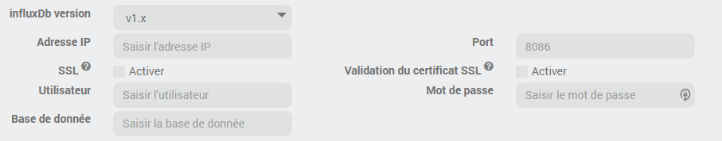
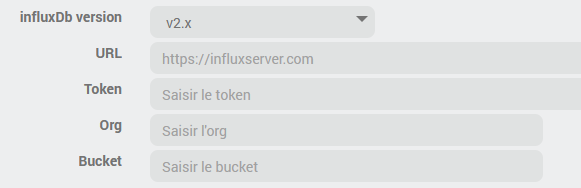
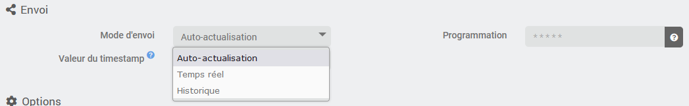
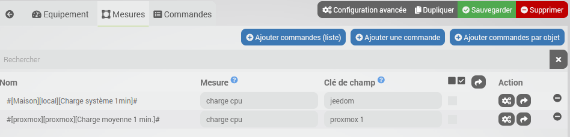
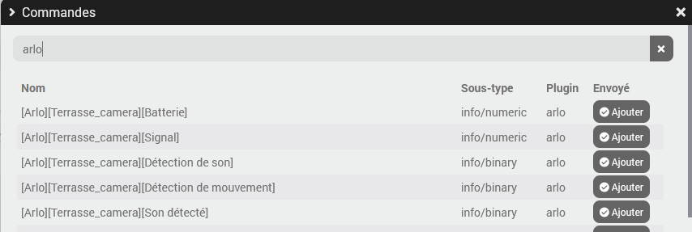

# Description

A plugin that allows you to connect to an InfluxDB database. It makes it easy to send the desired data by simply selecting the corresponding commands from a list, which allows you to export the history so it can then be viewed using Grafana, for example.

The plugin also allows you to export Jeedom commands history to InfluxDB.

# Supported Versions

> **Attention**
>
> The plugin supports InfluxDB versions >= 1.8 or >= 2.0. Older versions of InfluxDBv1 < 1.8 are not supported.

| Component | Version                     |
|-----------|-----------------------------|
| Debian    | Bullseye(11) & Bookworm(12) |
| Jeedom    | >= 4.4                      |
| InfluxDB  | v1.8+ & v2                  |

# Installation

To use the plugin, you must download, install, and activate it just like any other Jeedom plugin.

# Plugin Configuration

There is no specific configuration required; the plugin may use cronDaily to reset the counters.

# Equipment

A Jeedom device corresponds to an InfluxDB connector.

Each connector will connect to and send data to one and only one InfluxDB instance, but you can have as many connectors as you need.
The plugin supports InfluxDB v1.8+ and v2; the basic principle remains the same for both versions, but the connection method differs.

## InfluxDB v1.8+

For each connector, you must configure the IP address of your InfluxDB server, a username, a password, and the database name.
You have the option to enable or disable HTTPS.

## InfluxDB v2.0+

For v2, you must configure the URL in the format `https://server.my`, along with the access token, the organization, and the destination bucket (see the InfluxDB documentation).

> **Tip**
> InfluxDB offers a free cloud plan for v2 that’s very easy to set up for testing—or even for long-term use if it suits your needs (limited to a single organization, in terms of data volume and history duration). For more information: <https://www.influxdata.com/influxdb-cloud-pricing/>

## Shipping Method

You can also choose the delivery mode, which is set to auto-refresh by default. This mode can be changed at any time without any impact.

- _Auto-update_: The plugin will send all selected measurements according to the chosen schedule in a single call; by default, this occurs every minute.
This is the recommended operating mode; it is more efficient and places virtually no load on your Jeedom, while still providing measurements every minute.
- _Real-time_: The plugin will send measurements one by one each time a value changes, potentially resulting in several calls per second for the same command (depending on your equipment and commands). This mode can place a significant load on Jeedom depending on your hardware and the number of selected commands, whereas in many cases, a once-per-minute update to InfluxDB is more than sufficient to obtain useful statistics.
- _History_: Allows you to export the entire history from the previous day every night

It is entirely possible to have multiple devices connected to the same database, each configured with a different mode and different commands, if you want certain commands to be sent in real time while optimizing the load for the others.

In _Auto-update_ mode, you can choose the schedule as well as the value to be sent as the measurement's timestamp:

- _Posting Time_, Default Value, and Historical Behavior of the Plugin
- _Command value date_
- _Command collection date_

## Selecting the measurements to send

The second tab displays all the commands selected for sending to InfluxDB. You can filter the displayed rows using the "Search" field.

There are three ways to search for and select commands to send:

- Search for a single command using the **Add command** button
- Search for and add multiple commands using the **Add commands by object** button. This method has the advantage of displaying only the commands for equipment linked to a specific object, so the display will be faster if you have a large number of commands (more than 10,000).
- Search for and add multiple commands using the **Add Commands (List)** button. This screen will display all the command information from your Jeedom: it’s convenient because everything is shown, but if you have more than 10,000 commands, it may take 30 seconds or longer.

Search example:

1. In the commands search screens, you can filter or search for any value by typing your search query into the field at the top of the list.
2. The list will display only those commands that have not yet been selected for this device/connector.
3. To select a command and send it to InfluxDB, simply click the **Add** button. Don't forget to save the device after adding all the commands you want.

## Exporting Jeedom History to InfluxDB

To export the history, go to the _Measurements_ tab, where you have configured the commands to be sent to your Jeedom devices.

You can:

- or export the history of a specific command by clicking the _Export_ button on the corresponding row in the actions
- Either check or uncheck the desired measures (or check or uncheck all of them using the checkboxes in the column) and then click the _Export_ button at the top of the column.

In both cases, the next step will ask you for the start date and end date you want for the export, and then the task will be scheduled.
This may take a little time depending on the amount of data to be exported, but it will be seamless because the task will run in the background.

# Commands

The commands for the InfluxDB equipment/connector are displayed on the third tab:

- **Send All** allows you to send all current values for the measurements configured on the device; it does not send command history, only the current value.
- **Status** indicates the connector's status; it will be 1 if no problem is detected, and 0 otherwise.
- **Last Send Date** shows the date and time of the last successful transmission
- **Last Error Date** & **Last Error Description** show the date and time of the last failed transmission, as well as the error message
- **Total Readings** & **Daily Total Readings**: counters for total and daily readings sent.

# Definitions

A **point** in InfluxDB represents a data entry characterized by four components: the **metric**, a set of **fields**, a set of **tags**, and **timestamp** information.

Below is the link created by the plugin between InfluxDB concepts and Jeedom concepts:

| Jeedom | InfluxDB | Description |
| --- | --- | --- |
| Command Name | Measurement | A measurement in InfluxDB is similar to an SQL table. |
| Command value date | Timestamp | This is the data's timestamp. |
| Equipment Name | Field(key) | A field key is similar to a column name in an SQL table. |
| Command value | Field(value) | This is the data for the point. |

## Tags

Tags in InfluxDB are optional pieces of additional information that can be associated with data points.
They allow you to filter search results.
The following tags can be associated with each data point sent; they must be selected on the device's configuration page.
This list can be expanded if you need more:

| Tag(key) | Tag(value) |
| --- | --- |
| Plugin | plugin name |
| Object | Name of the Jeedom object/room or "None" |
| CommandName | command name |
| GenericType | generic command type |

# Change log

[View the changelog](./changelog)

# Support

If you're having a problem, start by reading the latest threads related to the plugin on [community]({{site.forum}}/tag/plugin-{{page.pluginId}}).

If you still can't find an answer to your question, feel free to create a new thread—and don't forget to include the plugin tag ([plugin-{{page.pluginId}}]({{site.forum}}/tag/plugin-{{page.pluginId}})).

At a minimum, you must provide:

- a screenshot of the Jeedom Health page
- a screenshot of the plugin's settings page
- All available plugin logs at the _INFO_ level, pasted into a `Preformatted Text` (use the `</>` button on the community), no files!
- Depending on the situation, a screenshot of the error encountered, a screenshot of the problematic configuration...
