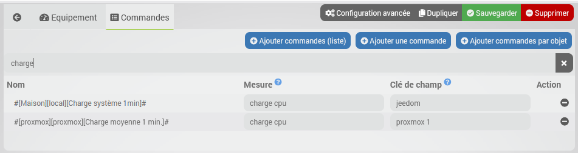

# Description

Installation

# In order to use the plugin, you must download, install and activate it like any Jeedom plugin.

Plugin configuration

# The devices

Changelog

# See the changelog

Support

If despite this documentation and after having read the topics related to the plugin on [community]({{site.forum}}/tags/plugin-{{page.pluginId}}) you do not find an answer to your question, do not hesitate to create a new topic with the tag of the plugin ([plugin-{{page.pluginId}}]({{site.forum}}/tags/plugin-{{page.pluginId}})).

## Sending mode

You can also choose how data must be sent, by default with auto-refresh. This configuration can be changed anytime without impact.

- Auto-refresh: the plugin will send all selected measurements every minute in one call.
This the the recommended way of working, it's the most optimal and do not add extra load on your Jeedom and at the same time it allows to have measurements every minute.
- Real time: the plugin will send measurement one by one each time there is a change of value, potentially several calls in the second for the same command. This mode will induce an important load on your installation depending your hardware and number of selected commands while most of the time an update by minute is more than enough to get useful statistics.

It is possible to have multiple connectors to the same database each configured with different mode and different commands if you want to have some commands send in real time while optimizing the load for others

## Commands selection

In the second tab all info commands of Jeedom are displayed in a table. It is possible to filter and sort each columns. You only have to select the commands that you want to send.

# Definitions

A **point** in InfluxDB represents a single data record that has 4 components: a **measurement**, **field** set, **tag** set and a **timestamp**.

Below the relation implemented by the plugin between InfluxDB concepts and Jeedom concepts:

Jeedom | InfluxDB | Description
- | - | -
Command name | Measurement | A measurement in InfluxDB is conceptually similar to a SQL table.
Timestamp | - | It's the timestamp of the data
Device name | Field (key) | A field key is similar to a column name in a SQL table.
Command value | Field (value) | It is the value of the point.

## Tags

Tags in InfluxDB are optional additional information associated to points.
Tags can be used in queries to filter result.
Following tags are systematically associated to each point; this list can be amended if you need more:

Tag(key) | Tag(value)
- | -
Plugin | plugin name
Object | Object/room name in Jeedom or "None".

# Changelog

[See the changelog](./changelog)

# Support

If despite this documentation and after having read the topics related to the plugin on [community]({{site.forum}}/tags/plugin-{{page.pluginId}}) you do not find an answer to your question, do not hesitate to create a new topic with the tag of the plugin ([plugin-{{page.pluginId}}]({{site.forum}}/tags/plugin-{{page.pluginId}})).
