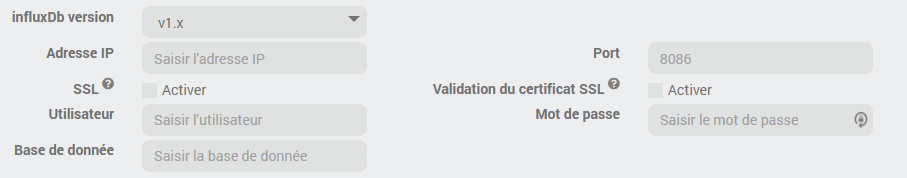
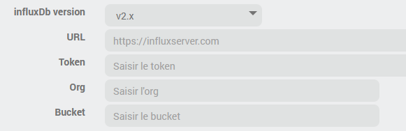
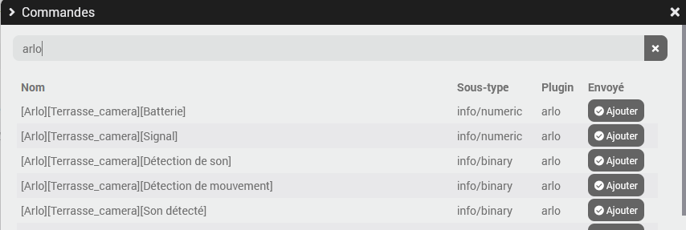

# Description

Plugin to connect to InfluxDB. It allows to easily send information by simply selecting the corresponding commands in a list. This allow to externalize the history which can then be consulted via Grafana for example.

The plugin also allows you to export Jeedom order history to InfluxDB.

# Installation

In order to use the plugin, you must download, install and activate it like any Jeedom plugin.

# Plugin configuration

There is no particular configuration to do, the plugin may use cronDaily to reset the counters.

# Devices

A Jeedom device correspond to one InfluxDB connection

Each connector will connect and send data to one and only one influxDB instance, but you can have as many connectors as you need.
The plugin manages InfluxDB v1 and v2, the basic principle between the two remains the same but the way to connect changes between the two.

## InfluxDB v1

For each connector, you have to configure the IP address of InfluxDB server, a user, a password and the database name.
You have the option to enable or not https.

## InfluxDB v2

For v2, you must configure the URL in the form `https://server.my`, the access token, the organization and the destination bucket (see influxDB documentation)

> **Tip**
> influxDB has a free cloud offer for v2 that is very easy to set up for testing or even definitively if it suits you (limited to a single organization, rate and history retention), more info: <https://www.influxdata.com/influxdb-cloud-pricing/>

## Sending mode

You can also choose how data must be sent, by default with auto-refresh. This configuration can be changed anytime without impact.

- _Auto-refresh_: the plugin will send all selected measurements at the selected schedule in one call, by default every minute.
This is the recommended way of working, it's the most optimal and do not add extra load on your Jeedom and at the same time it allows to have measurements every minute.
- _Real time_: the plugin will send measurement one by one each time there is a change of value, potentially several calls in the second for the same command (depending devices/commands). This mode might induce an important load on your installation depending your hardware and number of selected commands while most of the time an update by minute is more than enough to get useful statistics.

It is possible to have multiple connectors to the same database each configured with different mode and different commands if you want to have some commands send in real time while optimizing the load for others

In _Auto-refresh_ mode, you can choose the value that will be sent as the timestamp of the measurement:

- _Send time_, default value and historical plugin behavior
- _Value date_
- _Collect date_

## Selection of measurements to send

In the second tab are displayed all the commands selected for sending to InfluxDB. It is possible to filter the lines displayed via the "Search" field.

It is possible to search and select commands to send via 3 methods:

- Search for a single command via the button **Add a command**
- Search and add multiple commands via the button **Add commands by object**. This method has the advantage of only displaying the commands of devices linked to a particular object and therefore the display will be faster if you have a lot of commands (more than 10,000)
- Search and add multiple commands via the **Add commands (list)** button. This screen will display all the info commands of your Jeedom: useful because everything is displayed but if you have more than 10,000 commands it can take 30s or more.

Search example:

1. In the command search screens, it is possible to filter / search on any value by typing the search in the field at the top of the list.
2. The list will only show commands that have not yet been selected for this device / connector.
3. To select an command and send it to InfluxDB, all you have to do is click on the **Add** button. Remember to save the device after adding all the commands you want.

## Export of Jeedom history to InfluxDB

To export the history you must go to the _Measurements_ tab in which you have configured the commands for your Jeedom device to be sent.

You can:

- either send the history of a particular command by clicking on the _Export_ button of the corresponding line in the actions
- either check/uncheck the desired measures (and check/uncheck everything with the column selectors) and then click on the _Export_ button located in the upper zone of the column.

In both cases, the next step will ask you for the start date and the desired end date for the export and then the task will be scheduled.
This may take some time depending on the amount of data to be exported but it will be transparent as the task will run in the background.

# Commands

The InfluxDb device/connector commands are visible in the 3rd tab:

- **Send all** allows you to send all the current values of the measurements configured on the device, this does not send the command history, only the current value.
- **Status** gives the status of the connector, will be equal to 1 if no problem is detected, 0 otherwise.
- **Last send date** gives the date/time of the last successful send
- **Last error date** & **Last error description** gives the date/time of the last error sent as well as the error message
- **Total measurements** & **Total daily measurements** counters of measurements sent: total & daily.

# Definitions

A **point** in InfluxDB represents a single data record that has 4 components: a **measurement**, **fields** set, **tags** set and a **timestamp**.

Below the relation implemented by the plugin between InfluxDB concepts and Jeedom concepts:

Jeedom | InfluxDB | Description

- | - | -
Command name | Measurement | A measurement in InfluxDB is conceptually similar to a SQL table.
Command value date | Timestamp | This is the timestamp information of the data.
Device name | Field(key) | A field key is similar to a column name in a SQL table.
Command value | Field(value) | This is the data.

## Tags

Tags in InfluxDB are optional additional information associated to points.
Tags can be used in queries to filter result.
The following tags can be associated with each point sent, they must be selected in the device configuration page.
This list can be amended if you need more:

Tag(key) | Tag(value)

- | -
Plugin | plugin name
Object | Object/room name in Jeedom or "None"
CommandName | command name
GenericType | generic type of command

# Changelog

[See the changelog](./changelog)

# Support

If despite this documentation and after having read the topics related to the plugin on [community]({{site.forum}}/tags/plugin-{{page.pluginId}}) you do not find an answer to your question, do not hesitate to create a new topic with the tag of the plugin ([plugin-{{page.pluginId}}]({{site.forum}}/tags/plugin-{{page.pluginId}})).
