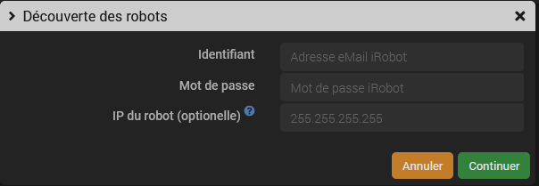

# Descripción

Complemento que permite controlar **exclusivamente de forma local** los robots aspiradores y fregadores de suelos de la marca iRobot.

El complemento se ha probado con éxito en muchos modelos diferentes y debería ser compatible con la mayoría de los modelos con wifi de la marca; si tienes alguna duda, ¡pruébalo tú mismo y lo sabrás!
Este complemento no funciona con los modelos antiguos de robots aspiradores Roomba equipados con una extensión de hardware (como RooWifi o Thinking Cleaner), sino que solo funciona con los modelos recientes que cuentan con conexión wifi.

Este complemento permite detectar y emparejar automáticamente los robots Roomba y Braava en la red local, obtener diversa información sobre el estado del robot (estado, aviso de bandeja llena, aviso de depósito...) y controlar el robot (Iniciar, Detener, Volver a la base...)

Incluye un widget de escritorio.

> **Importante**
>
> Están llegando nuevos modelos de robots, la serie x05, con una nueva aplicación llamada *Roomba Home*. Por el momento, estos modelos no son compatibles con el complemento y no tengo ni idea de si lo serán en el futuro.

# Versiones compatibles

| Componente | Versión                     |
|-----------|-----------------------------|
Debian | Bullseye (11) y Bookworm (12) |
| Jeedom    | >= 4.5                      |

# Instalación

Para utilizar el plugin, debes descargarlo, instalarlo y activarlo como cualquier otro plugin de Jeedom.

Al instalar los complementos, el plugin *MQTT Manager* se habrá instalado automáticamente si aún no estaba instalado. De no ser así, instala este plugin manualmente a través del Jeedom Market (plugin oficial gratuito).
A continuación, puede que sea necesario configurarlo (consulta la documentación del complemento *MQTT Manager*; en la mayoría de los casos, las opciones predeterminadas serán suficientes).

> **Consejo**
>
> Aunque ya tengas instalado un broker MQTT, es necesario instalar el complemento *MQTT Manager*, pero asegúrate de configurarlo en modo *broker remoto* introduciendo los parámetros de tu broker actual.

# Configuración del complemento

En la página de configuración del complemento, puedes modificar las siguientes opciones:

- El tema principal en el que el complemento publicará la información. Por defecto, el complemento publicará en el tema *iRobot*; no es necesario que lo modifiques si te parece bien.
- El puerto de escucha del demonio del complemento. No modifiques este valor a menos que comprendas cómo funciona y solo si tienes un conflicto con otro complemento.

Si las dependencias se han instalado correctamente y el complemento *MQTT Manager* está iniciado y en funcionamiento, puedes iniciar el demonio.

# Descubrimiento y creación de equipos (los robots)

Antes de empezar:

- Asegúrate de que el robot esté correctamente configurado en la red local y sea accesible desde Jeedom (en principio, en la misma red local) (procedimiento a través de la aplicación iRobot);
- Cierra todas las aplicaciones de iRobot en Android o iOS. Atención: el uso simultáneo de la aplicación de iRobot puede provocar fallos de comunicación entre el complemento y el robot;
- Asegúrate de que el robot esté en su base y no esté «en modo de suspensión» (pulsa brevemente «Clean» para activarlo si es necesario).

Desde la página de configuración de los dispositivos, haz clic en el botón *Detección*. Existen dos métodos para detectar tus robots y obtener la contraseña necesaria para que el complemento pueda controlar el robot de forma local:

- A través de la nube, *solo para la sincronización inicial*: Introduce la dirección de correo electrónico y la contraseña de tu cuenta de iRobot para que el complemento se conecte a la nube y recupere la lista de robots configurados y sus contraseñas.
- En modo local, *no funciona con todos los modelos*: Asegúrate de que los robots que quieras detectar estén en la base de recarga y encendidos (luz verde encendida). A continuación, mantén pulsado el botón HOME de tu robot hasta que emita una serie de pitidos (unos 2 segundos). Suelta el botón y la luz de WIFI debería parpadear.

> **Consejo**
>
> El modo «en la nube» solo se aplica a la detección del robot. Una vez detectado, el control del robot se realizará de forma local en todos los casos.

Si lo deseas, puedes introducir la dirección IP del robot; esto es útil **y necesario** si el robot no se encuentra en la misma subred que Jeedom, ya que el proceso de detección utiliza un mensaje de difusión para localizar los robots.

A continuación, espera entre 15 y 30 segundos; aparecerán notificaciones en la pantalla y, si el proceso se ha completado con éxito, el demonio se volverá a conectar automáticamente al finalizar. A continuación, se creará el equipo (puedes supervisar el progreso a través del registro si es necesario).

> **Consejo**
>
> Una vez finalizado el proceso de detección, podrás volver a utilizar tu aplicación móvil de iRobot si es necesario.

# Limpieza por habitación o por zona

Al detectar el robot, se crearán los comandos básicos correspondientes al mismo. Dispondrás de un comando **Iniciar** que te permitirá poner en marcha una limpieza completa de todas las habitaciones. El complemento también permite iniciar la limpieza de una habitación o de una zona específica (en los modelos compatibles).

Para ello, hay que seguir unos pasos para que se creen los comandos correspondientes en el equipo:

Por lo tanto, hay que:

- haber creado las habitaciones o zonas en la aplicación oficial;
- que la conexión entre el complemento y el robot esté operativa (demonio iniciado, que la información se transmita a Jeedom...);
- Desde la aplicación oficial, inicia por primera vez la limpieza en la habitación o zona deseada y, en los segundos siguientes, el complemento debería detectar la nueva zona y crear un comando de acción correspondiente en el dispositivo asociado al robot;
- Opcional: puedes hacer que el robot vuelva a la base;
- Por el momento, no es posible obtener el nombre de la zona de forma automática, por lo que el comando tendrá un nombre poco claro, pero puedes renombrarlo como prefieras. Hazlo ahora, antes de iniciar una nueva tarea para detectar la siguiente estancia; de lo contrario, ya no sabrás qué comando corresponde a cada estancia.

A partir de ahora puedes utilizar estos comandos como cualquier otro comando de Jeedom (no es necesario utilizar además el comando **Iniciar**).

A veces, iRobot modifica los identificadores de las tarjetas (probablemente cada vez que se realiza un cambio en la tarjeta). Cuando esto ocurre, hay que volver a iniciar una limpieza manual de la habitación para que el complemento actualice el comando.

# Lista de estados conocidos y su correspondencia en el widget

| Valor del comando *Estado* | Significado |
|------------------------------------------------|--------------------|
| *Charging* y *Recharging* | *En carga* |
| *Atracaje - Misión finalizada* y *Misión completada* | *Tarea completada*    |
| *Acoplamiento* y *Acoplamiento de usuario* | *Vuelta a la base* |
| *En pausa* | *Pausado*     |
| *Correr* | *Limpieza* |
| *Detener* | *Detener* |
| *Stuck* y *Base Unplugged* | *Bloqueado* |

# Historia

Este complemento fue creado inicialmente por @kavod (Brice Grichy).
Posteriormente, @vedrine se hizo cargo del plugin.

# Registro de cambios

[Ver el registro de cambios](./changelog)

# Asistencia

Si tienes algún problema, empieza por leer los últimos temas relacionados con el plugin en [community]({{site.forum}}/tag/plugin-{{page.pluginId}}).

Si, a pesar de todo, no encuentras respuesta a tu pregunta, no dudes en crear un nuevo tema sin olvidar incluir la etiqueta del plugin ([plugin-{{page.pluginId}}]({{site.forum}}/tag/plugin-{{page.pluginId}})).

Como mínimo, habrá que presentar:

- una captura de pantalla de la página de estado de Jeedom
- una captura de pantalla de la página de configuración del complemento
- Todos los registros disponibles del complemento, con nivel *INFO*, pegados en un `Texto preformateado` (botón `</>` en la comunidad), ¡sin archivos!
- según el caso, una captura de pantalla del error que se ha producido, una captura de pantalla de la configuración que da problemas...

# ¿Te gusta el plugin?

