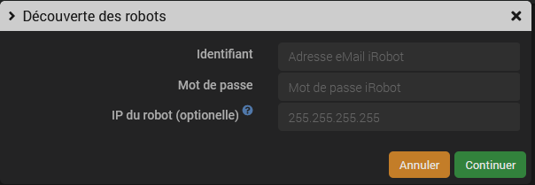

# Description

Plugin for controlling iRobot brand robot vacuum cleaners and floor cleaners **exclusively locally**.

The plugin has been successfully tested on many different models and most of the wifi models should be supported, if you have any doubts, test for yourself and you will be fixed!This plugin does not work with older models of Roomba robot vacuum cleaners equipped with a hardware extension (RooWifi or Thinking Cleaner type), it only works with recent models equipped with a Wifi connection.

This plugin allows the automatic detection and pairing of Roomba & Braava robots on the local network, to report various information on the robot's status (status, full bin info, tank info, etc.) as well as to control the robot ( Start, Stop, Return to base...)

It includes a desktop widget.

# Supported versions

| Component | Version                     |
|-----------|-----------------------------|
| Debian    | Bullseye(11) & Bookworm(12) |
| Jeedom    | >= 4.4                      |

# Installation

In order to use the plugin, you must download, install and activate it like any Jeedom plugin.

When installing dependencies, the *MQTT Manager* plugin was normally installed automatically if it wasn't already. Otherwise, please install this plugin manually via the Jeedom market (free official plugin)
Then, it may need to be configured (see *MQTT Manager* plugin documentation, in most cases the default options will be fine)

> **Tip**
>
> If you already have an MQTT broker installed, it is still necessary to install the *MQTT Manager* plugin but take care to configure it in *remote broker* mode by entering the parameters of your current broker.

# Plugin configuration

In the plugin configuration page, you can change the following options:

- The base topic under which the plugin will publish information. By default the plugin will publish under the *iRobot* topic; you don't need to modify if it suits you
- The listening port of the plugin daemon. Only change this value if you understand how it works and only if you have a conflict with another plugin.

If the dependencies have been successfully installed and the *MQTT Manager* plugin is started and functional, you can launch the daemon.

# Discovery and creation of devices (robots)

Before you start:

- Ensure that the robot is correctly configured on the local network and can be reached from Jeedom (in principle on the same local network) (procedure via the iRobot application)
- Shut down any iRobot app on Android or iOS. Warning: the simultaneous use of the iRobot application can cause communication blockages between the plugin and the robot
- Make sure the robot is on its base and not "asleep" (briefly press "Clean" to wake it up if necessary).

From the equipment configuration page, click on the *Discover* button. There are two ways to discover your robots and retrieve the password needed by the plugin to control the robot locally:

- Via the cloud, *only for initial synchronization*: Enter the eMail address and password of your iRobot account so that the plugin can connect to the cloud to retrieve the list of configured robots and their passwords.
- Locally, *does not work with all models*: Make sure the robots to be discovered are on the charging base and switched on (green lights on). Then press and hold your robot's HOME button until it emits a series of tones (approx. 2 seconds). Release the button and the WIFI LED should flash.

> **Tip**>> Cloud mode is for robot discovery only. Once discovered, the robot will be controlled locally in all cases.

You can optionally enter the robot's IP address, it is useful **and necessary** if the robot is not on the same subnet as Jeedom because the discovery process uses a broadcast message to find the robots.

Then wait for 15 to 30 seconds, you'll see on-screen notifications and the daemon will reconnect itself at the end of the process if successful. The device will then be created (you can monitor progress via the log if necessary).

> **Tip**
>
> When the discovery process is complete, you can use your iRobot mobile app again if needed.

# Cleaning by room or zone

When the robot is discovered, the basic commands corresponding to the robot will be created. You will have a **Start** command that allows you to start a complete cleaning of all the rooms. But the plugin also allows you to start cleaning of a specific room or area (on compatible models).

To do this, there are a few steps to follow so that the corresponding commands are created on the device:

It is therefore necessary to:

- have created the rooms or zones in the official app.
- that the connection between the plugin and the robot is operational (daemon started, the information goes back to Jeedom...)
- From the official app, start cleaning in the desired room or area and in the following seconds, the plugin should detect the new region and create a corresponding action command on the device corresponding to the robot.
- optional: you can return the robot to the base
- For now it is impossible to get the name of the region automatically, so the command will have an obscure name but you can rename it as you wish. Do it now before starting a new task to detect the next room otherwise you will no longer know which command corresponds to which room.

Now you can use these commands like any other Jeedom command (you should not use the **Start** command on top)

Sometimes card IDs are changed by iRobot (probably as soon as a card change is made). When this occurs, you must restart manual cleaning of the room for the plugin to update the command.

# List of known states and correspondence on the widget

| Command value *State*                         | Meaning      |
|------------------------------------------------|--------------------|
| *Charging* et *Recharging*                     | *Charging*        |
| *Docking - End Mission* et *Mission Completed* | *Task completed*    |
| *Docking* et *User Docking*                    | *Docking* |
| *Paused*                                       | *Paused*     |
| *Running*                                      | *Cleaning*        |
| *Stopped*                                      | *Stopped*           |
| *Stuck* and *Base Unplugged*                    | *Stuck*           |

# Historic

This plugin was originally created by @kavod (Brice Grichy).
The plugin was later taken over by @vedrine

# Changelog

[See the changelog](./changelog)

# Support

If you have a problem, start by reading the latest plugin-related topics on [community]({{site.forum}}/tag/plugin-{{page.pluginId}}).

If despite this you do not find an answer to your question, do not hesitate to create a new topic, with the tag of the plugin ([plugin-{{page.pluginId}}]({{site.forum}}/tag/plugin-{{page.pluginId}})).

At a minimum, you will need to provide:

- a screenshot of the Jeedom health page
- a screenshot of the plugin's configuration page
- all available plugin logs pasted into a `Preformatted Text` (button `</>` on community), no files!
- depending on the case, a screenshot of the error encountered, a screenshot of the configuration causing the problem...

# Do you like the plugin?

