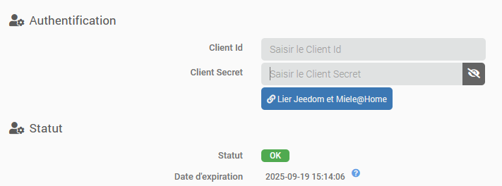

# Description

Plugin for integrating all devices in the Miele@Home line.
You can access device data, monitor devices, and perform certain actions (depending on the device).

# Supported Versions

| Component | Version                     |
|-----------|-----------------------------|
| Debian    | Bullseye(11) & Bookworm(12) |
| Jeedom    | >= 4.4                      |

# Installation

To use the plugin, you must download, install, and activate it just like any other Jeedom plugin.
You must have a Miele user account with at least one compatible Miele@Home device linked to it, and then <a href="https://www.miele.com/f/com/en/register_api.aspx" target="_blank">enable API access</a>

Dependencies are normally installed or updated automatically. If this does not happen, you can start the installation manually. Python 3.11 or later is required: it will be installed automatically if necessary, but this may take some time on a small system. Please be patient and do not interrupt the installation.

# Plugin configuration

In the plugin settings, you'll need to enter the _Client Id_ and _Client Secret_ you received to access the API, then save the settings.
Start the daemon, then click the "Link Jeedom and Miele@Home" button and follow the instructions. A new tab will open on the Miele website, where you'll need to log in with your Miele credentials to confirm the link.

If everything went smoothly, when you return to the configuration page, you should see that the connection status is now _OK_.

# Equipment

Once authentication is successful, the plugin will synchronize your devices. It will create any missing devices along with their commands and update the status of all connected devices. Commands will then be updated in real time (as long as the daemon is running).

> **Tip**
>
> The plugin will never delete a device from your Jeedom. If a device no longer corresponds to any device you own, please delete it manually.

On a device's configuration page, there is a button that lets you restore missing commands (useful if you accidentally deleted a command).

# Commands

Below, you will find descriptions of all the commands that may be available on your devices, organized by type and functionality. It is normal for not all of the commands described below to be present on your devices: this varies by device, and the plugin handles this dynamically.

In addition, in order to perform an action, the device must be in a specific state. For example, it is not possible to stop the device if it has not been started.

## Commands Common to all devices

- **Refresh**: Refresh the device information.
- **Status** & **Status Description**: Indicates the device's status (numeric) and its description, respectively (see below for a list of possible statuses)
- **Error**: binary value indicating whether the device is in an error state

## General Information & actions

Below are the commands available for various devices, depending on whether they can be turned on or off, or whether they have an associated port or lighting.

- **Status**: info/binary command indicating whether the device is on or off
- **On**: Turn on the device.
- **Off**: Turn off the device.
- **Notification**: a binary value indicating whether a notification is active
- **Port**: a binary value indicating whether one or more ports on the device are open
- **Light**: a binary value indicating the status of the device's light (if applicable)
- **Turn on the light** & **Turn off the light**

## "Program" commands

These commands are typically found on washing machines, dryers, dishwashers, coffee makers, ovens (conventional, steam, microwave, or combination), refrigerators, freezers (or combination units), and wine coolers.

- **Start**: Start the device; the device must be in the _4-Programmed and waiting to start_ status.
- **Pause**: Pause the device.
- **Stop**: Stop the device; the device must be in status _4-Scheduled and waiting to start_, _5-Running_, or _6-Pause_.
- **Program Type**: Displays the current program (see the list of known possible values below)
- **Program Name**: The name of the program currently running on devices that support this feature.
- **Phase**: the current phase of the program
- **Time Remaining**: the time remaining in hours and minutes until the end of the program; format HHMM
- **Start in**: the time remaining until the next scheduled start; format HHMM
- **Elapsed time**: the time that has elapsed since the program started; format HHMM
- **Start in**: Action command to start the device after a specified time (HHMM format).
- **Start Program**: Start a specific program.
- **Program Temperature**: the target temperature for the program
- **Temperature**: the current temperature of the appliance (for example, your oven is set to 180°C but is only at 70°C)

**Time Remaining**, **Start in**, **Elapsed time** are therefore numerical values in HHMM format that can be used directly in a scenario, for example (with the _IN_ or _AT_ block), but if they are displayed in a widget, the plugin formats them for readability and displays the value as `hh:mm`, for example `01:30` or `--:--` if the value is 0; this means that the information is not relevant given the device’s current state—that is, no program is currently running and no program is scheduled.

## "Temperature" commands

These commands are typically found on ovens (conventional, steam, microwave, or combination), refrigerators, freezers (or combination units), and wine coolers.

- **Program 1 Temperature**: Target temperature for Program 1.
- **Temperature 1**: Measured temperature 1.
- **Program 2 Temperature**: Target temperature for Program 2.
- **Temperature 2**: Measured temperature 2.
- **Program 3 Temperature**: Target temperature for Program 3.
- **Temperature 3**: Measured temperature 3.

## Washing machine, dryer, dishwasher

- **Rotational speed**: Rotational speed in revolutions per minute (rpm)
- **Dryness Level**: See below for a list of possible values
- **Water consumption**: The machine's current water consumption in liters
- **Energy consumption**: Current energy consumption of the machine in kWh
- **Water Forecast**: Water consumption forecast (in %).
- **Energy Forecast**: Forecast of energy consumption (in %).

## Range hood

- **Ventilation level**: Value from 1 to 4
- **Set ventilation level**: Set the ventilation level (1 to 4)
- **Set Colors**: Set the device's lighting color.

## Refrigerator, Freezer & Wine Cooler

- **Start Freezing**: Start the super-freeze mode.
- **Stop Freezing**: Stop the super-freeze mode.
- **Start Cooling**: Start super-cooling mode.
- **Stop Cooling**: Stop super-cooling mode.
- **Mode**: Select the operating mode (Normal, Sabbath, Party, Vacation).

# Possible values for the "infos" commands

## "Status" command

- 1 = OFF
- 2 = ON
- 3 = PROGRAMMED
- 4 = PROGRAMMED, WAITING TO START
- 5 = RUNNING
- 6 = PAUSE
- 7 = END PROGRAMMED
- 8 = FAILURE
- 9 = PROGRAM INTERRUPTED
- 10 = IDLE
- 11 = RINSE HOLD
- 12 = SERVICE
- 13 = SUPERFREEZING
- 14 = SUPERCOOLING
- 15 = SUPERHEATING
- 146 = SUPERCOOLING_SUPERFREEZING
- 255 = NOT_CONNECTED

## "Schedule" information command

This list is not exhaustive; there may be other values.

- Normal operating mode
- Custom program
- Automatic program
- Cleaning and care program

## "Phase" Information command

These lists are not exhaustive; there may be other values.

### Dishwasher

- Main Wash
- Rinse
- Final Rinse
- Drying
- Finished

### Oven and warming drawer

- PreHeat
- Program Running

## "Dryness Level" command

This list is not exhaustive; there may be other values.

- No drying step
- Extra dry
- Normal Plus
- Normal
- Slightly Dry
- Hand iron, Level 1
- Hand iron, Level 2
- Ironing machine

# Change log

[View the changelog](./changelog)

# Support

If you're having a problem, start by reading the latest threads related to the plugin on [Community]({{site.forum}}/tag/plugin-{{page.pluginId}}).

If you still can't find an answer to your question, feel free to create a new thread—and don't forget to include the plugin tag ([plugin-{{page.pluginId}}]({{site.forum}}/tag/plugin-{{page.pluginId}})).

At a minimum, you must provide:

- a screenshot of the Jeedom Health page
- a screenshot of the plugin's configuration page
- All available plugin logs at the _INFO_ level, pasted into a `Preformatted Text` block (use the `</>` button in Community), no files!
- Depending on the situation, a screenshot of the error encountered, a screenshot of the problematic configuration...
