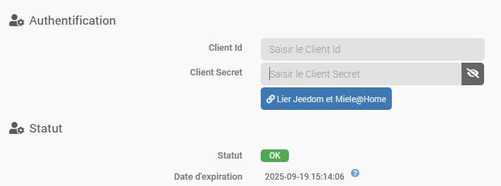

# Description

Plugin allowing to integrate all appliances compatible with Miel@Home.
It is possible to get appliances information, to monitor them and execute some actions (depending the appliance).

# Supported versions

| Component | Version                     |
|-----------|-----------------------------|
| Debian    | Bullseye(11) & Bookworm(12) |
| Jeedom    | >= 4.4                      |

# Installation

In order to use the plugin, you must download, install and activate it like any Jeedom plugin.
You must have a Miele account with at least one appliance compatible with Miele@Home linked to it and eventually <a href="https://www.miele.com/f/com/en/register_api.aspx" target="_blank">activate your access to the API</a>

Dependencies are normally installed or updated automatically. If this is not the case, you can run the installation manually. Python 3.11 minimum is required: it will be installed automatically if necessary, but this may take some time on a small configuration. Please be patient and do not interrupt the installation.

# Plugin configuration

In the plugin configuration, you'll need to enter the _Client Id_ and _Client Secret_ you've received to access the API, and save.
Start the daemon, then click on the Link Jeedom and Miele@Home button and follow the instructions. A new tab will open on the Miele website, where you'll need to log in with your Miele credentials to validate the link.

If everything went smoothly, when you return to the configuration page, you should see that the connection status is now _OK_.

# Devices

As soon as authentication is successful, the plugin will synchronize your devices. It will create the missing devices with their commands and update the status of all connected devices. The commands will then be updated in real time (as long as the daemon is running).

> **Tip**
>
> The plugin will never delete a device in your Jeedom. If a device does not correspond to any appliance in your possession, please delete it manually.

On the device configuration page, a button allows you to recreate missing commands (useful if you've deleted a command by mistake).

# Commands

## Info commands common to all appliances

Each Miele device has the following commands, not all of them are applicable to all appliances:

- **Status** & **Status description**: indicates the (digital) device status and its description respectively (see below for list of possible statuses).
- **State**: command info/binary indicating whether the device is on or off.
- **Program type**: indicates the current program (see below for a list of known possible values).
- **Program name**: the name of the current program on devices supporting this feature.
- **Phase**: the current phase of the program
- **Remaining time**: the time remaining in hours and minutes before the end of the program; format HHMM
- **Start in**: time to next scheduled start; format HHMM
- **Elapsed time**: time elapsed since program start; format HHMM
- **Program temperature**: target program temperature
- **Temperature**: the current temperature of the appliance (for example, your oven is set to 180°C but only 70°C).
- **Notification**: binary value indicating if a notification is active
- **Error**: binary value indicating whether the device is in error.
- **Door**: binary value indicating whether one (or more) of the device's doors is open.
- **Light**: binary value indicating device light status (if applicable)

**Remaining time**, **Start in**, **Elapsed time** are therefore numerical info in HHMM format, directly usable in a scenario for example (with _IN_ or _AT_ block), but if they are displayed in a widget, the plugin takes care of making them readable and will display the value in the form `hh:mm`, for example `01:30` or `--:--` if the value is 0; this means that the info is not relevant to the current state of the device, that there is no program running and no program is scheduled.

### List of values for "Status" info

- 1 = OFF
- 2 = ON
- 3 = PROGRAMMED
- 4 = PROGRAMMED WAITING TO START
- 5 = RUNNING
- 6 = PAUSE
- 7 = END PROGRAMMED
- 8 = FAILURE
- 9 = PROGRAMME INTERRUPTED
- 10 = IDLE
- 11 = RINSE HOLD
- 12 = SERVICE
- 13 = SUPERFREEZING
- 14 = SUPERCOOLING
- 15 = SUPERHEATING
- 146 = SUPERCOOLING_SUPERFREEZING
- 255 = NOT_CONNECTED

### List of values for "Program" info

This list is not exhaustive, there may be other values.

- Normal operation mode
- Own program
- Automatic program
- Cleaning-/Care program

### Lists of known values for the "Phase" info

This list is not exhaustive, there may be other values.

#### Dishwasher

- Main Wash
- Rinse
- Final Rinse
- Drying
- Finished

#### Oven & heated drawer

- PreHeat
- Program Running

## Info commands specific to some appliances

- **Rotation speed** for washing machines, numerical value in rpm.
- **Drying level** for tumble dryers, see below for list of possible values
- **Ventilation level** for hoods, values from 0 to 4
- **Water consumption** and **Energy consumption** for washing machines, dryers and dishwashers

### List of values for the info "Drying level"

- No drying step
- Extra dry
- Normal Plus
- Normal
- Slightly Dry
- Hand iron level 1
- Hand iron level 2
- Machine iron

## Actions commands

The action commands below will be present on the device if the action is supported by the appliance. On top, to be able to perform an action, the appliance must be in a given status/state. For example, it is not possible to stop it if it was not started.

- **On**, **Off**
- **Start**, the device must be in 4-Programmed status and waiting to start
- **Stop**, the device must be in 4-Programmed status and waiting to start, 5-Operating or 6-Pause
- **Pause**
- **Start Freezing**, only for freezer type devices, the device must be in 5-Operating status
- **Stop Freezing**, only for freezer type devices, the device must be in Freezing mode
- **Start Cooling**, only for freezer type devices, the device must be in 5-Operating status
- **Stop Cooling**, only for freezer type devices, the device must be in Cooling mode
- **Switch on light**
- **Switch off light**
- **Set start time**, the device must be in 4-Programmed status and waiting to start
- **Define ventilation level** & **Define colors**, for hoods

# Changelog

[See the changelog](./changelog)

# Support

If you have a problem, start by reading the latest plugin-related topics on [Community]({{site.forum}}/tag/plugin-{{page.pluginId}}).

If despite this you do not find an answer to your question, do not hesitate to create a new topic, with the tag of the plugin ([plugin-{{page.pluginId}}]({{site.forum}}/tag/plugin-{{page.pluginId}})).

At a minimum, you will need to provide:

- a screenshot of the Jeedom health page
- a screenshot of the plugin's configuration page
- all available plugin logs pasted into a `Preformatted Text` block (button `</>` on Community), no files!
- depending on the case, a screenshot of the error encountered, a screenshot of the configuration causing the problem...
