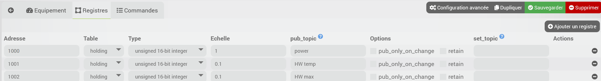

# Descripción

Complemento que permite actuar como pasarela entre Modbus TCP/IP y MQTT.

# Versiones compatibles

| Componente | Versión |
|-----------|-----------------------------|
Debian | Bullseye (11) y Bookworm (12) |
| Jeedom    | >= 4.4 |

# Instalación

Para utilizar el plugin, debes descargarlo, instalarlo y activarlo como cualquier otro plugin de Jeedom.
Este complemento necesita el complemento *MQTT Manager (MQTT2)* para funcionar.

# Configuración del complemento

Antes de empezar, asegúrate de haber instalado y configurado el complemento *MQTT Manager (MQTT2)*, consulta la documentación de este complemento.

En la página de configuración del complemento, puedes modificar las siguientes opciones:

- El tema principal en el que el complemento publicará la información (véase la configuración de los dispositivos). Por defecto, el complemento publicará en el tema *modbus2mqtt*; no es necesario que lo modifiques si te parece bien.
- El puerto de escucha del demonio del complemento. No modifiques este valor a menos que comprendas cómo funciona y solo si tienes un conflicto con otro complemento.

# Configuración de los dispositivos

El complemento se encuentra en el menú Complementos → Protocolo de domótica.

Una vez creado un nuevo dispositivo, estarán disponibles las opciones habituales.

Cada dispositivo corresponde a una pasarela compuesta por un cliente Modbus y un cliente MQTT. Por lo tanto, el dispositivo se conectará al dispositivo Modbus configurado para leer y escribir los registros definidos y se conectará a tu broker MQTT para publicar y recibir los mensajes correspondientes.

Además de los parámetros generales, habrá que configurar los parámetros específicos para la conexión Modbus, así como el tema MQTT para este equipo.

## Parámetros de conexión Modbus

- *IP* y *puerto* de tu equipo Modbus TCP
- *Actualización*: intervalo en segundos entre cada operación de lectura/escritura en el equipo Modbus
- *Offset*: desplazamiento que se debe aplicar a las direcciones de los registros
- *Longitud del lote*: número de registros contiguos que se leerán en cada operación de lectura (entre 1 y 100, ambos incluidos). Si el valor es 1, cada registro se leerá por separado.
- *Orden de los bytes*: Solo para números de 32 o 64 bits; se puede elegir entre *Big-endian* (por defecto) y *Little-endian*

## Configuración de MQTT

Solo hay que configurar un elemento: el tema de este dispositivo.

Será un subtema del tema general del complemento (véase la configuración del complemento) y cada registro Modbus se publicará en un subtema de este tema.

Ejemplo: si tienes un dispositivo Modbus al que llamaremos *solar* y que permite obtener la potencia generada, a la que llamaremos *power*, la información se publicará en el tema *modbus2mqtt/solar/power*

## Definición de los registros Modbus

En la segunda pestaña, *Registros*, tendrás que configurar los registros Modbus que te interesen y su correspondencia con MQTT.
Ejemplo:

Por lo tanto, debes especificar:

- la dirección
- la tabla de registros
- el tipo: entero con o sin signo de 16, 32 o 64 bits.
- escalado: el valor leído se multiplicará por este valor antes de publicarse
- el tema MQTT para la publicación del valor (es decir, Modbus → MQTT)
- La opción *Solo si hay cambios* permite publicar en MQTT únicamente si el valor ha cambiado; si se desmarca, el valor se publicará cada vez que se lea.
- opción *Retain* para publicar con la opción *retain* o sin ella
- posiblemente el tema de escritura: toda la información publicada en este tema se escribirá en el registro Modbus correspondiente (es decir, MQTT → Modbus); por lo general, si es necesario, podrás introducir allí «power\set» o «power_set», por ejemplo.

## Creación de comandos

Ahora ya puedes guardar tu equipo; el complemento creará los controles correspondientes a tu configuración y, por lo tanto, podrás obtener los valores directamente a través de dichos controles, que se actualizarán con cada nueva publicación y, por lo tanto, se pueden utilizar directamente en cualquier lugar de Jeedom.

Por lo tanto, no es necesario configurar otro dispositivo MQTT para obtener los valores; no obstante, puedes hacerlo si lo deseas o consultar los temas MQTT desde otro dispositivo, otra plataforma...

Los controles se pueden ver en la tercera pestaña, donde encontrarás las opciones de configuración habituales.
Deberías comprobar y modificar, si es necesario, el subtipo de los comandos de información (numérico o binario) para que se ajuste a la definición del registro.

Si has configurado un tema para poder escribir un valor en un registro, también se creará un comando de acción/mensaje correspondiente, que podrás utilizar directamente en cualquier parte de Jeedom.

# Registro de cambios

[Ver el registro de cambios](./changelog)

# Asistencia

Si tienes algún problema, empieza por leer los últimos temas relacionados con el plugin en [community]({{site.forum}}/tag/plugin-{{page.pluginId}}).

Si, a pesar de todo, no encuentras respuesta a tu pregunta, no dudes en crear un nuevo tema sin olvidar incluir la etiqueta del plugin ([plugin-{{page.pluginId}}]({{site.forum}}/tag/plugin-{{page.pluginId}})).

Como mínimo, habrá que presentar:

- una captura de pantalla de la página de estado de Jeedom
- una captura de pantalla de la página de configuración del complemento
- Todos los registros disponibles del complemento, con nivel *INFO*, pegados en un `Texto preformateado` (botón `</>` en la comunidad), ¡sin archivos!
- según el caso, una captura de pantalla del error que se ha producido, una captura de pantalla de la configuración que da problemas...
