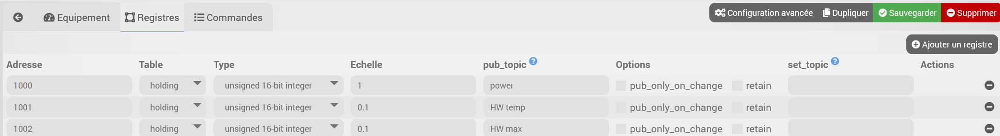

# Description

Plugin permettant de faire passerelle entre du modbus TCP/IP et MQTT.

# Installation

Afin d’utiliser le plugin, vous devez le télécharger, l’installer et l’activer comme tout plugin Jeedom.
Ce plugin nécessite le plugin *MQTT Manager (MQTT2)* pour fonctionner. Pour l'instant et tant que le plugin *MQTT Manager (MQTT2)* sera en beta, il est nécessaire d'installer celui-ci manuellement.

# Configuration du plugin

Avant de commencer, assurez-vous d'avoir installer et configurer le plugin *MQTT Manager (MQTT2)*, voir documentation de ce plugin.

Dans la page de configuration du plugin, vous pouvez modifier les options suivantes:

- Le topic de base sous lequel le plugin va publier les informations (voir configuration des équipements). Par défaut le plugin publiera sous le topic *modbus2mqtt*; vous n'avez pas besoin de modifier si cela vous convient
- Le port d'écoute du démon du plugin. Ne modifiez cette valeur que si vous comprenez le fonctionnement et uniquement si vous avez un conflit avec un autre plugin.

# Configuration de l'équipement

Le plugin se trouve dans le menu Plugins > Protocole domotique.
Après avoir créé un nouvel équipement, les options habituelles sont disponibles.

Chaque équipement correspond à une passerelle composée d'un client modbus et un client MQTT. L'équipement se connectera donc à l'équipement modbus configuré pour lire et écrire les registres définis et se connectera à votre broker MQTT pour y publier et recevoir les messages correspondant.

En plus des paramètres généraux il faudra donc configurer les paramètres spécifiques pour la connexion modbus ainsi que le topic MQTT pour cet équipement.

## Paramètres de connexion modbus

- *IP* et *Port* de votre équipement modbus TCP
- *Actualisation*: délai en secondes entre chaque opérations de lecture/écriture sur l'équipement modbus
- *Décalage* (offset) à appliquer sur les adresses des registres
- *Lot*: nombre de registres contigus à lire lors de chaque opération de lecture (entre 1 et 100 inclus). Si 1 alors chaque registre sera lû séparément.

## Paramètre MQTT

Le topic de cet équipement. Ce sera un sous-topic du topic général du plugin (voir configuration du plugin).
Chaque registre sera publié dans un sous-topic de ce topic.

Exemple: si vous avez un équipement modbus que l'on va appeler *solar* qui permet d'obtenir la puissance produite que l'on va appeler *power*, l'info sera publiée dans le topic *modbus2mqtt/solar/power*

## Définition des registres modbus

Dans le deuxième onglet, *Registres*, vous allez devoir configurer les registres modbus qui vous intéressent et leur correspondance MQTT.
Exemple:

Vous devez donc spécifier:

- l'adresse
- la table de registre (*holding* ou *input* pour l'instant uniquement, évolution à envisager selon les demandes)
- le type: entier 16 bits signé ou entier 16 bits non-signé pour l'instant, évolution à envisager selon les demandes.
- la mise à l'échelle: la valeur lue sera multiplié par cette valeur avant d'être publiée
- le topic MQTT de publication de la valeur (donc modbus -> MQTT)
- option *Publication seulement si changement* permet de ne publier sur MQTT que si la valeur à changée, si décoché la valeur sera publiée lors de chaque lecture
- option *retain* pour publier avec l'option *retain* ou non
- éventuellement le topic de lecture: toute info publiée sur ce topic sera écrite sur le registre modbus correspondant (donc MQTT -> modbus)

## Création des commandes

Vous pouvez à présent sauver votre équipement; le plugin créera les commandes correspondantes à votre configuration et vous pourrez donc obtenir les valeurs directement sur ces commandes, elles seront mise à jour lors de chaque nouvelle publication et sont donc directement utilisables partout sous Jeedom.

Il n'est donc pas nécessaire de configurer un autre équipement MQTT pour obtenir les valeurs cependant vous êtes libre de le faire ou de consommer les topics MQTT depuis un autre appareil, une autre plateforme...

Les commandes sont visibles dans le 3ème onglet et vous y trouverez les options de configurations habituelles.
Vous devriez vérifier et modifier si besoin le sous-type (numérique ou binaire) pour que cela corresponde à la définition du registre.

# Changelog

[Voir le changelog](./changelog)

# Support

Si malgré cette documentation et après voir lu les sujets en rapport avec le plugin sur [community]({{site.forum}}/tags/plugin-{{page.pluginId}}) vous ne trouvez pas de réponse à votre question, n'hésitez pas à créer un nouveau sujet en n'oubliant pas de mettre le tag du plugin ([plugin-{{page.pluginId}}]({{site.forum}}/tags/plugin-{{page.pluginId}})).
