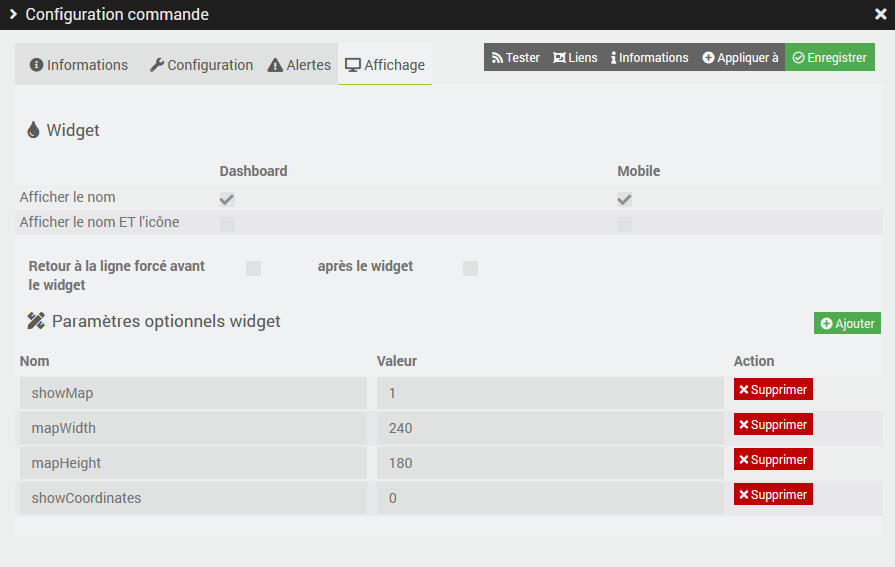

# Description

Plugin to connect to the MyAudi platform allowing to retrieve cars which are compatible.

# Installation

In order to use the plugin, you must download, install and activate it like any Jeedom plugin.

> **Important**
>
> It is essential to be under Debian 10 Buster minimum to run the plugin.

# Plugin configuration

In the configuration of the plugin it will be necessary to setup the username and password.
You can also enter a Google Maps API key which will be used to display the map with the location of the vehicle on the widget.

# The devices

As soon as the daemon starts, if your username and password are correct, the plugin will automatically create the vehicles linked to your account.
It is possible to synchronize manually via the devices page.

In device configuration page you can configure auto-refresh frequency.

# Commands

For the moment the following commands are available:

- Outside temperature
- Mileage
- Next oil change in days and km
- Next maintenance in days and km
- Oil level (in L and in %)
- Warning of low oil level and oil change
- Tank level
- Total range (in km)
- AdBlue range (in km)
- Door open and locked status
- Vehicle location (latitude and longitude)

# Widget

In the advanced configuration of the _Location_ command you can configure the following options:

- **showMap:** 0 to not display the map, 1 to display the map
- **mapWidth:** map width, default 240
- **mapHeight:** map height, default 180
- **showCoordinates:** if the map is displayed, by default does not display the coordinates (latitude and longitude). 1 to display them.

# Changelog

[See the changelog](./changelog)

# Support

If you have a problem, start by reading the latest plugin-related topics on [community]({{site.forum}}/tags/plugin-{{page.pluginId}}).

If despite this you do not find an answer to your question, do not hesitate to create a new topic, with the tag of the plugin ([plugin-{{page.pluginId}}]({{site. forum}}/tags/plugin-{{page.pluginId}})).

At a minimum, you will need to provide:

- a screenshot of the Jeedom health page
- all available plugin logs
- depending on the case, a screenshot of the error encountered, a screenshot of the configuration causing the problem...
