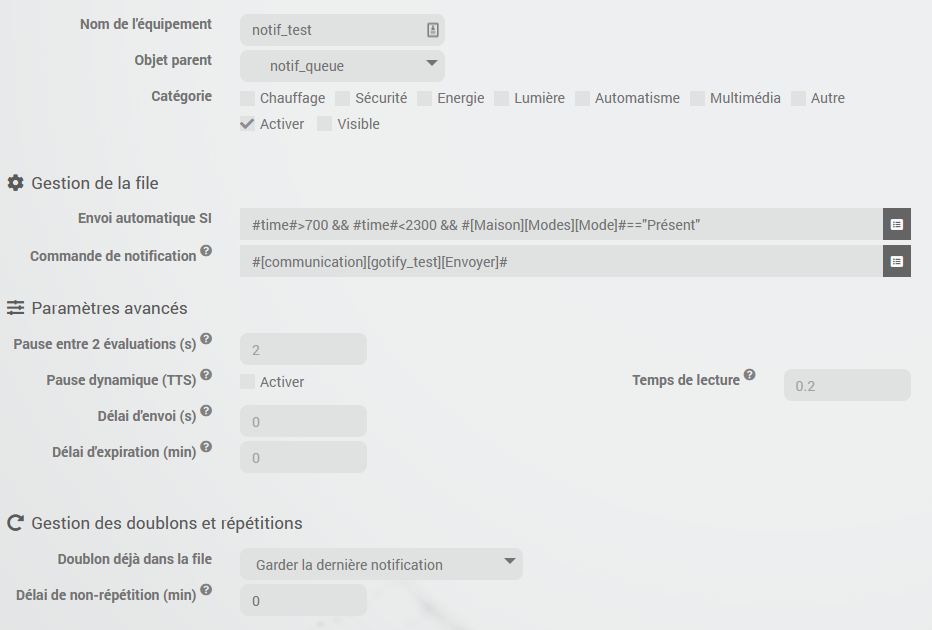

# Descripción

Complemento que permite crear comandos de notificaciones (comandos de tipo acción/mensaje) que funcionan como una cola y solo envían las notificaciones (enviadas a su cola respectiva) si se cumple una condición.

Esto permite, por ejemplo:

- que solo se emita una notificación por voz (TTS) en una habitación determinada si hay alguien en ella;
- avisarte de una acción que debes realizar solo si estás en casa;
- para que solo se envíen determinadas notificaciones durante el día y evitar que suene el teléfono por la noche.

Cada cola también se puede configurar para añadir un retraso antes del envío, un plazo de caducidad del mensaje, evitar repetir una notificación ya enviada anteriormente...

# Versiones compatibles

| Componente | Versión                     |
|-----------|-----------------------------|
| Debian    | Bullseye(11) & Bookworm(12) |
| Jeedom    | >= 4.5                      |

# Instalación

Para utilizar el plugin, debes descargarlo, instalarlo y activarlo como cualquier otro plugin de Jeedom.

No es necesario realizar ninguna configuración en el plugin.

# Configuración de los dispositivos

El complemento se encuentra en el menú Complementos → Comunicación.

Una vez creado un nuevo dispositivo, estarán disponibles las opciones habituales.

Puedes crear varios dispositivos para organizar tus diferentes comunicaciones según tus preferencias.

Además de los ajustes habituales de un dispositivo, debes configurar:

- una condición (la condición para que se envíen las notificaciones)
- el comando o comandos de notificación que se deben utilizar (cuando se cumpla la condición)

> **Consejo**
>
> Puedes especificar varios comandos de notificación separándolos con &&

# Opciones adicionales

## Pausa entre dos evaluaciones

Esto permite configurar el tiempo de espera entre dos evaluaciones de la condición al enviar mensajes sucesivos, por ejemplo, si la respuesta de estado de un comando tarda en llegar.

## Pausa dinámica entre dos mensajes (TTS)

Si está activado, el complemento calculará el tiempo de lectura del mensaje. Para ello, cuenta el número total de sílabas y multiplica esa cifra por el tiempo medio de lectura por sílaba. Puedes ajustar este tiempo en función de tu dispositivo TTS en la configuración del equipo.

## Plazo de envío

Es posible configurar un tiempo de espera para el envío de notificaciones (en segundos) durante el cual una nueva notificación se mantendrá en la cola aunque la condición sea cierta; solo transcurrido ese tiempo se enviará la notificación si se cumple la condición.

## Plazo de caducidad

Es posible configurar un plazo de caducidad para las notificaciones (en minutos). Transcurrido ese plazo, la notificación ya no se enviará si la condición no se ha cumplido hasta ese momento.

## Duplicado

También puedes elegir cómo actuar cuando se añade a la cola una notificación con el mismo mensaje que una notificación ya existente.

- Ignorar: la nueva notificación simplemente se añadirá al final de la cola (comportamiento predeterminado);
- Conservar la primera notificación: así, la nueva no se añadirá;
- Conservar la última notificación: la notificación anterior se eliminará de la cola y la nueva se añadirá al final de la misma.

## Plazo de no repetición

Esto permite eliminar la notificación y, por lo tanto, no añadirla a la cola; así, no se enviará si ya se ha enviado el mismo mensaje en los últimos X minutos.

# Algunos principios

- Se garantiza el orden de envío de las notificaciones (FIFO: la primera notificación recibida es la primera que se envía), salvo en los casos de duplicados, según la configuración.
- Si se detecta un problema durante el envío (lo cual no siempre es posible), el mensaje se vuelve a colocar al final de la cola para volver a intentarlo más tarde.
- El complemento comprueba automáticamente el estado de cada cola:
  - cada minuto,
  - cada vez que se añaden nuevos mensajes y
  - cuando un comando «info» utilizado en la condición cambia de valor (el mismo principio que los desencadenantes de escenarios)
- La solicitud la gestiona el complemento (el comando de notificación que se utilice a continuación también debe gestionarla)

## Generación de texto

El complemento gestiona la generación de texto aleatorio. El sistema es el mismo que para las interacciones:

`[Hola|Hola|Hola]` devolverá `Hola`, `Hola` o `Hola`.

## Texto condicional

El complemento gestiona las condiciones en el texto mediante un operador ternario: `{(test) ? verdadero : falso}`

Ejemplo:

`Esta mañana {(#[Casa][Tiempo][Temperatura]# < 6) ? hace frío:hace calor}`

Es posible no introducir ningún texto en el caso de que la condición sea verdadera o falsa, pero es obligatorio dejar los dos puntos («:»), por ejemplo:

`Esta mañana {(#[Casa][Tiempo][Temperatura]# < 6) ? hace frío:}`

Las condiciones no se pueden anidar; esta función no está disponible.

# Los pedidos

- **Añadir** permite añadir un mensaje a la cola; la condición se evaluará inmediatamente y, si se cumple, se enviarán todos los mensajes (por orden).
- **Vaciar** permite vaciar la cola.
- **Comprobar y enviar** permite activar manualmente la comprobación de la condición y el envío de mensajes si esta es válida
- **Enviar sin condiciones** permite forzar el envío inmediato de todos los mensajes sin tener en cuenta la condición (pero sí el plazo de envío)
- **Número de mensajes**: comando de información que indica el número de mensajes que hay actualmente en cola

# El widget

El widget será el predeterminado del núcleo, con la visualización predeterminada de los comandos (mensajes) según su configuración.

# Registro de cambios

[Ver el registro de cambios](./changelog)

# Asistencia

Si tienes algún problema, empieza por leer los últimos temas relacionados con el plugin en [community]({{site.forum}}/tag/plugin-{{page.pluginId}}).

Si, a pesar de todo, no encuentras respuesta a tu pregunta, no dudes en crear un nuevo tema sin olvidar incluir la etiqueta del plugin ([plugin-{{page.pluginId}}]({{site.forum}}/tag/plugin-{{page.pluginId}})).

Como mínimo, habrá que presentar:

- una captura de pantalla de la página de estado de Jeedom
- una captura de pantalla de la página de configuración del complemento
- Todos los registros disponibles del complemento, con nivel *INFO*, pegados en un `Texto preformateado` (botón `</>` en la comunidad), ¡sin archivos!
- según el caso, una captura de pantalla del error que se ha producido, una captura de pantalla de la configuración que da problemas...
