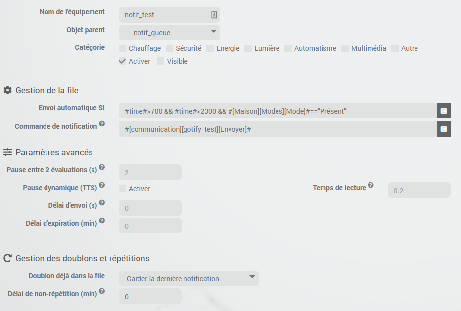

# Description

Plugin permettant de créer des commandes de notifications (commande de type action/message) qui se comportent comme une file d'attente et ne délivrent les notifications (envoyées dans leur file respective) que si une condition est remplie.

Cela permet par exemple:

- de ne délivrer une notification par voix (TTS) dans un pièce donnée que si quelqu'un si trouve;
- de vous avertir d'une action à faire que si vous êtes présent chez vous;
- de n'envoyer certaines communications que pendant la journée et éviter de faire sonner votre téléphone la nuit.

Chaque file peut aussi être configurée pour ajouter un délai avant envoi, un délai d'expiration du message, éviter de répéter une notification déjà envoyée précédemment...

# Installation

Afin d’utiliser le plugin, vous devez le télécharger, l’installer et l’activer comme tout plugin Jeedom.
Il n'y a aucune configuration à faire sur le plugin.

# Configuration de l'équipement

Le plugin se trouve dans le menu Plugins > Communication.
Après avoir créé un nouvel équipement, les options habituelles sont disponibles.

Vous pouvez créer plusieurs équipements pour organiser vos différentes communications selon vos préférences.

En plus des configurations habituelles d'un équipement, vous devez configurer:

- une condition (la condition pour que les notifications soient envoyées)
- la ou les commandes de notification à utiliser (quand la condition est remplie)

> **Tip**
>
> Vous pouvez spécifier plusieurs commandes de notification en les séparant par &&

# Options additionnelles

## Pause entre 2 évaluations

Cela permet de configurer le temps de pause entre 2 évaluations de la condition lors d'envoi de messages successifs si par exemple le retour d'état d'une commande prend du temps.

## Pause dynamique entre 2 messages (TTS)

Si activé, le plugin va calculer le temps de lecture du message. Pour cela il compte le nombre de syllabes totales et multiplie ce nombre par un temps de lecture moyen par syllabe. Vous pouvez adapter ce temps en fonction de votre périphérique TTS dans la configuration de l'équipement.

## Délai d'envoi

Il est possible de configurer un délai d'envoi des notifications (en seconde) pendant lequel une nouvelle notification sera gardée dans la file même si la condition est vrai, ce n'est qu'après ce délai que la notification sera envoyée si la condition est remplie.

## Délai d'expiration

Il est possible de configurer un délai d'expiration des notifications (en minute). Passé ce délai la notification ne sera plus envoyée si la condition n'a pas été remplie jusque là.

## Doublon

Vous pouvez aussi choisir le comportement lorsqu'une notification avec le même message qu'une notification existante est ajoutée à la file.

- Ignorer: la nouvelle notification sera simplement ajoutée à la fin de la file (comportement par défaut);
- Garder la première notification: la nouvelle ne sera donc pas ajoutée;
- Garder la dernière notification: la notification précédente sera supprimée de la file et la nouvelle sera ajoutée à la fin de celle-ci.

## Délai de non-répétition

Cela permet de supprimer la notification et donc de ne pas ajouter l'ajouter à la file; elle ne sera donc pas envoyée si le même message a déjà été envoyé durant les X dernières minutes.

# Quelques principes

- L'ordre d'envoi des notifications est garantie (FIFO, première notification reçue, première notification envoyée), exception suivant la configuration des doublons.
- Si un problème est détecté pendant l'envoi (pas toujours possible), le message est remis à la fin de la file pour un nouvel essai plus tard.
- Le plugin vérifie automatiquement la condition de chaque file:
  - toutes les minutes,
  - à chaque ajout de nouveaux messages et
  - lorsqu'une commande info utilisée dans la condition change de valeur (même principe que les déclencheurs de scénario)
- le ask est géré par le plugin (il faut que la commande de notification utilisée ensuite le gère également)

## Génération de texte

Le plugin gère la génération de texte aléatoire. Le système est le même que pour les interactions:

`[Bonjour|Salut|Coucou]` retournera soit `Bonjour` soit `Salut` soit `Coucou`

## Texte conditionnel

Le plugin gère les conditions dans le texte grâce à un opérateur ternaire: `{(test) ? vrai : faux}`

Exemple:

`Ce matin {(#[Maison][Météo][Température]# < 6) ? il fait froid:il fait chaud}`

Il est possible de ne pas mettre de texte dans le cas de la condition vrai ou faux mais il faut obligatoirement laisser les deux points (":"), exemple:

`Ce matin {(#[Maison][Météo][Température]# < 6) ? il fait froid:}`

Les conditions ne peuvent pas être imbriquée, ce n'est pas géré.

# Les commandes

- **Ajouter** permet d'ajouter un message dans la file, la condition sera évaluée immédiatement et tous les messages seront alors envoyés (dans l'ordre) si elle est remplie
- **Vider** permet de vider la file.
- **Vérifier et envoyer** permet de déclencher manuellement la vérification de la condition et l'envoi des messages si celle-ci est valide
- **Envoyer sans condition** permet de forcer l'envoi immédiat de tous les messages sans tenir compte de la condition (mais en tenant compte du délai d'envoi)
- **Nombre de messages** commande info donnant le nombre de message actuellement en attente

# Le widget

Le widget sera celui par défaut du core avec l'affichage par défaut des commandes (messages) suivant la configuration de celles-ci.

# Changelog

[Voir le changelog](./changelog)

# Support

Si malgré cette documentation et après voir lu les sujets en rapport avec le plugin sur [community]({{site.forum}}/tags/plugin-{{page.pluginId}}) vous ne trouvez pas de réponse à votre question, n'hésitez pas à créer un nouveau sujet en n'oubliant pas de mettre le tag du plugin ([plugin-{{page.pluginId}}]({{site.forum}}/tags/plugin-{{page.pluginId}})).
