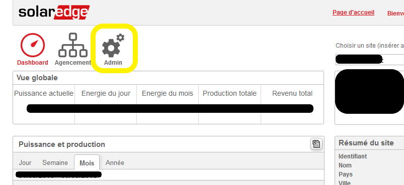
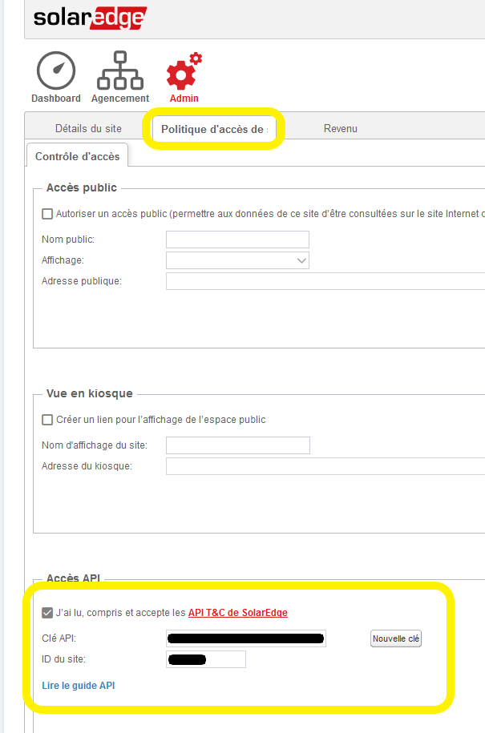
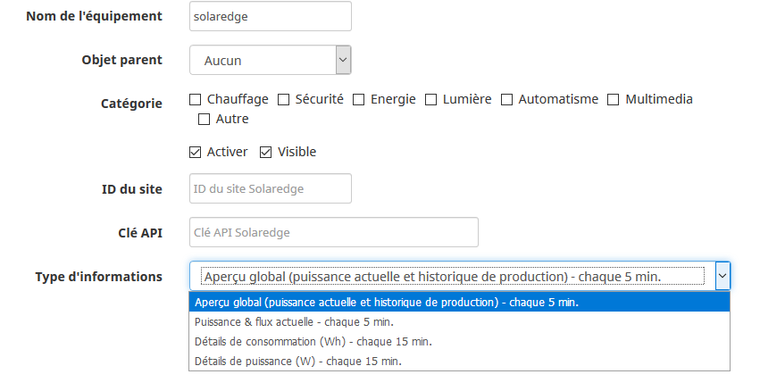
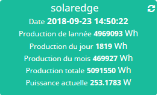
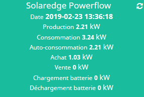
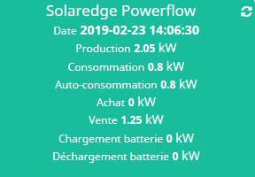

# Descripción

Complemento que permite leer los datos de un inversor de paneles fotovoltaicos de la marca Solaredge.
El complemento utiliza la API que ofrece Solaredge para recuperar los datos que se encuentran en la plataforma de monitorización.
Se puede obtener la siguiente información; se podría añadir más en función de las solicitudes:

- Resumen general (potencia actual e historial de producción)
- Potencia actual de los distintos equipos de la instalación y flujo entre ellos (si tu instalación lo admite)
- Detalles del consumo energético del último cuarto de hora (compra, producción, consumo, autoconsumo)
- Datos de potencia del último cuarto de hora (compra, producción, consumo, autoconsumo)

# Versiones compatibles

| Componente | Versión                     |
|-----------|-----------------------------|
| Debian    | Bullseye(11) & Bookworm(12) |
| Jeedom    | >= 4.5                      |

# Instalación

> **Consejo**
>
> Para utilizar el plugin, debes descargarlo, instalarlo y activarlo como cualquier otro plugin de Jeedom.

En la página de configuración del complemento, es posible introducir comandos para la hora de la salida y la puesta del sol, tal y como los proporcionan los complementos *Meteo* o *Heliotropo*. Esto permitirá pausar la recopilación de datos entre esas horas, ya que por lo general hay poca producción solar por la noche ;-). Si no se introduce ningún comando, la tarea se ejecutará durante todo el día, desde la medianoche hasta las 23:59. También puedes introducir horas «fijas», en formato hhmm, por ejemplo, 400 para las 4:00 y 2200 para las 22:00.

# Configuración

## Activación del acceso a la API de Solaredge

> **Importante**
>
> El procedimiento que se describe a continuación ya no es válido. SolarEdge ha modificado su página web de monitorización y los menús son diferentes. Es necesario ponerse en contacto con su servicio de asistencia para solicitarles el procedimiento para obtener una clave API. Esta documentación se actualizará en cuanto se conozca el procedimiento.

- Accede a tu cuenta en la dirección <https://monitoring.solaredge.com/> (debes iniciar sesión con los datos de acceso que te ha facilitado tu proveedor) y deberías llegar a tu panel de control.
- A continuación, haz clic en la sección «Admin», que aparece en amarillo en la captura de pantalla:

- A continuación, haz clic en la pestaña «Política de acceso...» y, en la parte inferior de la pantalla, debes aceptar las condiciones de uso, generar una nueva clave (o copiar la existente) y anotar el ID del sitio. No olvides guardar los cambios.

## Creación del dispositivo en tu Jeedom

- Accede a la página de configuración de los equipos a través del menú «Plugins», luego «Energía» y «Solaredge».
- Haz clic en «Añadir» y ponle un nombre.
- Accederás a la página de configuración del dispositivo, donde podrás configurar las opciones habituales en Jeedom (no olvides activar tu nuevo dispositivo).

> **Importante**
>
> Debes introducir la clave API y el ID del sitio que hayas generado o copiado previamente desde la plataforma de monitorización de Solaredge.

A continuación, elige el tipo de información que desees. Si quieres más de una, solo tienes que crear un segundo dispositivo con el mismo ID de sitio y la misma clave API.

Por último, elige la frecuencia de actualización del equipo. Las opciones disponibles son las siguientes:

- automático: la frecuencia se calculará dinámicamente en función de las horas de activación y desactivación configuradas, con el fin de actualizar la información con la mayor frecuencia posible sin superar el límite de solicitudes impuesto por Solaredge.
- manual: tú eliges la frecuencia, pero el complemento no permitirá bajar del mínimo indicado.
- desactivado.

> **Importante**
>
> Solaredge solo permite 300 llamadas al día a través de la API; actualizar los datos cada 5 minutos durante 24 horas generará 288 llamadas (por lo tanto, por debajo del límite de 300). Si decides gestionar la actualización de los datos de otra forma, asegúrate de no superar este límite.

## Ejemplos de widgets

Resumen general:

Potencia actual de los distintos equipos con información sobre producción, consumo y autoconsumo, compra y venta, y carga y descarga de la batería (según los equipos de tu instalación).

Ejemplo de compra:

Ejemplo de venta:

# Registro de cambios

[Ver el registro de cambios](./changelog)

# Asistencia

Si tienes algún problema, empieza por leer los últimos temas relacionados con el plugin en [community]({{site.forum}}/tag/plugin-{{page.pluginId}}).

Si, a pesar de todo, no encuentras respuesta a tu pregunta, no dudes en crear un nuevo tema sin olvidar incluir la etiqueta del plugin ([plugin-{{page.pluginId}}]({{site.forum}}/tag/plugin-{{page.pluginId}})).

Como mínimo, habrá que presentar:

- una captura de pantalla de la página de estado de Jeedom
- una captura de pantalla de la página de configuración del complemento
- Todos los registros disponibles del complemento, con nivel *INFO*, pegados en un `Texto preformateado` (botón `</>` en la comunidad), ¡sin archivos!
- según el caso, una captura de pantalla del error que se ha producido, una captura de pantalla de la configuración que da problemas...
