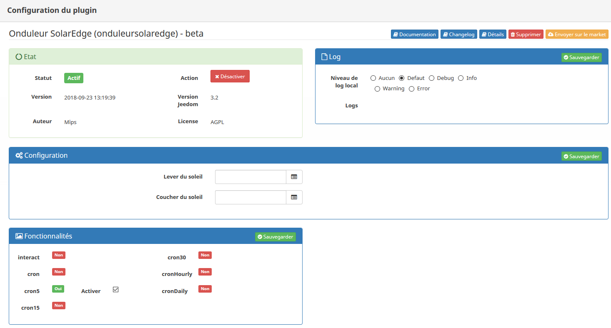

# Description

The plugin allow to retrieve data of an Solaredge inverter. The plugin refresh data every 5 minutes with a cron.
The plugin use Solaredge API to get these data from the Solaredge monitoring platform.
Following information are available, others can be retrieved depending the demand:

- Global overview (current power and production history)
- Current power of different devices in the installation & flow between them (if supported by your installation)
- Energy details of the last quarter (purchase, production, consumption, self-consumption)
- Power details of the last quarter (purchase, production, consumption, self-consumption)

# Configuration

## Installation

> **Tip**
>
> In order to use the plugin you have to download,install and activate it as any other Jeedom plugin.

The plugin use a "cron5" to get the data every 5 minutes. You can decide to deactivate it and to refresh your device manually or another mean but it's useless to refresh data more frequently.
> **Important**
>
> Solaredge allow only 300 calls/day on their API; refreshing data every 5 minutes during 24 hours will trigger 288 calls (so below the limit of 300 calls). If you decide to manage the refresh with another mean, take care to not bypass this limit.

- In the plugin configuration, it is possible to provide a command to get sunrise and sunset time as provided by the "Weather" or "Héliotrope" plugin. This will allow to pause the task that get data between those time as there isn't any solar energy production overnight ;-). If no commands are provided, the task will pause between 10pm and 4am (not configurable yet).

## Solaredge API access activation

- Browse to your Solaredge account at <https://monitoring.solaredge.com/> (You have to connect with your credentials provided by your provider), You should land on your Dashboard.
- Then, click on "Admin" section, highlighted in yellow in the printscreen:

- Next, click on "Site access" and on the bottom of the screen you have to accept the T&C, get a new API key (or use the existing one) and use the provided "Site ID". Don't forget to save your changes.

## Creating the device in Jeedom

- Navigate to devices management available under menu "Plugins", "Energy" and "{{site.title}}".
- Click "Add" and choose a name.
- You will land on the configuration of your newly created device on witch you can setup usual Jeedom options (don't forget to activate your new device).

> **Important**
>
> You need to provide the API key and Site ID previously obtained from Solaredge monitoring platform.

Then choose the type of information you want. If you want more than one just create a second device with the same site ID and same API key.

- That's over, you can navigate to your dashboard to see the corresponding widget.

Global overview:

Current power of different devices in the installation with information of production/consumption/self-consumption, purchased/feed-in and charge/discharge of batteries (if supported by your installation)

Purchase example:

Feed-in example:

Either you wait 5min. for the task to run to see data or you trigger a manual refresh to get an update immediately.

# Changelog

[See changelog]({{site.baseurl}}/changelog)

# Support

If despite this documentation and after having read the topics related to the plugin on [community]({{site.forum}}/tags/plugin-{{page.pluginId}}) you do not find an answer to your question, do not hesitate to create a new topic with the tag of the plugin ([plugin-{{page.pluginId}}]({{site.forum}}/tags/plugin-{{page.pluginId}})).
