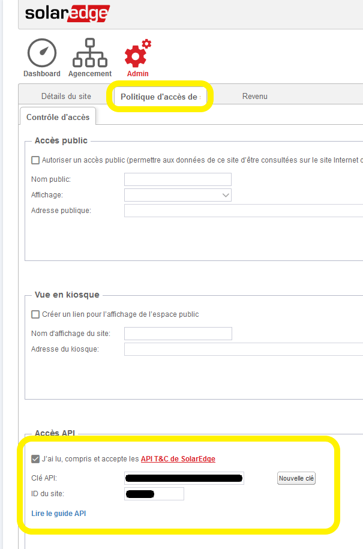
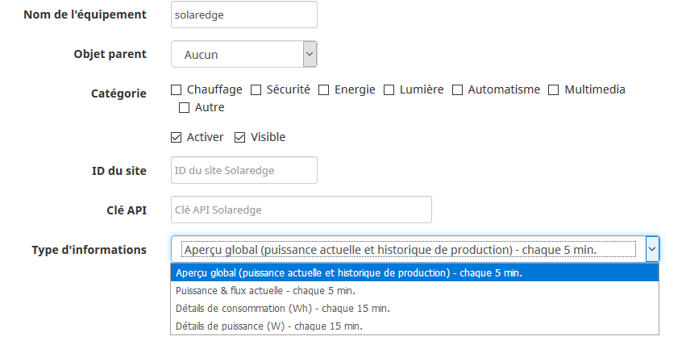

# Description

Plugin permettant la lecture des données d'un onduleur de panneaux photovoltaïque de la marque Solaredge.
Le plugin utilise l'API mise à disposition par Solaredge pour récupérer les données se trouvant dans la plateforme de monitoring.
Les informations suivantes sont récupérables, d'autres pourraient être rajoutée selon les demandes:

- Aperçu global (puissance actuelle et historique de production)
- Puissance actuelle des différents équipements dans l'installation & flux entre ceux-ci (si supporté par votre installation)
- Détails des consommations d'énergie du dernier quart d'heure (achat, production, consommation, auto-consommation)
- Détails de puissance du dernier quart d'heure (achat, production, consommation, auto-consommation)

# Versions supportées

| Composant | Version                     |
|-----------|-----------------------------|
| Debian    | Bullseye(11) & Bookworm(12) |
| Jeedom    | >= 4.2                      |

# Installation

> **Tip**
>
> Afin d’utiliser le plugin, vous devez le télécharger, l’installer et l’activer comme tout plugin Jeedom.

Sur la page de configuration du plugin, il est possible de renseigner des commandes pour l'heure du lever et l'heure du coucher du soleil tel que fournit par le plugin *Météo* ou *Héliotrope*. Ceci permettra de mettre en pause la récupération des données entre ces heures car il y a généralement peu de production solaire la nuit ;-). Si aucune commande n'est fournie, la tâche tournera toute la journée, de minuit à 23h59. Vous pouvez également entrer des heures en "dur", format hhmm, par exemple 400 pour 4h00 et 2200 pour 22h00.

# Configuration

## Activation de l'accès API Solaredge

- Rendez-vous sur votre compte à l'adresse <https://monitoring.solaredge.com/> (vous devez vous connecter avec les identifiants reçu de votre fournisseur), vous devriez arriver sur votre Dashboard.
- Ensuite, cliquez sur la section "Admin", en jaune dans la capture:

- Ensuite, cliquez sur l'onglet "Politique d'accès..." et dans le bas de l'écran vous devez accepter les conditions d'utilisations, générer une nouvelle clé (ou copier celle existante) et prendre note de l'ID du site. N'oubliez pas de sauver les changements.

## Création de l'équipement dans votre Jeedom

- Rendez-vous sur la page de configuration des équipements via le menu "Plugins", puis "Energie" et "Solaredge".
- Cliquez sur "Ajouter" et donnez un nom.
- Vous arriverez sur la page de configuration de l'équipement sur laquelle vous pouvez configurer les options habituelles dans Jeedom (n'oubliez pas d'activer votre nouvel équipement).

> **Important**
>
> Vous devez renseigner la clé API et l'ID du site précédemment générés/copiés depuis la plateforme de monitoring de Solaredge.

Choisissez ensuite le type d'informations voulue. Si vous en voulez plus qu'une il suffit de créer un deuxième équipement avec le même ID de site et la même clé API.

Enfin, choisissez la fréquence de rafraîchissement de l'équipement. Les choix suivant sont possibles:

- automatique: la fréquence sera calculée dynamiquement en fonction des heures de lever et coucher configurées afin de rafraîchir le plus souvent possible sans dépasser la limite du nombre de requêtes imposée par Solaredge.
- manuelle: vous choisissez la fréquence mais le plugin n'acceptera pas de passer en dessous du minimum indiqué.
- désactivé.

> **Important**
>
> Solaredge n'autorise que 300 appels par jours via l'API; actualiser les données toutes les 5 minutes pendant 24 heures exécutera 288 appels (donc en dessous de la limite des 300). Si vous choisissez de gérer l'actualisation des données autrement, prenez soin de ne pas dépasser cette limite.

## Exemples de widget

Aperçu global:

Puissance actuelle des différents équipements avec information de production/consommation/auto-consommation, achat/vente et chargement/déchargement batterie (selon les équipements de votre installation).

Exemple achat:

Exemple vente:

# Changelog

[Voir le changelog](./changelog)

# Support

Si vous avez un problème, commencez par lire les derniers sujets en rapport avec le plugin sur [community]({{site.forum}}/tag/plugin-{{page.pluginId}}).

Si malgré tout vous ne trouvez pas de réponse à votre question, n'hésitez pas à créer un nouveau sujet en n'oubliant pas de mettre le tag du plugin ([plugin-{{page.pluginId}}]({{site.forum}}/tag/plugin-{{page.pluginId}})).

Il faudra au minimum fournir:

- une capture d'écran de la page santé Jeedom
- une capture d'écran de la page de config du plugin
- tous les logs disponibles du plugin collés dans un `Texte préformaté` (bouton `</>` sur community), pas de fichiers!
- selon les cas, une capture d'écran de l'erreur rencontrée, une capture d'écran de la configuration posant problème...
