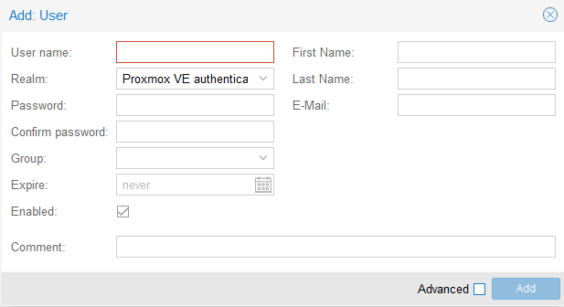
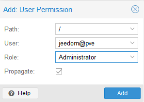
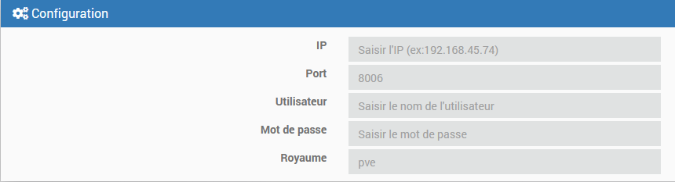
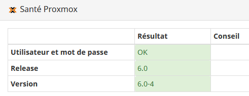
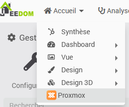
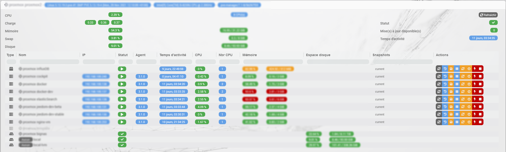

# Descripción

Complemento que permite gestionar un servidor (un nodo) Proxmox o un clúster (varios nodos en el mismo clúster) Proxmox; en otras palabras, **un único** *centro de datos* Proxmox.
Es posible recuperar todos los recursos (nodos, máquinas virtuales, almacenamiento...) y todas sus propiedades (estado, memoria, CPU, disco, dirección IP, tiempo de actividad, lista de instantáneas...)
El complemento también permite iniciar y detener máquinas virtuales y contenedores, así como realizar instantáneas y copias de seguridad.
También cuenta con una página específica de estado que resume toda la información sobre tus dispositivos.

# Versiones compatibles

| Componente | Versión                     |
|-----------|-----------------------------|
| Debian    | Bullseye(11) & Bookworm(12) |
| Jeedom    | >= 4.4                      |
| Proxmox   | >= 8.2 |

# Instalación

Para utilizar el plugin, debes descargarlo, instalarlo y activarlo como cualquier otro plugin de Jeedom.

# Configuración de usuario de Proxmox

> **Consejo**
>
> Se recomienda crear un usuario local específico para Jeedom, tal y como se describe aquí; por supuesto, existen otras configuraciones posibles, siempre y cuando Jeedom disponga de un usuario con acceso a los recursos de Proxmox que desees supervisar.

Aquí no se va a explicar en detalle cómo crear un usuario de Proxmox, sino que solo se proporcionará la información principal; para obtener más detalles, es recomendable que consultes la documentación oficial de Proxmox.

Esta configuración se realiza en el «centro de datos» desde la interfaz de Proxmox, en el menú «Permisos».

## Creación de usuario

En el menú Permisos > Usuarios, haz clic en «Añadir» y rellena la siguiente pantalla:

> **Importante**
>
> Selecciona el ámbito «Servidor de autenticación de Proxmox VE»; de lo contrario, no podrás elegir la contraseña aquí.

Anota el nombre de usuario y la contraseña que hayas elegido, ya que tendrás que configurarlos en el complemento.

## Asignación de permisos

Hemos creado un nuevo usuario en Proxmox, pero aún no tiene acceso.

En el menú principal «Permisos», haz clic en «Añadir» y, a continuación, en «Permisos de usuario», y rellena la siguiente pantalla según los permisos que quieras conceder a Jeedom (consulta la documentación de Proxmox para obtener más detalles):

No se recomienda asignar el rol de «Administrador» al usuario «Jeedom»; los privilegios mínimos necesarios para que funcionen todas las funciones del complemento son los siguientes:

| Privilegios | Nodo: información | Nodo: acciones | KVM y LXC: información | KVM y LXC: acciones | KVM y LXC: copias de seguridad e instantáneas | Almacenamiento: información |
|-------------------------|--------------|----------------|------------------|--------------------|------------------------------|-----------------|
| Datastore.Allocate | | | | | obligatorio | |
| Datastore.AllocateSpace | | | | | obligatorio | |
| Datastore.Audit | | | | | obligatorio | obligatorio |
| Sys.Audit | obligatorio | obligatorio | | | | |
| Sys.Modify | | obligatorio | | | | |
| Sys.PowerMgmt | | obligatorio | | | | |
| VM.Monitor | | | Requisitos | | | |
| VM.Audit | | | requerido | requerido | | |
| VM.Backup | | | | | Requisitos | |
| VM.PowerMgmt | | | | obligatorio | | |
| VM.Snapshot | | | | | obligatorio | |

Para limitar el acceso a lo estrictamente necesario, debe crear un nuevo rol personalizado (menú «Permisos» > «Roles»); asígnele un nombre y concédale los privilegios indicados anteriormente.
A continuación, podrás asignar este rol al usuario a través del menú «Permisos» (en lugar del rol «Administrador», por tanto).

Encontrarás más información aquí: <https://pve.proxmox.com/wiki/User_Management>

# Configuración del complemento

Hay que introducir la siguiente información en la configuración del complemento:

- Dirección IP de tu servidor (o de uno de los nodos del clúster, si tienes varios). Puedes configurar una lista de direcciones IP para cada uno de los nodos **de un mismo clúster o centro de datos**, separadas por una coma.
- el puerto, tan diferente del puerto predeterminado (8006)
- un nombre de usuario y su contraseña
- el dominio de autenticación del usuario, tan diferente de «pve» ( = «Proxmox VE authentication server», dominio predeterminado para los usuarios creados localmente en Proxmox; véase la documentación de Proxmox)

Puedes comprobar si la configuración del plugin es correcta a través de la página de estado (menú Análisis > Estado)

Si la conexión se establece correctamente, se mostrará la versión de tu servidor Proxmox.

También puedes configurar el objeto en el que se crearán los dispositivos para no tener que moverlos después. El complemento intentará asignar el objeto principal al dispositivo, salvo que ya exista un dispositivo con el mismo nombre para ese objeto.

Por último, puedes elegir el intervalo de actualización de la información, que por defecto es de 30 segundos.

También puedes activar el panel del tablero de control, al que podrás acceder a través del menú *Inicio*

# Panel

El panel es muy completo y ofrece una visión general de todos los recursos de Proxmox (contenedores, máquinas virtuales y espacios de almacenamiento) organizados por nodos. Es posible realizar todas las acciones en las máquinas virtuales directamente desde el panel y la información se actualiza en tiempo real.

# Funcionamiento del complemento

En cuanto se haya completado la configuración del complemento, el demonio debería iniciarse e intentará conectarse a Proxmox según el intervalo configurado para sincronizar la información.

Todos los dispositivos a los que tiene acceso el complemento se crearán automáticamente en Jeedom y se activarán; no es posible crear un dispositivo manualmente. El nombre de los dispositivos no se puede modificar en Jeedom, siempre coincidirá con el nombre que tienen en Proxmox. Un dispositivo nunca se eliminará automáticamente, sino que se desactivará.

Es posible realizar una sincronización manual mediante el botón de la página de dispositivos.

Cuando se realice una acción (por ejemplo, la creación de una instantánea o el reinicio de un equipo), el estado del equipo también se actualizará automáticamente.

# Los comandos disponibles

## Los nodos

Estos equipos disponen de varios comandos de información que indican el tiempo de actividad, el uso de la CPU, el disco y la memoria, así como datos sobre el número y el tipo de CPU y la versión del núcleo utilizada.
También están disponibles los siguientes comandos de acción:

- **Reiniciar el nodo**: Apaga todas las máquinas virtuales y reinicia el nodo
- **Detener el nodo**: Detiene todos los VMS y el nodo
- **Iniciar todo**: Inicia todas las máquinas y contenedores que tengan activada la opción «Inicio automático».
- **Detener todo**: Detiene todas las máquinas virtuales y los contenedores

## Máquinas virtuales y contenedores

Existen varios comandos de información que muestran, entre otros datos, el estado, el número de CPU y su uso, la memoria total y su uso, el tiempo de actividad, y las direcciones IPv4 e IPv6.

> **Consejo**
>
> Para rastrear las direcciones IP, es necesario instalar el agente de Proxmox en las máquinas virtuales y activarlo (véase la documentación de Proxmox). Este agente también garantizará un estado estable de tu máquina virtual durante las copias de seguridad y las instantáneas.

También están disponibles los siguientes comandos de acción:

- **Iniciar**: Inicia la máquina virtual o el contenedor.
- **Detener**: Esto provoca un apagado ordenado de la máquina virtual o del contenedor.
- **Apagar inmediatamente**: Esto apaga de forma inmediata y brusca la máquina virtual o el contenedor, lo que puede dañar los datos.
- **Pausa**: Suspende la máquina virtual o el contenedor
- **Reanudar**: Reinicia la máquina virtual o el contenedor tras haber estado en suspenso
- **Instantánea**: permite realizar una instantánea; se puede asignar un nombre a la instantánea (opcional) y una descripción (también opcional). El nombre debe estar compuesto exclusivamente por letras y números, así como por el carácter de guión bajo (_), y debe comenzar por una letra. Si no se proporciona ningún nombre o si el nombre no es válido, el complemento generará un nombre aleatorio. En el caso de las máquinas virtuales, también es posible elegir si se incluye o no la RAM al utilizar el comando en un escenario.
- **Copia de seguridad**: permite realizar una copia de seguridad. Este comando (de tipo «mensaje») tiene un campo «email» que puede contener una dirección de correo electrónico a la que se enviará una notificación una vez finalizada la copia de seguridad (el correo lo envía tu servidor Proxmox) y un campo «Options» en el que hay que indicar cada opción deseada en el formato *opción=valor* (utiliza un espacio para separar varias opciones; consulta la tabla siguiente para ver la lista de opciones disponibles); ejemplo: `mode=snapshot compress=zstd mailnotification=failure`

| Nombre | Descripción | Formato | Valor por defecto |
|------------------|------------------------------------------------------------------------------------------------------------------------------------|-----------------------------------------------------------------------------------------------------------------------------------------------------------------|----------------------------------------------------------------------|
| almacenamiento | Ubicación de la copia de seguridad | Nombre del recurso de almacenamiento que debe configurarse para el tipo de contenido «copia de seguridad» y tener el estado «disponible». Ten en cuenta que hay que respetar las mayúsculas y minúsculas. | Por defecto, se utiliza el primer recurso de almacenamiento que cumpla los criterios. |
| modo | Modo de copia de seguridad | los valores posibles son: `snapshot`, `suspend`, `stop` | `snapshot` |
| compress | Compresión de copias de seguridad | los valores posibles son: `0`, `gzip`, `lzo`, `zstd` | `lzo` |
| mailnotification | Especifica cuándo enviar una notificación | los valores posibles son: `always`, `failure` | `always` |
| eliminar | Elimina las copias de seguridad antiguas si hay más del máximo configurado para el almacenamiento elegido (véase la configuración de Proxmox) | los valores posibles son: `0`, `1` | `1` |

## Los sistemas de almacenamiento

Los comandos de información muestran el uso del disco y el estado del equipo.

También es posible visualizar el tipo de contenido del mismo (copias de seguridad, ISO, discos de las máquinas virtuales...); esta información resulta útil al utilizar el comando «Backup» de las máquinas virtuales.

# Registro de cambios

[Ver el registro de cambios](./changelog)

# Asistencia

Si tienes algún problema, empieza por leer los últimos temas relacionados con el plugin en [community]({{site.forum}}/tag/plugin-{{page.pluginId}}).

Si, a pesar de todo, no encuentras respuesta a tu pregunta, no dudes en crear un nuevo tema sin olvidar incluir la etiqueta del plugin ([plugin-{{page.pluginId}}]({{site.forum}}/tag/plugin-{{page.pluginId}})).

Como mínimo, habrá que presentar:

- una captura de pantalla de la página de estado de Jeedom
- una captura de pantalla de la página de configuración del complemento
- Todos los registros disponibles del complemento, con nivel *INFO*, pegados en un `Texto preformateado` (botón `</>` en la comunidad), ¡sin archivos!
- según el caso, una captura de pantalla del error que se ha producido, una captura de pantalla de la configuración que da problemas...
