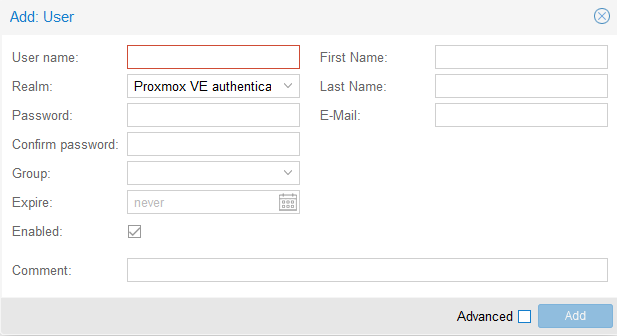
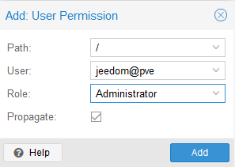
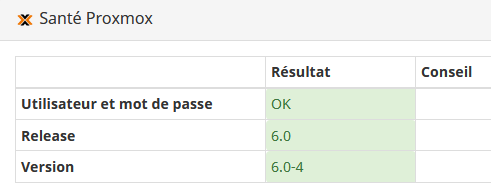
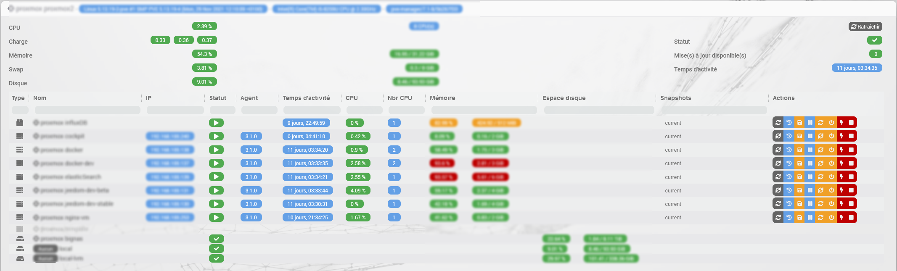

# Description

Plugin permettant la gestion d'un serveur (un noeud) Proxmox ou d'un cluster (plusieurs noeuds dans le même cluster) Proxmox, autrement dit **un et un seul** *datacenter* Proxmox.
Il est possible de récupérer toutes les ressources (noeuds, vms, stockage...) et toutes leurs propriétés (statut, mémoire, CPU, disque, adresse IP, temps d'activité, list des snapshots...)
Le plugin permet aussi de démarrer et arrêter les VMs et les containers ainsi que de prendre des snapshots et des backups.
Il dispose également d'une page santé spécifique résumant l'ensemble des informations de vos équipements.

# Versions supportées

| Composant | Version                     |
|-----------|-----------------------------|
| Debian    | Bullseye(11) & Bookworm(12) |
| Jeedom    | >= 4.4                      |
| Proxmox   | >= 8.2                      |

# Installation

Afin d’utiliser le plugin, vous devez le télécharger, l’installer et l’activer comme tout plugin Jeedom.

# Configuration utilisateur Proxmox

> **Tip**
>
> Il est recommandé de créer un utilisateur local dédié à Jeedom et c'est ce qui est documenté ici, d'autres configurations sont possibles bien entendu tant que Jeedom dispose d'un utilisateur ayant accès aux ressources Proxmox que vous voulez surveiller.

La création d'un utilisateur Proxmox ne va pas être documentée en détails ici, seulement les informations principales, il est préférable que vous utilisiez la documentation officielle de Proxmox pour les détails.

Cette configuration se fait sur le "datacenter" dans l'interface de Proxmox, menu "Permissions"

## Création de l'utilisateur

Dans le menu Permissions>Users, cliquez sur "Add" et remplissez l'écran suivant:

> **Important**
>
> Sélectionnez le realm "Proxmox VE authentication server" sinon vous ne pourrez pas choisir le mot de passe ici.

Retenez le nom d'utilisateur et le mot de passe choisi, c'est ce qu'il faudra configurer dans le plugin.

## Attribution des permissions

Nous avons créé un nouvel utilisateur sous Proxmox mais celui-ci n'a encore aucun accès.

Dans le menu principal "Permissions", cliquez sur sur "Add" puis "User permission" et remplissez l'écran suivant selon les permissions que vous voulez accorder à Jeedom (voir la documentation de Proxmox pour plus de détails):

Il n'est pas recommandé de donner le rôle "Administrator" à l'utilisateur "Jeedom"; les privilèges minimum requis pour que toutes les fonctions du plugin fonctionnent sont les suivants:

| Privilèges              | Noeud: infos | Noeud: actions | KVM & LXC: infos | KVM & LXC: actions | KVM & LXC: backup & snapshot | Stockage: infos |
|-------------------------|--------------|----------------|------------------|--------------------|------------------------------|-----------------|
| Datastore.Allocate      |              |                |                  |                    | requis                       |                 |
| Datastore.AllocateSpace |              |                |                  |                    | requis                       |                 |
| Datastore.Audit         |              |                |                  |                    | requis                       | requis          |
| Sys.Audit               | requis       | requis         |                  |                    |                              |                 |
| Sys.Modify              |              | requis         |                  |                    |                              |                 |
| Sys.PowerMgmt           |              | requis         |                  |                    |                              |                 |
| VM.Monitor              |              |                | requis           |                    |                              |                 |
| VM.Audit                |              |                | requis           | requis             |                              |                 |
| VM.Backup               |              |                |                  |                    | requis                       |                 |
| VM.PowerMgmt            |              |                |                  | requis             |                              |                 |
| VM.Snapshot             |              |                |                  |                    | requis                       |                 |

Pour limiter les accès à ce qui est strictement nécessaire, vous devez donc créer un nouveau rôle personnalisé (menu "Permissions" > "Roles"); donnez un nom et accordez les privilèges listés ci-dessus.
Vous pourrez ensuite assigner ce rôle à l'utilisateur via le menu "Permissions" (à la place du rôle "Administrator" donc).

Vous trouverez plus d'information ici: <https://pve.proxmox.com/wiki/User_Management>

# Configuration du plugin

Il faut saisir les informations suivantes dans la configuration du plugin:

- adresse IP de votre serveur (ou d'un des noeuds du cluster si vous en avez plusieurs). Vous pouvez configurer une liste d'IP vers chacun des noeuds **d'un même cluster / datacenter**, séparée par une virgule.
- le port si différent du port par défaut (8006)
- un nom d'utilisateur et son mot de passe
- le royaume d'authentification de l'utilisateur, si différent de "pve" (="Proxmox VE authentication server", royaume par défaut pour les utilisateurs créés localement sur Proxmox, voir documentation de Proxmox)

Vous pouvez vérifier si la configuration du plugin est correcte grâce à la page santé (menu Analyse > Santé)

Si la connexion est réussie, la version de votre serveur Proxmox sera affichée.

Vous pouvez également configurer l'objet dans lequel seront créer les équipements pour ne pas devoir les déplacer ensuite. Le plugin tentera d'assigner le parent à l'équipement sauf si un équipement du même nom existe déjà pour cet objet.

Enfin, vous pouvez choisir le délai d'actualisation des informations, par défaut à 30s.

Vous pouvez aussi activer le panel pour le dashboard qui sera accessible via le menu *Accueil*

# Panel

Le panel est très complet, il offre une vue globale de toute les ressources proxmox (les containers, les machines virtuelles et les espaces de stockage) organisées par noeuds. Il est possible d'effectuer toutes les actions sur les VMs directement depuis le panel et les informations sont mises à jours en temps réel.

# Fonctionnement du plugin

Dès que la configuration du plugin sera terminée, le démon devrait démarrer et essaiera de se connecter à Proxmox selon le délai configuré afin de synchroniser les informations.

Tous les équipements auxquels le plugin a accès seront automatiquement créés dans Jeedom et activé, il n'est pas possible de créer un équipement manuellement. Le nom des équipements n'est pas modifiable sous Jeedom, il correspondra toujours au nom sous Proxmox. Un équipement ne sera jamais supprimé automatiquement mais il sera désactivé.

Il est possible de faire une synchronisation manuelle via le bouton dans la page des équipements.

Lors d'une action (prise d'un snapshot ou redémarrage d'une machine par exemple), l'état de l'équipement sera automatiquement actualisé également.

# Les commandes disponibles

## Les noeuds

Ces équipements disposent de plusieurs commandes info donnant le temps d'activité, l'utilisation CPU, disque et mémoire ainsi que des informations sur le nombre et le type de CPU et la version du kernel utilisé.
Les commandes actions suivantes sont également disponibles:

- **Redémarrer le noeud**: Arrête toutes les VMs et redémarre le noeud
- **Arrêter le noeud**: Arrête toutes les VMS et le noeud
- **Démarrer tout**: Démarre toutes les machines et les containers qui ont l'option "Démarrage automatique" activée
- **Arrêter tout**: Arrête toutes les machines virtuelles et les containers

## Les machines virtuelles & containers

Plusieurs commandes info existent donnant entre autre le statut, le nombre de CPU et leur utilisation, la mémoire totale et l'utilisation, le temps d'activité, les adresses IPv4 et IPv6.

> **Tip**
>
> Pour remonter les adresses IP, il est nécessaire d'installer l'agent Proxmox sur les VMs et de l'activer (voir documentation Proxmox). Cet agent assurera aussi un état stable de votre VM lors des sauvegardes et snapshots.

Les commandes actions suivantes sont également disponibles:

- **Démarrer**: Démarre la machine virtuelle ou le container.
- **Arrêter**: Cela déclenche un arrêt propre de la machine virtuelle ou du container.
- **Arrêter immédiatement**: Cela coupe immédiatement et brutalement la machine virtuelle ou le container, cela peut endommager les données.
- **Pause**: Suspend la machine virtuelle ou le container
- **Reprendre**: Relance la machine virtuelle ou le container après avoir été suspendu
- **Snapshot**: permet de prendre un snapshot, il est possible de donner le nom du snapshot (optionnel). Le nom doit être composé exclusivement de lettre et de chiffre ainsi que du caractère tiret bas (_) et doit commencer par une lettre. Si aucun nom n'est fourni ou si le nom n'est pas valide, un nom aléatoire sera généré par le plugin.
- **Backup**: permet de prendre une sauvegarde. Cette commande (de type message) a un champ 'email' qui peut contenir une adresse email à laquelle sera envoyé une notification une fois la sauvegarde terminée (email envoyé par votre serveur Proxmox) et un champ 'Options' dans lequel il faut indiquer chaque option voulue sous la forme *option=valeur* (utiliser un espace pour séparer plusieurs options; voir le tableau ci-dessous pour la liste des options disponibles).

| Nom              | Description                                                                                                                        | Format                                                                                                                                                          | Valeur par défaut                                                    |
|------------------|------------------------------------------------------------------------------------------------------------------------------------|-----------------------------------------------------------------------------------------------------------------------------------------------------------------|----------------------------------------------------------------------|
| storage          | Emplacement du backup                                                                                                              | Nom de la ressource de type stockage qui doit être configurée pour le type de contenu 'backup' et avoir le statut 'available'. Attention de respecter la casse. | Par défaut, le premier stockage respectant les critères est utilisé. |
| mode             | Mode du backup                                                                                                                     | les valeurs possibles sont: `snapshot`, `suspend`, `stop`                                                                                                       | `snapshot`                                                           |
| compress         | Compression backup                                                                                                                 | les valeurs possibles sont: `0`, `gzip`, `lzo`, `zstd`                                                                                                          | `lzo`                                                                |
| mailnotification | Spécifie quand envoyer une notification                                                                                            | les valeurs possibles sont: `always`, `failure`                                                                                                                 | `always`                                                             |
| remove           | Supprime les anciennes sauvegardes s'ils y en a plus que le maximum configuré pour le stockage choisi (voir configuration Proxmox) | les valeurs possibles sont: `0`, `1`                                                                                                                            | `1`                                                                  |

## Les stockages

Des commandes info donnent l'usage disque ainsi que le status de l'équipement.

Il est également possible de visualiser le type de contenu de celui-ci (backup, iso, disques des vms...); cette information est utile lors de l'utilisation de la commande "Backup" des machines virtuelles.

# Changelog

[Voir le changelog](./changelog)

# Support

Si vous avez un problème, commencez par lire les derniers sujets en rapport avec le plugin sur [community]({{site.forum}}/tag/plugin-{{page.pluginId}}).

Si malgré tout vous ne trouvez pas de réponse à votre question, n'hésitez pas à créer un nouveau sujet en n'oubliant pas de mettre le tag du plugin ([plugin-{{page.pluginId}}]({{site.forum}}/tag/plugin-{{page.pluginId}})).

Il faudra au minimum fournir:

- une capture d'écran de la page santé Jeedom
- une capture d'écran de la page de config du plugin
- tous les logs disponibles du plugin collés dans un `Texte préformaté` (bouton `</>` sur community), pas de fichiers!
- selon les cas, une capture d'écran de l'erreur rencontrée, une capture d'écran de la configuration posant problème...
