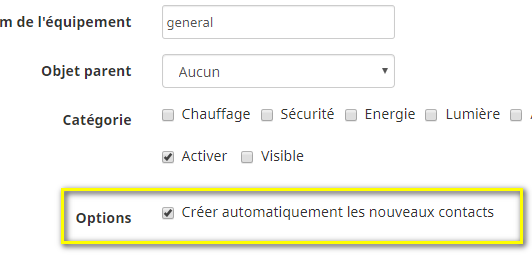
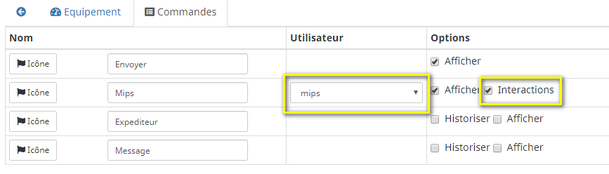

# Description

Plugin that allows you to connect to a Rocket.chat server. Rocket.chat is a collaborative messaging platform (type Slack, HipChat, etc.).
The plugin supports "ask" commands (in scenarios), interactions, and sending attachments (e.g., camera images).
The advantage of this solution is that it can be hosted on your own server (a Docker container is all you need), so your data remains in your possession.

# Supported Versions

| Component | Version                     |
|-----------|-----------------------------|
| Debian    | Bullseye(11) & Bookworm(12) |
| Jeedom    | >= 4.5                      |

# Installation

To use the plugin, you must download, install, and activate it just like any other Jeedom plugin.
You must already have a Rocket.chat server; the various options for setting one up are very well documented on their website.
On this instance, be sure to create a user with the `bot` role.

# Plugin configuration

In the plugin settings, you'll need to enter the RocketChat server URL in the format `https://IP_SERVER:3000`, along with your bot's username and password.

# Equipment

As soon as the daemon starts up and your bot has successfully connected, the plugin will create a device for each existing channel on your server (provided the bot has access).

Each device has an "action" command to send a message on the channel, as well as two "info" commands that display the last message sent (by a user other than the bot) and the user's name.

By default, when a message is received on the channel, the plugin will create a command corresponding to the user who sent it (if one does not already exist).

There is an option on the device to disable this behavior.

These commands allow you to send a message on the device's channel, notifying the corresponding user (e.g., `@Mips This is a test message`).

# Message Command Options

There is an *Options* field on the plugin's *messages* commands. Currently, there is only one option: the ability to specify a locally accessible file to send (for example, a camera snapshot that is already on your Jeedom).
You need to enter a configuration similar to this: `file=/path/to/file description="description of my file"`

Be sure to use quotation marks if there are spaces in the path or description (otherwise, they are not necessary); the description is optional.

> **Tip**
>
> This is not necessary when sending a new screenshot from the camera plugin (for example); in this case, simply use the appropriate command from the camera plugin in your scenario and specify the *message* command from the *Rocket.Chat* plugin to send it.

# Interactions

For interactions to work, the plugin must recognize the user, so the corresponding command must have been created (see above).

Next, in the "Command" tab, select the Jeedom user corresponding to the Rocket.Chat user by choosing them from the list. You can enable or disable interaction support for each user.
.

In public channels or private discussion groups, your bot (the plugin) will only respond to interactions if it is tagged in the channel (e.g., `@jeedombot Turn on the radio`). This is to prevent it from responding with `Sorry, I didn't understand` to every message exchanged between other users.
This is not the case in private direct messages between you and the bot.

# Change log

[View the changelog](./changelog)

# Support

If you're having a problem, start by reading the latest threads related to the plugin on [community]({{site.forum}}/tag/plugin-{{page.pluginId}}).

If you still can't find an answer to your question, feel free to create a new thread—and don't forget to include the plugin tag ([plugin-{{page.pluginId}}]({{site.forum}}/tag/plugin-{{page.pluginId}})).

At a minimum, you must provide:

- a screenshot of the Jeedom Health page
- a screenshot of the plugin's settings page
- All available plugin logs at the *INFO* level, pasted into `Preformatted Text` (use the `</>` button on the community), no files!
- Depending on the situation, a screenshot of the error encountered, a screenshot of the problematic configuration...
