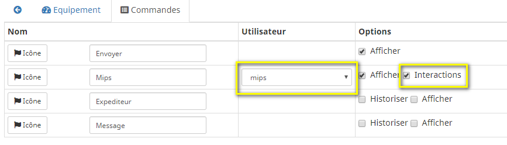

# Description

Plugin allowing connection to a Rocket.chat server. Rocket.chat is a collaborative messaging platform (like Slack, HipChat ...).
The plugin take in charge the ask (in scenarios), interactions and sending of attachments (ex: camera image).
The advantage of this solution is that it can be hosted at your home (a docker is enough), so your data remains in your possession.

# Supported versions

| Component | Version                     |
|-----------|-----------------------------|
| Debian    | Bullseye(11) & Bookworm(12) |
| Jeedom    | >= 4.2                      |

# Installation

In order to use the plugin, you must download, install and activate it like any Jeedom plugin.
You need to already have a Rocket.Chat server installed, solutions to have this are fully documented on their website.
On it, please create a user with the `bot` role.

> **Important**
>
> It is essential to be under Debian 10 Buster minimum to run the plugin.

# Plugin configuration

In the plugin configuration you have to provide server URL with the format `https://IP_SERVER:3000` as well as the username and the password of your bot.

# Devices

As soon as the daemon starts and your bot has been able to connect, the plugin will create one device per existing channel on your server (as long as the bot has access).

Each device has an action command to send a message on the channel as well as two info commands giving the last message sent (by a user other than the bot) and the name of that user.

By default, when a message is received on the channel, the plugin will create a command corresponding to the user who sent it (if it does not already exist).

An option exists on the device to deactivate this behavior.

These commands allow you to send a message on the device channel with a notification to the corresponding user, (e.g.: `@Mips This is a test message`).

# Messages commands options

An *Options* field exists on the *messages* commands of the plugin. Currently only one option exists: the possibility of specifying a file accessible locally to send it (for example a capture of camera which would already be on your Jeedom).
You have to put a config similar to this: `file=/path/to/file description="description of my file"`

Be careful to put quotes if there are spaces in the path or in the description (otherwise not necessary); The description is optional.

> **Tip**
>
> This is not necessary when sending a new capture from the camera plugin (for example), for this case you just have to use the appropriate command of the camera plugin in your scenario and to specify the command *message* from *Rocket.Chat* plugin for sending.

# Interactions

For the interactions to work, the plugin must know the user, so the corresponding command must have been created (see above).

Then, in the command tab, you must select the Jeedom user corresponding to the Rocket.Chat user by selecting it from the list. It is possible to activate or deactivate support for interactions for each user.
.

In public channels or private discussion groups, your bot (the plugin) will only respond to interactions if it is notified on the channel (ex: `@jeedombot Turn on the radio`) in order to avoid it responds `Sorry I didn't understand` to each message exchanged between other users.
This is not the case in direct private messages between you and the bot.

# Changelog

[See the changelog](./changelog)

# Support

If you have a problem, start by reading the latest plugin-related topics on [community]({{site.forum}}/tag/plugin-{{page.pluginId}}).

If despite this you do not find an answer to your question, do not hesitate to create a new topic, with the tag of the plugin ([plugin-{{page.pluginId}}]({{site.forum}}/tag/plugin-{{page.pluginId}})).

At a minimum, you will need to provide:

- a screenshot of the Jeedom health page
- all available plugin logs
- depending on the case, a screenshot of the error encountered, a screenshot of the configuration causing the problem...
