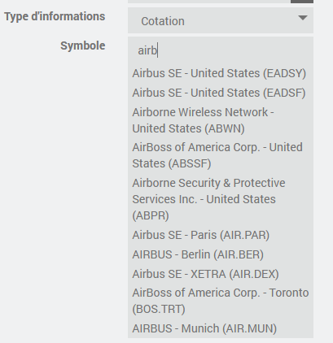
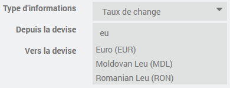

# Descripción

Complemento que permite obtener las cotizaciones bursátiles de una acción o un índice, así como el tipo de cambio entre dos divisas (incluidas las criptomonedas, como el bitcoin) y las materias primas.
Por lo general, todos los datos están disponibles en tiempo real, pero la frecuencia de actualización depende del servicio que se utilice.

# Versiones compatibles

| Componente | Versión |
|-----------|-----------------------------|
Debian | Bullseye (11) y Bookworm (12) |
| Jeedom    | >= 4.5 |

# Instalación

Para utilizar el plugin, debes descargarlo, instalarlo y activarlo como cualquier otro plugin de Jeedom.

# Configuración del complemento

No es necesario realizar ninguna configuración en el plugin; las claves API se configuran en los dispositivos en función del servicio seleccionado.

# Configuración de un dispositivo

Una vez creado un nuevo dispositivo, estarán disponibles las opciones habituales.
También podrás indicar la frecuencia con la que se actualizará la información.

A continuación, debes seleccionar el servicio que deseas utilizar para este dispositivo de entre la lista que se te ofrece. En la página de configuración encontrarás una descripción de cada servicio. Allí también encontrarás el enlace para crear una nueva cuenta si aún no tienes una o si deseas crear una nueva.

A continuación, habrá que introducir la clave API correspondiente al servicio.

> **Consejo**
> Ten cuidado de no solicitar una actualización demasiado frecuente si no es necesario, teniendo en cuenta el número de dispositivos que estás creando, para no superar el límite impuesto por el servicio.

A continuación, debe elegir el tipo de información que desea:

- Cotización bursátil: el precio de una acción o de un índice (según el servicio seleccionado)
- Tipo de cambio entre dos divisas (incluidas las criptomonedas)
- Materias primas
- Criptomonedas

> **Atención**
> Guarda la configuración, incluida la clave API, antes de continuar. Se necesitará una clave API válida para completar la configuración, en particular la búsqueda de símbolos.

## Cotizaciones bursátiles e índices bursátiles

Para este tipo de información, debe introducir el símbolo de la acción o del índice.
El complemento ofrece una función de búsqueda dinámica: solo tienes que empezar a escribir el nombre de una empresa (mínimo 3 caracteres) o el símbolo que desees y se te mostrará una lista de opciones. Solo tienes que elegir una de ellas.

## Tipos de cambio

Para este tipo de información, debes seleccionar la moneda de origen y la de destino.
El complemento ofrece una función de búsqueda dinámica: solo tienes que empezar a escribir el nombre de una divisa o su código y aparecerá una lista con las divisas que coincidan. Solo tienes que elegir una de ellas.

## Materias primas

Para este tipo de información, debe indicar el símbolo de la materia prima.
El complemento ofrece una función de búsqueda dinámica: solo tienes que empezar a escribir el nombre de una materia prima (mínimo 3 caracteres) o el símbolo deseado y se te mostrará una lista de posibilidades. Solo tienes que elegir una de ellas.

## Criptomonedas

Para este tipo de información, debes introducir el símbolo de la criptomoneda deseada y la divisa de destino.
El complemento ofrece una función de búsqueda dinámica: solo tienes que empezar a escribir el nombre de una criptomoneda (mínimo 3 caracteres) o el símbolo deseado y se te mostrará una lista de opciones. Solo tienes que elegir una de ellas.

# Los comandos disponibles

A continuación encontrarás un resumen de los comandos más importantes disponibles por tipo de información.

## Cotización bursátil

- **Apertura**: precio de apertura
- **Cierre anterior**: precio al cierre anterior
- **Máximo**: máximo alcanzado desde la apertura
- **Mín**: mínimo alcanzado desde la apertura
- **Precio**: precio actual
- **Volumen**: Volumen de negociación
- **Evolución**: Evolución desde la inauguración

## Tipos de cambio

- **Tipo de cambio**
- **Oferta**: el precio de la oferta
- **Demanda**: el precio de la demanda

## Materias primas

- **Precio**
- **Divisa**
- **Unidad**
- **Fecha**

## Criptomonedas

- **Precio**
- **Volumen**
- **Variación del volumen** en las últimas 24 horas
- **Variación porcentual** en 1 h, 24 h, 7, 30, 60 y 90 días
- **Capitalización bursátil**
- **Capitalización bursátil totalmente diluida**

# Registro de cambios

[Ver el registro de cambios](./changelog)

# Asistencia

Si tienes algún problema, empieza por leer los últimos temas relacionados con el plugin en [community]({{site.forum}}/tag/plugin-{{page.pluginId}}).

Si, a pesar de todo, no encuentras respuesta a tu pregunta, no dudes en crear un nuevo tema sin olvidar incluir la etiqueta del plugin ([plugin-{{page.pluginId}}]({{site.forum}}/tag/plugin-{{page.pluginId}})).

Como mínimo, habrá que presentar:

- una captura de pantalla de la página de estado de Jeedom
- una captura de pantalla de la página de configuración del complemento
- Todos los registros disponibles del complemento, con nivel *INFO*, pegados en un `Texto preformateado` (botón `</>` en la comunidad), ¡sin archivos!
- según el caso, una captura de pantalla del error que se ha producido, una captura de pantalla de la configuración que da problemas...
