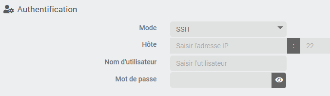
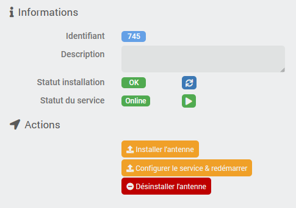

# Descripción

El objetivo de este complemento es facilitarte la instalación y configuración de antenas que funcionan con *Theengs gateway*, lo que permite detectar [dispositivos Bluetooth (BLE)](https://decoder.theengs.io/devices/devices.html) y enviarlos a Jeedom para integrarlos a través del complemento [MQTT Discovery]({{site.baseurl}}/MQTTDiscovery/{{page.lang}}).

Ofrece una solución llave en mano para realizar esta configuración.

Por supuesto, no es obligatorio utilizar este plugin; tienes total libertad para instalar [Theengs gateway](https://gateway.theengs.io/install/install.html) por tu cuenta. Una alternativa aún más sencilla es comprar la pasarela que ofrece el equipo de Theengs; [consulta el tema aquí](https://community.jeedom.com/t/theengs-bridge-nouvelle-version/128348).

También os invito a consultar [esta documentación](https://mips2648.github.io/jeedom-plugins-docs/MQTTDiscovery/fr_FR/#tocAnchor-1-15) para comprender con más detalle cómo funciona todo el sistema.

> **Importante**
>
> Este complemento no garantiza que *Theengs gateway* funcione en tu dispositivo, ya que hay demasiados parámetros que pueden influir en su correcto funcionamiento: depende de tu hardware, de la versión de tu sistema operativo, de la llave Bluetooth utilizada, etc. El complemento solo se encarga de instalar la aplicación y te permite controlar su estado desde Jeedom.
>
> La gestión de Bluetooth en la Jeedom Smart Box causa graves problemas; la mayoría de las instalaciones de antenas locales no funcionarán: la instalación funciona y el servicio se inicia, pero el Bluetooth se bloquea al cabo de un tiempo. Esto no se debe ni al complemento ni a la aplicación *Theengs gateway*. Por supuesto, el complemento se puede utilizar en una Smart para instalar una antena remota.

# Versiones compatibles

> **Importante**
>
> La instalación de Antenna en **Debian Buster (10) ya no es compatible**. Para instalar Antenna, es imprescindible disponer de un equipo con **Debian Bullseye (11) o Debian Bookworm (12)** (o su equivalente en Raspbian para Raspberry Pi).

| Componente | Versión                     |
|-----------|-----------------------------|
Debian | Bullseye (11) y Bookworm (12) |
| Jeedom    | >= 4.5                      |

# Instalación

Para utilizar el plugin, debes descargarlo, instalarlo y activarlo como cualquier otro plugin de Jeedom.
**La pasarela Theengs** necesita el complemento *MQTT Manager (MQTT2)* para funcionar; esto permite obtener el estado de las antenas y facilitar su configuración.

# Configuración del complemento

Antes de empezar, asegúrate de haber instalado y configurado el complemento *MQTT Manager (MQTT2)*, consulta la documentación de este complemento.

A continuación, habrá que configurar los datos de conexión al broker MQTT que van a utilizar las antenas. Puedes utilizar simplemente los datos que ya han sido configurados por *MQTT Manager (MQTT2)* seleccionando la opción correspondiente en la lista desplegable, pero también tienes la posibilidad de configurar un nombre de usuario y una contraseña diferentes para las antenas, aunque esto es totalmente opcional. Atención: en este último caso, el nombre de usuario y la contraseña configurados aquí deben haber sido creados por usted mismo; **Theengs gateway** no se encarga de ello.

Si no sabes cómo hacerlo o tienes alguna duda, utiliza la configuración de *MQTT Manager (MQTT2)*.

> **Importante**
>
> La información que se configure aquí se utilizará únicamente para la configuración de las antenas. El complemento **Theengs gateway** siempre utilizará *MQTT Manager (MQTT2)* para conectarse al broker.

# Las instalaciones

El complemento se encuentra en el menú Complementos → Programación.

Cada dispositivo se asociará a una antena Theengs. Por lo tanto, debes empezar por añadir un dispositivo y asignarle un nombre.
En la configuración del equipo, verás los parámetros habituales comunes a todos los equipos Jeedom.

## Instalación de la antena

A continuación, lo primero que hay que hacer es elegir si se trata de una antena local o remota (vía SSH) y, en el caso de una antena remota, hay que proporcionar los datos de conexión:



> **Importante**
>
> El usuario configurado debe pertenecer al grupo *sudoers* y tener permiso para ejecutar `sudo` sin tener que confirmar su contraseña.

Si necesitas ayuda para crear y configurar este usuario, [sigue estos pasos](#tocAnchor-1-8)

Por defecto, la interfaz Bluetooth utilizada será *hci0*; si es necesario, puedes cambiar esta configuración.

En la parte derecha de la pantalla verás el estado de la instalación, así como el estado del servicio:



Una vez que haya configurado la sección *Autenticación*, debe guardar los ajustes del equipo y, a continuación, puede proceder a la instalación de la antena haciendo clic en el botón *Instalar la antena*.

> **Importante**
>
> Este paso puede tardar bastante (una hora o más en un pi0). Es muy importante tener paciencia y no iniciar la instalación varias veces en la misma antena.
> Sin embargo, sí que puede iniciar la instalación de varias antenas al mismo tiempo.
>
> Acuérdate de desactivar la antena del complemento BLEA si utilizabas el Pi para BLEA. Como consume muchos recursos, ralentizará la instalación en la misma medida.
>
> Los dos procesos (antena BLEA y Theengs Gateway) no pueden utilizar el Bluetooth al mismo tiempo, por lo que se recomienda encarecidamente disponer de dos llaves o chips Bluetooth diferentes o utilizar solo uno de los dos a la vez.

El estado de la instalación pasará a *En curso* y, finalmente, a *OK*. El registro de instalación estará disponible en el menú Análisis → Registros, incluso durante la instalación, y se denominará `tgw_[eqLogicID]_update`, por lo que siempre es posible seguir en detalle el progreso de la instalación.

## Configuración y puesta en marcha

Cuando el estado de la instalación cambie a *OK*, puedes hacer clic en el botón *Configurar el servicio y reiniciar*; esto solo debería tardar unos segundos.

En este paso se escribirá el archivo de configuración y se creará el servicio *TheengsGateway* en el servidor remoto.

> **Importante**
>
> Si modificas algún parámetro del dispositivo o los datos de conexión al broker en la configuración del complemento, será necesario volver a configurar el servicio **después** de haber guardado el dispositivo.

El servicio se configurará para que se inicie automáticamente cada vez que se reinicie el sistema o en caso de fallo.

En caso necesario, un último botón permite (re)iniciar el servicio; este botón tiene la misma función que el comando **Reiniciar** que se describe a continuación.

## Parámetros opcionales

En la configuración del equipo encontrarás varios parámetros opcionales que te permiten modificar los ajustes de *Theengs gateway*. La mayoría son bastante fáciles de entender y, por lo tanto, no requieren ninguna explicación especial, pero si lo necesitas, no dudes en consultar la [documentación de Theengs gateway](https://gateway.theengs.io/use/use.html) o la [comunidad]({{site.forum}}/tag/plugin-{{page.pluginId}}).

### Configuración de la decodificación de direcciones MAC aleatorias

Esta configuración permite decodificar una dirección MAC aleatoria para obtener la dirección MAC real y, por lo tanto, permite detectar la presencia del dispositivo.

Para ello, debes introducir la dirección MAC real y, separada por un espacio, la «clave de resolución de identidad» (IRK, por sus siglas en inglés), tal y como se muestra en este ejemplo:


Se pueden realizar varias configuraciones, una por línea.

Para saber cómo obtener este IRK para los dispositivos de Apple, consulta [esta documentación](https://gateway.theengs.io/use/use.html#getting-identity-resolving-key-irk-for-apple-watch-iphone-ipad-and-airpods).

# Los pedidos

Cada antena dispone de 3 mandos:

- **Online**: comando de información/binario que indica si la antena está en línea o no. «En línea» significa que está conectada al broker y a la escucha de dispositivos Bluetooth.
- **Reiniciar**: acción que permite (re)iniciar la antena si es necesario
- **Stop**: acción que permite detener la antena si es necesario

# Anexo: cómo crear un usuario en Debian y otorgarle permisos de sudo

Los siguientes pasos describen cómo crear un usuario en Debian (que podrá estar dedicado al complemento), cómo otorgarle permisos *sudo* y permitirle ejecutar `sudo` sin tener que confirmar su contraseña. No es necesario que sigas estos pasos si ya sabes cómo hacerlo o si ya tienes un usuario correctamente configurado.

Los siguientes comandos dan por hecho que vas a realizar las operaciones con un usuario que ya dispone de permisos *sudo*. Si las realizas con el usuario *root*, por supuesto, no es necesario escribir el comando `sudo` al principio de la línea.

> **Importante**
>
> ¡No realices estos pasos en el equipo que aloja Jeedom, sino únicamente en una antena remota!

## Creación de un usuario

Conéctate a tu máquina mediante la línea de comandos (ssh o consola) y escribe el siguiente comando para crear un usuario llamado *tgw-user*

```bash
sudo adduser tgw-user
```

A continuación, deberá elegir su contraseña; siga las instrucciones que aparecen en pantalla.

## Añadir al usuario al grupo sudo

A continuación, añade al usuario al grupo *sudo*

```bash
sudo usermod -aG sudo tgw-user
```

## Ejecutar «sudo» sin confirmar la contraseña

Edita el archivo de configuración con el siguiente comando

```bash
sudo visudo
```

Al final del archivo, añade esta línea:

```text
tgw-user ALL=(ALL) NOPASSWD:ALL
```

Salga pulsando las teclas `Ctrl+X` y confirme el guardado pulsando `O` o `Y`, según el idioma de su sistema (véase el mensaje en la parte inferior de la pantalla).

# Registro de cambios

[Ver el registro de cambios](./changelog)

# Asistencia

Si tienes algún problema, empieza por leer los últimos temas relacionados con el plugin en [community]({{site.forum}}/tag/plugin-{{page.pluginId}}).

Si, a pesar de todo, no encuentras respuesta a tu pregunta, no dudes en crear un nuevo tema sin olvidar incluir la etiqueta del plugin ([plugin-{{page.pluginId}}]({{site.forum}}/tag/plugin-{{page.pluginId}})).

Como mínimo, habrá que presentar:

- una captura de pantalla de la página de estado de Jeedom
- una captura de pantalla de la página de configuración del complemento
- Todos los registros disponibles del complemento, con nivel *INFO*, pegados en un `Texto preformateado` (botón `</>` en la comunidad), ¡sin archivos!
- según el caso, una captura de pantalla del error que se ha producido, una captura de pantalla de la configuración que da problemas...
