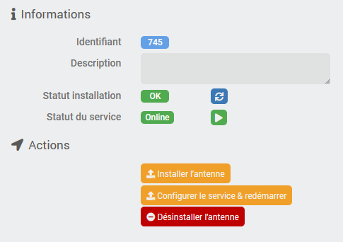

# Description

The purpose of this plugin is to make it easier for you to install and configure antennas running on *Theengs gateway*, which allows to listen to Bluetooth devices (BLEA) and use them in Jeedom via the [MQTT Discovery]({{site.baseurl}}/MQTTDiscovery/{{page.lang}}).

It offers a turnkey solution to perform this configuration.

I invite you to consult [this documentation](https://mips2648.github.io/jeedom-plugins-docs/MQTTDiscovery/fr_FR/#tocAnchor-1-14) to understand in more detail how it works.

# Installation

In order to use the plugin, you must download, install and activate it like any Jeedom plugin.
**Theengs gateway** requires the *MQTT Manager (MQTT2)* plugin to work, this allows to get status of antennas and to easily configure them.

# Plugin configuration

Before starting, make sure you have installed and configured the *MQTT Manager (MQTT2)* plugin, see plugin documentation.

You will then have to configure the connection information to the MQTT broker that the antennas will use, you can simply use the information that has already been configured by *MQTT Manager (MQTT2)* by choosing the corresponding option from the dropdown list but you can also configure a different username and password for the antennas but this is completely optional. Attention, in the latter case, the username and password configured here must have been created by you, **Theengs gateway** is not in charge of it.

If you don't know or are in doubt, use configuration from *MQTT Manager (MQTT2)*.

> **Important**
>
> The information configured here will only be used for antenna configuration. The plugin **Theengs gateway** will always use *MQTT Manager (MQTT2)* to connect to the broker.

# Devices

The plugin can be found in the Plugins → Programming menu.

Each device will correspond to a Theengs antenna. So you have to start by adding device and giving a name.
In the device configuration, you will see the usual settings that are common to all Jeedom device.

## Installing the antenna

Then the first thing to do is to choose if it is a local or remote (via SSH) antenna and in the case of a remote antenna you must provide the connection information:


> **Important**
>
> The configured user must be in the *sudoers* group and must have the permission to `sudo` without password confirmation

If you need help creating and configuring this user, [follow these steps](#tocAnchor-1-8)

By default the Bluetooth interface used will be *hci0*, if necessary you can change this configuration.

On the right side of the screen you will see the status of the installation as well as the status of the service:



Once you have configured the *Authentication* section, you need to save the device and then you can proceed to the installation of the antenna by clicking on the *Install Antenna* button.

> **Important**
>
> This step can be very long (1 hour or more on a ft0). It is very important to be patient and not launch the installation multiple times on the same antenna.
> On the other hand, you can perfectly launch the installation of several antennas in parallel.
>
> Remember to stop the antenna of the BLEA plugin if you were using the pi for BLEA. As this consumes a lot of resources, it will slow down the installation accordingly.
>
> Both processes (BLEA Antenna & Theengs Gateway) cannot use the Bluetooth at the same time, it is highly recommended to have 2 different Bluetooth keys/chips or only use one of them at a time.

The installation status will change to *Ongoing* and finally to *OK*. The installation log will be visible even during the installation in the Analysis → Logs menu and will be named `tgw_[eqLogicID]_update` so it is always possible to follow the progress of the installation in detail.

## Setup and startup

When the installation status changes to *OK*, you can click on the *Configure Service and Restart* button, this should only take a few seconds.

This step will write the configuration file and create the *TheEngsGateway* service on the remote host.

> **Important**
>
> If you change a device parameter or broker connection information in the plugin configuration, it will be necessary to redo the service configuration **after** having saved the device.

The service will be configured to start automatically each time the system is rebooted or if it fails.

If necessary, a final button allows you to (Re)Start the service, this button has the same function as the **Restart** command described below.

# Commands

Each antenna has 3 commands:

- **Online** info/binary command indicating whether the antenna is online or not. “Online” means connected to the broker and listening to the Bluetooth device.
- **Restart** action to (re)start the antenna if necessary
- **Stop** action to stop the antenna if necessary

# How to create a user under Debian and give him sudo permission

The following steps describe how to create a user under Debian (who can be dedicated to the plugin), how to give him *sudo* permission and allow him to run `sudo` without having to confirm his password. You don't necessarily have to follow these steps if you know how to do it or if you already have a user set up properly.

The following commands assume that you are going to perform operations with a user who has the *sudo* rights itself. If you do them with the user *root* you should of course not type the `sudo` command at the beginning of the line.

> **Important**
>
> Do not perform these steps on the machine hosting Jeedom but only on a remote antenna!

## User creation

Log in to your machine using the command line (ssh or console) and type the following command to create a user named *jeedom*

```bash
sudo adduser jeedom
```

You will then have to choose his password, follow the instructions on the screen.

## Adding the user to the sudo group

Then add the user to the *sudo* group

```bash
usermod -aG sudo jeedom
```

## Execute sudo without confirming the password

Edit the configuration file with the following command

```bash
sudo visudo
```

At the end of the file, add this line:

```text
jeedom ALL=(ALL) NOPASSWD:ALL
```

Exit by typing the `Ctrl+x` keys and confirm the save by typing `O` or `Y` depending on the language of your system (see message at the bottom of the screen)

# Changelog

[See the changelog](./changelog)

# Support

If you have a problem, start by reading the latest plugin-related topics on [community]({{site.forum}}/tags/plugin-{{page.pluginId}}).

If despite this you do not find an answer to your question, do not hesitate to create a new topic, with the tag of the plugin ([plugin-{{page.pluginId}}]({{site.forum}}/tags/plugin-{{page.pluginId}})).

At a minimum, you will need to provide:

- a screenshot of the Jeedom health page
- all available plugin logs
- depending on the case, a screenshot of the error encountered, a screenshot of the configuration causing the problem...
