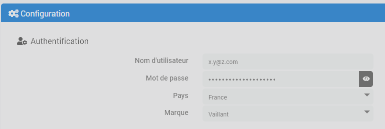

# Descripción

Complemento que permite conectarse a un sistema myVaillant a través de su pasarela de Internet (VR900, VR920, VR921).
En Jeedom es posible consultar el estado de todos los dispositivos conectados y controlarlos: definir el modo (Encendido, Apagado, Automático...), establecer las temperaturas de consigna, activar el funcionamiento forzado...

También se controlan las válvulas y los termostatos de la gama ambiSENSE conectados al sistema.

> **Importante**
>
> El complemento debería funcionar con todos los pasarelas (VR900, VR920, VR921...) y reguladores (VRC700, VRC720...) compatibles con la aplicación myVaillant.

# Versiones compatibles

> **Atención**
>
> Este complemento ya no es compatible con el sistema vaillantMULTIMATIC, sino únicamente con myVaillant. Si aún no has migrado a myVaillant, no instales esta versión del complemento.

| Componente | Versión                     |
|-----------|-----------------------------|
Debian | Bullseye (11) y Bookworm (12) |
| Jeedom    | >= 4.5                      |

# Instalación

Para utilizar el plugin, debes descargarlo, instalarlo y activarlo como cualquier otro plugin de Jeedom.
A continuación, hay que instalar las dependencias.

# Configuración del complemento

Debes introducir el nombre de usuario y la contraseña en la configuración del complemento, así como tu país y la marca de tu sistema (Bullex, Saunier Duval o Vaillant).

También tiene la posibilidad de configurar la frecuencia de actualización de la información, en minutos.

> **Consejo**
>
> Cuando se realiza una acción, como por ejemplo un cambio de valor de consigna o de modo, el estado del equipo se actualiza de inmediato. Se trata de actualizaciones adicionales que se realizan en segundo plano.

# Los equipos y sus controles

En cuanto se hayan instalado las dependencias y la configuración del complemento sea correcta, se iniciará el demonio y el complemento sincronizará tus dispositivos con Jeedom.

> **Consejo**
>
> El complemento nunca eliminará ningún dispositivo de tu Jeedom. Si, efectivamente, un dispositivo de Jeedom ya no se corresponde con ningún dispositivo que tengas, elimínalo manualmente.

Se crearán dispositivos de distintos tipos en función de los que ya existan en su sistema. Los dispositivos posibles son: la propia pasarela, el controlador de su producción de agua caliente y la bomba de circulación, un dispositivo para gestionar la ventilación, un dispositivo por zona de calefacción y, si dispone de dispositivos de la gama ambiSENSE, un dispositivo por habitación y un dispositivo por válvula y por termostato.

> **Consejo**
>
> Si tu sistema myVaillant no dispone de ninguno de los dispositivos mencionados anteriormente, no se creará ningún dispositivo de este tipo en Jeedom; esto es normal. Esta documentación simplemente recoge todas las posibilidades.

## La pasarela

Es el equipo principal del sistema. Permite controlar los modos rápidos y el modo vacaciones, y muestra la información de temperatura de los distintos sensores en función de lo que haya en tu instalación, por ejemplo, la temperatura de salida de la calefacción, del calentador de agua, la temperatura exterior...

Los modos rápidos son los mismos que los disponibles en la aplicación móvil; afectan a todos los componentes del sistema en función del modo activado.

El modo «vacaciones» también tendrá un impacto general, pero es un poco especial, ya que tiene una fecha de inicio y de fin y, por lo tanto, está programado. Si está activado, pero la fecha actual no se encuentra dentro del intervalo definido, no se aplicará (y es posible que se aplique otro modo rápido, según tu configuración).

A continuación se ofrece una descripción general de los comandos disponibles:

- **Actualizar** actualiza toda la información de todos los dispositivos
- **Online**: información sobre pedidos/archivos binarios
- **Fecha de inicio de las vacaciones**, **Fecha de fin de las vacaciones** y **Definir fechas de vacaciones** son, respectivamente, los comandos que indican la fecha de inicio y la de fin de las vacaciones registradas, así como el comando para definir dichas fechas
- **Temperatura de referencia en modo vacaciones** y **Definir temperatura de referencia en modo vacaciones** permiten consultar y definir la temperatura de referencia que se aplica cuando el modo vacaciones está activo.
- **Modo vacaciones activo** y **Cancelar modo vacaciones** son los comandos que permiten conocer el estado y desactivar el modo vacaciones.
- **Temperatura exterior**, **Temperatura de salida** y **Presión del agua** son comandos informativos/numéricos

## Agua caliente sanitaria

Este equipo recoge información sobre la producción de agua caliente sanitaria.

- **Modo** devuelve el modo activo; puede tener uno de los siguientes valores: _Auto_, _On_, _Off_
- **Auto**, **On**, **Off**, comando de acción para activar el modo correspondiente
- **Punto de consigna** y **Definir punto de consigna** indican y permiten modificar el punto de consigna deseado
- **Temperatura** indica la temperatura actual del agua
- **Boost ECS activo**, **Boost ECS activado** y **Boost ECS desactivado** para controlar el modo «boost» del agua caliente sanitaria

## Ventilación

- **Modo** devuelve el modo activo; puede tener uno de los siguientes valores: _Día_, _Noche_, _Desactivado_
- **Día**, **Noche**, **Apagado**, comando de acción para activar el modo correspondiente
- **Estado** indica el estado actual: _Día_, _Noche_, _Apagado_.
- **Velocidad** indica la velocidad actual
- **Velocidad diurna** y **Velocidad nocturna**: comandos informativos que indican la velocidad programada durante el día y la noche, respectivamente
- **Definir velocidad diurna** y **Definir velocidad nocturna**: comandos de acción que permiten modificar la velocidad programada durante el día y la noche, respectivamente
- **Temperatura** indica la temperatura actual

## Las zonas

Habrá un equipo de tipo «_Zone_» por cada zona de calefacción (por circuito) gestionado por tu sistema Vaillant.
Cada zona contará con los siguientes controles:

- **Activo**: comando de información binaria que indica si la zona está activa o no
- **Modo** devuelve el modo activo; puede tener uno de los siguientes valores: _Auto_, _Día_, _Noche_, _Desactivado_
- **Auto**, **Día**, **Noche**, **Desactivado**, comando de acción para activar el modo correspondiente
- **Consigna** muestra la consigna aplicada actualmente
- **Punto de consigna diurno** y **Establecer punto de consigna** indican y permiten modificar el punto de consigna utilizado en el modo _Diurno_
- **Temperatura nocturna** y **Establecer temperatura nocturna** indican y permiten modificar la temperatura utilizada en el modo _Nocturno_
- **Temperatura** indica la temperatura actual de la zona
- **Activar temperatura forzada**: comando de acción/control deslizante que permite establecer un valor de consigna y activar el modo forzado; es decir, forzar la aplicación de dicha consigna independientemente del programa en curso. Este modo permanecerá activo durante el tiempo configurado en el comando **Duración del modo forzado**, antes de volver al programa anterior.
- **Anular temperatura forzada**: comando que permite anular el modo forzado
- **Duración del modo forzado** indica el tiempo durante el cual el modo forzado estará activo _la próxima vez que se active_
- **Definir duración del modo forzado** permite modificar la duración durante la cual el modo forzado estará activo _en la próxima activación_. Modificar esta duración no influye en el tiempo restante si la temperatura forzada ya estaba activada; para ello, hay que volver a utilizar el comando **Activar temperatura forzada**

## Los circuitos

Habrá un equipo del tipo _Circuit_ por cada circuito de la instalación.
Cada circuito dispondrá de los siguientes controles:

- **Estado**
- **Temperatura**

## Las habitaciones

Cuando tengas válvulas y/o termostatos de la gama ambiSENSE conectados al sistema, el complemento creará dispositivos _Habitación_ que se correspondan con las habitaciones existentes en la aplicación móvil.
El control de la temperatura se realizará de forma individual a través de estos dispositivos y ya no de forma centralizada para toda la zona. Esto permitirá, por tanto, una gestión más precisa de la calefacción.
Los dispositivos de la _habitación_ disponen de los siguientes controles:

- **Actualizar** actualiza la información de la habitación
- **Modo** devuelve el modo activo; puede tener uno de los siguientes valores: _Auto_, _Manual_, _Off_
- **Automático**, **Manual**, **Apagado**: comando para activar el modo correspondiente
- **Estado** indica el estado actual: _Automático_, _Manual_ o _Apagado_
- **Consigna** muestra la consigna aplicada actualmente
- **Definir consigna** permite modificar la consigna. En modo _Manual_, esto cambiará la consigna manual; en modo _Auto_ o _Forzado_, activará el modo forzado y aplicará la nueva consigna (equivalente al comando **Activar temperatura forzada**).
- **Temperatura** indica la temperatura actual de la habitación
- **Humedad** indica la humedad actual de la habitación si hay un termostato en ella; de lo contrario, no se mostrará ninguna información en este control
- **Activar temperatura forzada**: comando de acción/control deslizante que permite establecer un valor de consigna y activar el modo forzado; es decir, forzar la aplicación de dicha consigna independientemente del programa en curso. Este modo permanecerá activo durante el tiempo configurado en el comando **Duración del modo forzado**, antes de volver al programa anterior.
- **Anular temperatura forzada**: comando que permite anular el modo forzado y volver al programa anterior
- **Duración del modo forzado** indica el tiempo durante el cual el modo forzado estará activo _la próxima vez que se active_
- **Definir duración del modo forzado** permite modificar la duración durante la cual el modo forzado estará activo _en la próxima activación_. Modificar esta duración no influye en el tiempo restante si la temperatura forzada ya estaba activada; para ello, hay que volver a utilizar el comando **Activar temperatura forzada**
- **Seguridad infantil**: comando binario que indica si la seguridad infantil está activada en la válvula o en el termostato de la habitación
- **Ventana abierta**: señal de información binaria que indica si la válvula o el termostato de la estancia ha detectado una ventana abierta (por una caída brusca de la temperatura)

## Válvulas y termostatos

Estos dispositivos «técnicos» no disponen de ningún mando para gestionar la calefacción; todo se controla a través de los dispositivos de _habitación_. No obstante, cuentan con los dos mandos siguientes:

- **Batería baja**: comando de información binario que indica si el nivel de la batería es bajo. No se transmite el estado en porcentaje.
- **Fuera de alcance**: comando de información binario que indica si el equipo está fuera del alcance del sistema (y, por lo tanto, ya no se comunica con la pasarela).
- **rssi**: parámetro de información digital que indica la calidad de la señal

El complemento enviará la información sobre la _batería_ al dispositivo para que el núcleo pueda acceder a ella de forma estándar (como con el resto de dispositivos de Jeedom) y para que podamos recibir notificaciones a través de las alertas previstas en Jeedom; sin embargo, dado que la información en porcentaje no existe realmente, se definirán los siguientes valores ficticios:

- 100 % siempre que el comando **Batería baja** tenga el valor 0
- 10 % cuando el comando **Batería baja** tiene el valor 1

# Registro de cambios

[Ver el registro de cambios](./changelog)

# Asistencia

Si tienes algún problema, empieza por leer los últimos temas relacionados con el plugin en [community]({{site.forum}}/tag/plugin-{{page.pluginId}}).

Si, a pesar de todo, no encuentras respuesta a tu pregunta, no dudes en crear un nuevo tema sin olvidar incluir la etiqueta del plugin ([plugin-{{page.pluginId}}]({{site.forum}}/tag/plugin-{{page.pluginId}})).

Como mínimo, habrá que presentar:

- una captura de pantalla de la página de estado de Jeedom
- una captura de pantalla de la página de configuración del complemento
- Todos los registros disponibles del complemento, con nivel _INFO_, pegados en un `Texto preformateado` (botón `</>` en la comunidad), ¡sin archivos!
- según el caso, una captura de pantalla del error que se ha producido, una captura de pantalla de la configuración que da problemas...
