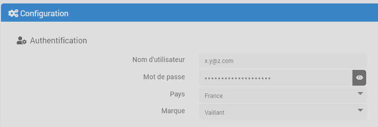

# Description

Plugin allowing you to connect to a myVaillant system via its internet gateway (VR900, VR920, VR921).
In Jeedom, it is possible to report the status of all connected device and to control them: define the mode (On, Off, Auto...), define the set temperatures, activate a forced operation...

The valves and thermostats of the ambiSENSE range connected to the system are also managed.

> **Important**
>
> The plugin should work with all gateways (VR900, VR920, VR921...) and regulators (VRC700, VRC720...) compatible with the myVaillant application.

# Supported versions

> **Attention**
>
> This plugin is no longer compatible with the vaillantMULTIMATIC system but only myVaillant. If you have not yet migrated to myVaillant, do not install this version of the plugin.

| Component | Version                     |
|-----------|-----------------------------|
| Debian    | Bullseye(11) & Bookworm(12) |
| Jeedom    | >= 4.2                      |

# Installation

In order to use the plugin, you must download, install and activate it like any Jeedom plugin.
Then you need to install dependencies.

# Plugin configuration

You must enter the username and password in the configuration of the plugin as well as your country and the brand of your system (Bullex, Saunier Duval or Vaillant)

You also have an option to configure the frequency of updates, in minutes.

> **Tip**
>
> During an action, a change of setpoint or mode for example, the state of the equipment is updated immediately. These are additional updates performed in the background.

# Devices and commands

As soon as the dependencies are installed and the plugin configuration is correct, the daemon will start and the plugin will synchronize your devices with Jeedom.

> **Tip**
>
> The plugin will never delete a device in your Jeedom. If a jeedom device does not correspond to any device in your possession, please delete it manually.

Device of different types will be created depending on what exists in your system. The possibilities are: the gateway itself, the controller of your hot water production and the circulator, device to manage ventilation system, on device per heating zone and if you have devices from the ambiSENSE range, one device per room and one device per valve and thermostat.

> **Tip**
>
> If your myVaillant system does not have one of the equipment listed above, then there will be no device of this type created under Jeedom, this is normal. This documentation simply lists all the possibilities.

## The gateway

It is the main device of the system. It allows the control of quick modes, vacation mode and will display the temperature information of the different sensors according to what exists on your installation, for example the starting temperature of the heating, the hot water tank, the outside temperature ...

The quick modes are the same as those available in the mobile app, they have an overall impact on the system components depending on the mode activated.

The vacation mode will also have a global impact but it is a bit special because it has a start and end date and is therefore scheduled. If it is activated but the current date is not within the defined interval, it will not be applied (and another fast mode may be applied depending on your configuration).

Here is an overview of the available commands:

- **Refresh** refreshes all information of all device
- **Online** info/binary command
- **Holiday start date**, **Holiday end date** & **Define holiday dates** are respectively the commands giving the start and end date of the recorded holiday as well as the command to define these dates
- **Holiday setpoint** and **Define holiday setpoint** are used to find out and define the temperature setpoint applied when holiday mode is active.
- **Holiday mode active**, **Cancel holiday mode** are the commands to know the status and to deactivate the holiday mode.
- **Outside temperature**, **Starting temperature** are info/numeric commands

## Hot water

This device contains information on the production of domestic hot water.

- **Mode** returns the active mode, it can have one of the following values: _Auto_, _On_, _Off_
- **Auto**, **On**, **Off**, action command to activate the corresponding mode
- **Setpoint** and **Define setpoint** indicates and allows modification of the setpoint
- **Temperature** indicates the current water temperature
- **Boost DHW activated**, **Boost DHW on** and **Boost DHW off** control the domestic hot water boost mode

## Ventilation

- **Mode** returns the active mode, it can have one of the following values: _Day_, _Night_, _Off_
- **Day**, **Night**, **Off**, action command to activate the corresponding mode
- **Status** gives the current status, _Day_, _Night_, _Off_.
- **Speed** give current speed
- **Day Speed** and **Night Speed** info commands giving the programmed speed during day and night respectively
- **Set Day Speed** and **Set Night Speed** action commands to change the set speed during day and night respectively
- **Temperature** indicates the current temperature

## Zones

There will be one _Zone_ device per heating zone (per circuit) managed by your Vaillant system.
Each zone will have the following commands:

- **Active** binary info command indicating whether the zone is active or not
- **Mode** returns the active mode, it can have one of the following values: _Auto_, _Day_, _Night_, _Off_
- **Auto**, **Day**, **Night**, **Off**, action command to activate the corresponding mode
- **Setpoint** gives the setpoint currently applied
- **Day setpoint** and **Define day setpoint** indicates and allows modification of the setpoint used in _Day_ mode
- **Night setpoint** and **Define night setpoint** indicates and allows modification of the setpoint used in _Night_ mode
- **Temperature** indicates the current temperature of the zone
- **Activate forced temperature** action/slider command allowing to give an instruction and to activate the forced mode, in other words to force the application of this instruction independently of the program in progress. This mode will be active for the duration configured in the command **Forced mode duration** before returning to the previous program.
- **Cancel forced temperature** action command to cancel forced mode
- **Forced mode duration** contains the duration during which the forced mode will be active _during the next activation_
- **Define forced mode duration** allows to modify the duration during which the forced mode will be active _during the next activation_. Modifying this duration has no influence on the remaining duration if the forced temperature was already activated, to do this you must again use the command **Activate forced temperature**

## Rooms

When you have valves and/or thermostats from the ambiSENSE range connected to the system, the plugin will create _Room_ device corresponding to the existing rooms in the mobile app.
The temperature setpoint will be managed individually via this device and no longer centrally over the entire zone. This will therefore allow more granular management of your heating.
The _Room_ devices have the following commands:

- **Refresh** refreshes the part information
- **Mode** returns the active mode, it can have one of the following values: _Auto_, _Manuel_, _Off_
- **Auto**, **Manual**, **Off**, action command to activate the corresponding mode
- **State** gives the current state: _Auto_, _Manual_ or _Off_
- **Setpoint** gives the setpoint currently applied
- **Set setpoint** allows to modify the setpoint. In _Manual_ mode this will change the manual setpoint, in _Auto_ or _Forced_ mode this will activate forced mode and apply the new setpoint (equivalent to the command **Activate forced temperature**)
- **Temperature** indicates the current room temperature
- **Humidity** indicates the current humidity of the room if a thermostat is there otherwise no information will be sent to this command
- **Activate forced temperature** action/slider command allowing to give an instruction and to activate the forced mode, in other words to force the application of this instruction independently of the program in progress. This mode will be active for the duration configured in the command **Forced mode duration** before returning to the previous program.
- **Cancel forced temperature** action command to cancel forced mode and return to the previous program
- **Forced mode duration** contains the duration during which the forced mode will be active _during the next activation_
- **Define forced mode duration** allows to modify the duration during which the forced mode will be active _during the next activation_. Modifying this duration has no influence on the remaining duration if the forced temperature was already activated, to do this you must again use the command **Activate forced temperature**
- **Child lock** binary info command indicating whether child lock is activated on the valve or the room thermostat
- **Window open** binary info command indicating if the room valve or thermostat has detected an open window (by a sudden drop in temperature)

## Valves & thermostats

This "technical" device has no command to manage the heating, all done via the _Room_ device. They still have the following 2 commands:

- **Battery low** Binary info command indicating if the battery status is low. There is no percentage feedback.
- **Out of range** Binary info command indicating if the device is out of range of the system (and therefore no longer communicating with the gateway).
- **rssi** numeric/info command indicating signal quality

The plugin will update the _battery_ information in the device so that the core can access it in a standard way (like all other device under Jeedom) and that we can be notified via the alerts provided in Jeedom but as the information in percent does not actually exist, the following dummy values will be set:

- 100% as long as the **Battery low** command is 0
- 10% when **Low Battery** command is 1

# Changelog

[See the changelog](./changelog)

# Support

If you have a problem, start by reading the latest plugin-related topics on [community]({{site.forum}}/tag/plugin-{{page.pluginId}}).

If despite this you do not find an answer to your question, do not hesitate to create a new topic, with the tag of the plugin ([plugin-{{page.pluginId}}]({{site.forum}}/tag/plugin-{{page.pluginId}})).

At a minimum, you will need to provide:

- a screenshot of the Jeedom health page
- all available plugin logs
- depending on the case, a screenshot of the error encountered, a screenshot of the configuration causing the problem...
