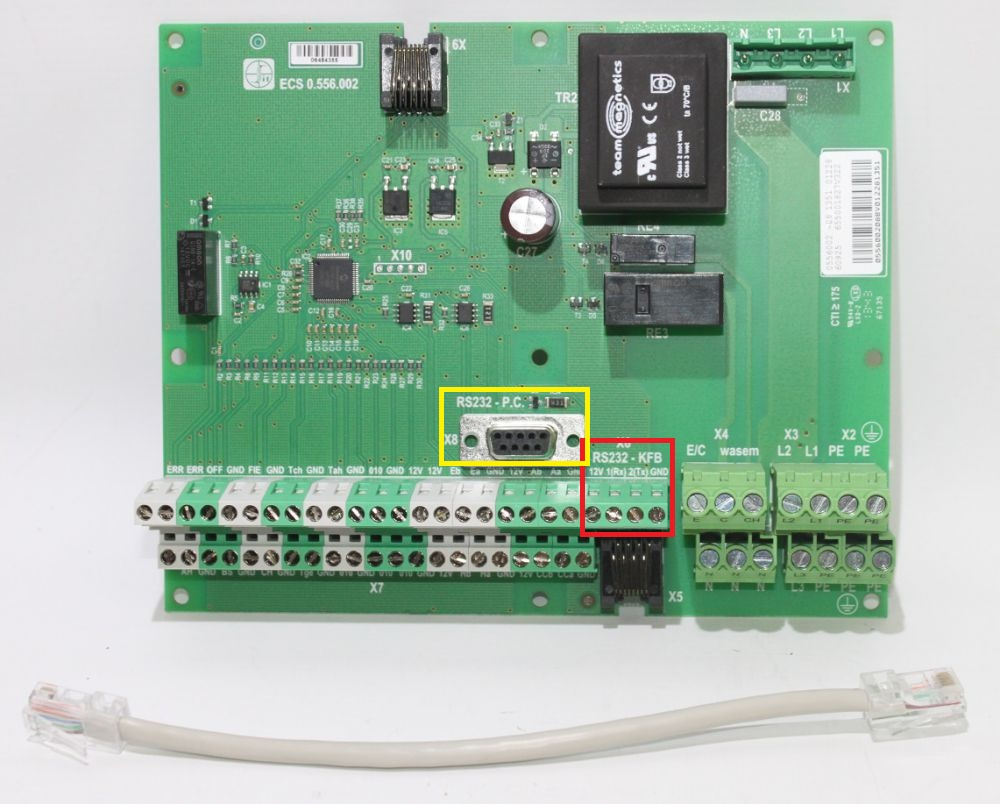
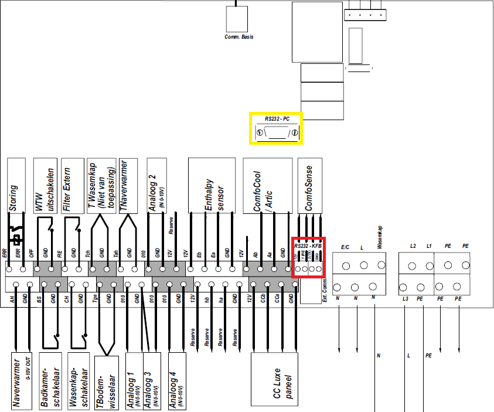
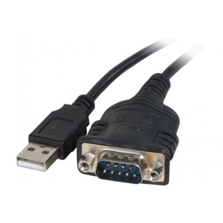
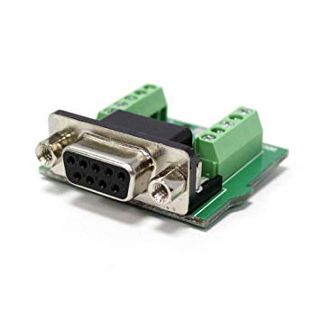
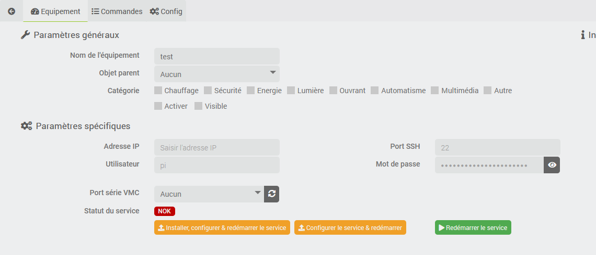
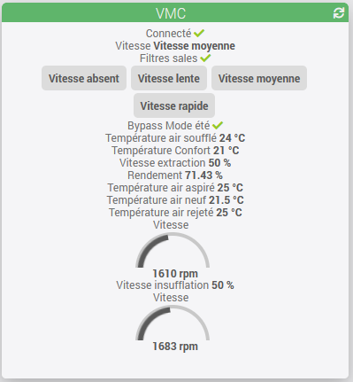

# Description

Plugin that allows you to interface a Zehnder-brand mechanical ventilation system—also known as Storkair, ComfoAir, or Wernig—via the serial port (RS232) used by CCEase/ComfoSense.
The following models should be compatible, but not all of them have been tested:

- ComfoAir 180, 200, SL 330, 350
- ComfoD 250/350/450/550
- WHR 920/930/950/960

# Supported Versions

| Component | Version                     |
|-----------|-----------------------------|
| Debian    | Bullseye(11) & Bookworm(12) |
| Jeedom    | >= 4.5                      |

# Hardware Installation

## Prerequisites

You'll need a Raspberry Pi (you don't need a powerful model—a Pi Zero W will do, or an old model if you have one lying around) or any other system running at least Debian Buster (not tested with other distributions).
If your Jeedom is located near the mechanical ventilation system, you can use it, but I recommend separating the two functions.
The rest of this documentation assumes that you have a Raspberry Pi, other than Jeedom.

You need to set up your Raspberry Pi, connect it to the network with a static IP address, and enable SSH.
This Raspberry Pi will host a daemon that will handle the connection between the CMV (via its serial interface; see below) and the plugin (via MQTT). The SSH connection is used to install and configure the remote daemon.

This plugin requires a working installation of the "MQTT Manager (MQTT2)" plugin. If this plugin is not already installed on your system, it will be installed automatically, but you will need to complete its configuration (see the *MQTT Manager* documentation).

At this point, it is recommended that you update your Pi (apt-get update, apt-get upgrade) to speed up the installation of the daemon later (see below).

> **Important**
>
> sudo must be installed on the machine connected to the VMC; the user account used by the plugin must be in the sudoers group and have the permission to run a sudo command without confirming their password.

## Connecting the mechanical ventilation system

The plugin will communicate with the VMC via the RS232 interface. On the VMC, this interface is available:

- either via a terminal block (4-wire) to which the CCEase may be connected if you have one,
- either a DB9 port,
- which is sometimes an RJ45 port.

You'll need to connect this interface to the Raspberry Pi.
DB9-to-USB adapters are available; this is the simplest solution if your mechanical ventilation system has a DB9 port.

If the DB9 port isn't available, there are also terminal block-to-DB9 adapters you can use to connect a DB9-to-USB adapter; you can then connect the wires to the terminal block on the ventilation unit or to the RJ45 port.

# Installing the plugin

> **Tip**
>
> To use the plugin, you must download, install, and activate it just like any other Jeedom plugin.

No additional configuration is required here.

# Device setup

## Creating the device in your Jeedom

- Go to the device configuration page via the "Plugins" menu, then "Comfort" and "VMC (Zehnder/Storkair)";
- Click "Add" and enter a name;
- You'll be taken to the device configuration page, where you can set up the usual options in Jeedom (don't forget to enable your new device).

## Connectivity between the plugin and the Raspberry Pi (SSH configuration)

Next, you must enter the IP address of the Raspberry Pi that was previously installed and connected to the VMC, the SSH port (if different from the default port), the username (if other than "pi"), and the password.

> **Important**
>
> The configured user must be in the sudoers group and have the right to use sudo without re-entering the password.

**Back up** your device, and if the configuration is correct, you can move on to the next step.

## Installation & Configuration of the Daemon

### Initial installation

In principle, after saving the device configuration, the *VMC Serial Port* drop-down list should contain a list of USB devices detected on the Raspberry Pi. If this is not the case:

- Check the login information: IP address, username, password
- Make sure you have properly plugged the USB adapter into the Pi.

Select the correct port and **save** the device.

You can now click the **Install, Configure & Restart Service** button. This will take a little while, so please be patient; you’ll receive regular progress updates.

The installation will:

- Copy the necessary files to the Pi (via SSH);
- Install the dependencies;
- start the remote service

If everything goes smoothly, the daemon/service will begin sending information about the CMV, and the *status* will change to *OK*

### Configuration Change

If you change the serial port to be used, you must resend the configuration after saving the device. To do this, click the **Configure Service & Restart** button.

# Setting Up the Mechanical Ventilation System

The "Reload Configuration" action reads the configuration from the VMC, which can then be viewed via the *Configuration* tab.
It is not normally necessary to perform this action; the configuration is updated automatically each time the service starts.

The screen displays a summary of the CMV information, usage meters, and ventilation speed settings.

# Commands

All created commands can, of course, be found in the *Orders* tab.
You'll find a button there to recreate any missing commands on your device. There's no risk involved in taking this action; an existing command will never be replaced or overwritten.

In addition to information displays (current fan speed, measured temperature, etc.) and the command to refresh this information, there are also:

- A command for each fan speed (0-off, 1-slow, 2-medium, 3-fast) to set the corresponding fan speed.
You can use these commands in your scenarios, for example, to lower the fan speed when you're away, on vacation, or at night, or to increase it when humidity rises in the bathroom and/or kitchen (via separate sensors).
- A command to set the comfort temperature, accepting a value between 12°C and 28°C. The comfort temperature determines whether or not the CMV system will use the bypass (to cool the house in case of overheating; see the CMV manual). It is not recommended to change this value frequently; the CMV system will handle the management once the temperature is set, and this temperature is likely already set correctly in your system.

The *Connected* command corresponds to the status of the remote daemon.

# Efficiency

The plugin calculates the efficiency of the mechanical ventilation system using the fresh air efficiency formula: ηt = (Supply Air Temperature – Fresh Air Temperature) / (Exhaust Air Temperature – Fresh Air Temperature)

The result provides an indication of how dirty your filters are: dirty filters will reduce the efficiency of the mechanical ventilation system.

# Widget

# Change log

[View the changelog](./changelog)

# Support

If you're having a problem, start by reading the latest threads related to the plugin on [community]({{site.forum}}/tag/plugin-{{page.pluginId}}).

If you still can't find an answer to your question, feel free to create a new thread—and don't forget to include the plugin tag ([plugin-{{page.pluginId}}]({{site.forum}}/tag/plugin-{{page.pluginId}})).

At a minimum, you must provide:

- a screenshot of the Jeedom Health page
- a screenshot of the plugin's settings page
- All available plugin logs at the *INFO* level, pasted into `Preformatted Text` (use the `</>` button on the community), no files!
- Depending on the situation, a screenshot of the error encountered, a screenshot of the problematic configuration...

# Do you like the plugin?

While it makes your daily life easier, a small donation helps keep the project going.

<iframe src="https://github.com/sponsors/Mips2648/card" title="Sponsor Mips2648" height="225" width="600" style="border: 0;"></iframe>

