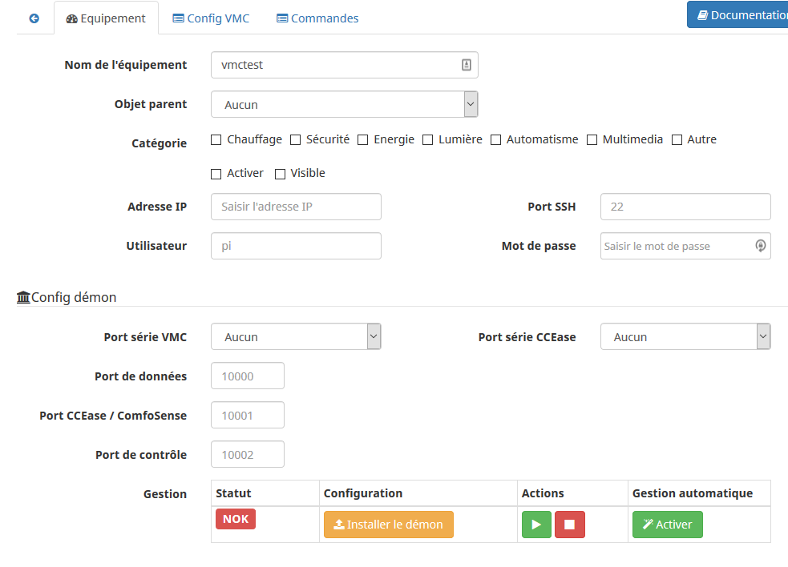
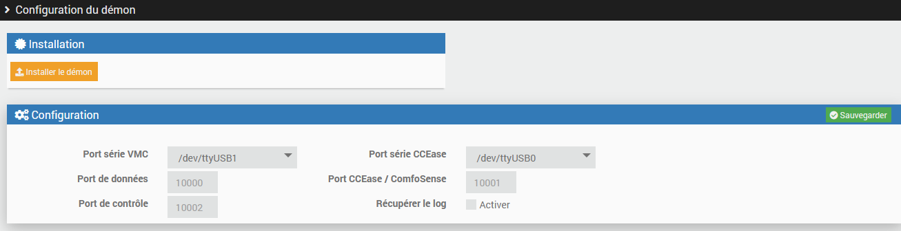
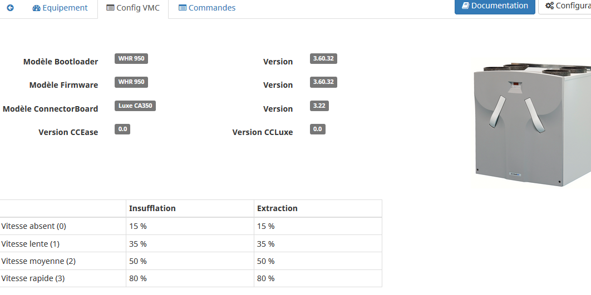

# Description

Plugin to interface a Zehnder HRV-ERC - also known as Storkair, Comfo Air, Wernig - via the serial port (RS-232) used by the CCEase/ComfoSense.
The following models should be compatible but they have not all been tested:

- ComfoAir 180, 200, SL 330, 350
- ComfoD 250/350/450/550
- WHR 920/930/950/960

# Hardware installation

## Prerequisites

You will need a Raspberry pi (no need for a powerful model, a zero w is enough, or an old model if you have one) or any other system running under debian (not tested with others distributions).
If your Jeedom is close to the HRV, you can use it but I advise to separate the 2 roles.
The rest of the documentation assumes that you have a pi, different from Jeedom.

You must install your Raspberry pi, connect it to the network with a fixed IP and enable ssh.
This Raspberry will host a daemon that will provide a connection between the HRV-ERV (via its serial interface, see below) and the plugin (via TCP). The SSH connection is used to manage the daemon.

At this point, it is recommended to update your pi (apt-get update, apt-get upgrade) in order to speed up the installation of the daemon later (see below).

> **Important**
>
> sudo must be installed on the machine connected to the VMC, the user used for the plugin must be in the group sudoers and have the right to execute a sudo command without confirming his password.

## Connecting the HRV

The plugin will communicate with the HRV via the RS232 interface. On the HRV, this interface is available:

- either via a terminal block (4 wires) on which the CCEase may be connected if you have one,
- a DB9 port,
- or a RJ45 port.

You will need to connect this interface to the Raspberry Pi.
There are DB9-USB adapters, it's the simplest if the DB9 port is present on your HRV

If the db9 port is not present, there are also terminal block adapters to DB9 and then connect a DB9-USB adapter, up to you connect the wires to the terminal block of the HRV or to the RJ45 port.

# Plugin installation

> **Tip**
>
> In order to use the plugin you have to download,install and activate it as any other Jeedom plugin.

There is no additional config to perform here, the plugin will use the cron5 to refresh the HRV-ERV data every 5min and the cron to check the remote(s) daemon(s) every minute.

# Device configuration

## Creating the device in Jeedom

- Navigate to devices management available under menu "Plugins", "Comfort" and "VMC (Zehnder/Storkair)".
- Click "Add" and choose a name.
- You will land on the configuration of your newly created device on witch you can setup usual Jeedom options (don't forget to activate your new device).

## Connectivity between plugin and pi (ssh configuration)

You must then enter the IP address of the Raspberry previously installed and connected to the HRV, the port ssh (if different from the default port), the user (if other than "pi") and its password.

Save the change and if the configuration is correct you can proceed to next step.

## Installing the daemon

You can now start the installation of the daemon and its dependencies, the first installation can take several minutes (especially if the pi was not up to date before).

The installation will:

- copy the necessary files to the pi (via SSH)
- install the dependencies

If the previous step went well, you should see the list of "devices" (usb) connected to your pi, you must select the device connected to the HRV and possibly select the one connected to the CCEease (optional).
It is not recommended to change the configuration of the TCP ports, only do this if you know what you are doing and you have a problem with usage of these ports; These ports will be used by the remote daemon, on the Raspberry connected to the VMC, not on Jeedom (unless it's the same device).

Save the configuration.

## Starting the daemon

You can now start the daemon and enable automatic management.

If all goes well, the status should go green. If not please wait a few minutes if the installation is not finished (monitor the log), the daemon will be started automatically as soon as possible.

# HRV configuration

HRV configuration

# Commands

Commands

- All created commands are obviously in the "Commands" tab.
There is a button to recreate the missing commands on your device if needed. There is no risk to perform this action, an existing command will never be replaced.
On top of the information commands (current fan speed, measured temperature, etc.) and the refresh command for these information, there are:
- a command for each fan speed (0-absent, 1-low, 2-medium, 3-high) to set the corresponding speed.

# You can use these commands in your scenarios for example to reduce speed in case of absence, vacation or at night or increase it in case of increased humidity in the bathroom and/or kitchen ( via separate sensors).

a command to set the comfort temperature, accepting a value between 0 and 40 (° C). The comfort temperature determines whether or not the bypass is used by the VMC (to cool the house in case of overheating, see the VMC manual). It is not recommended to change this value often, the VMC will handle the management once the temperature is set and this temperature is probably already set correctly in your installation.

Efficiency

# The plugin calculates the efficiency of the system via the formula of the efficiency on fresh air: ηt = (T ° C Air insufflated - T ° C New Air) / (T ° C Air Extract - T ° C Air New)

The result gives an indication of the clogging of your filters: dirty filters will reduce the efficiency of the HRV.

# Widget

# Changelog

If despite this documentation and after having read the topics related to the plugin on [community]({{site.forum}}/tags/plugin-{{page.pluginId}}) you do not find an answer to your question, do not hesitate to create a new topic with the tag of the plugin ([plugin-{{page.pluginId}}]({{site.forum}}/tags/plugin-{{page.pluginId}})).
