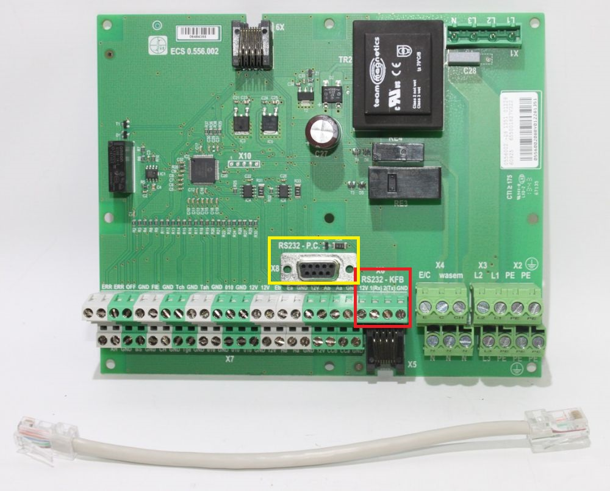
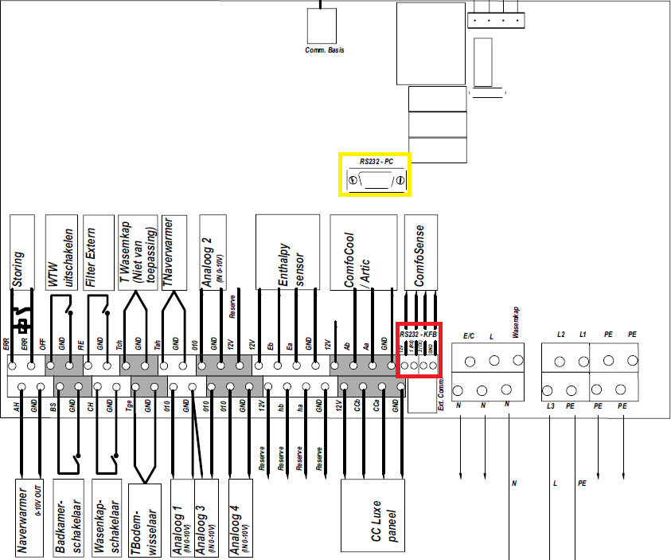
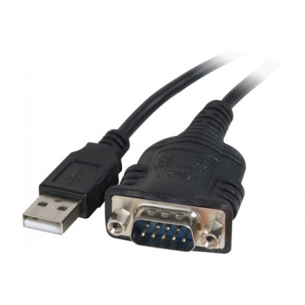
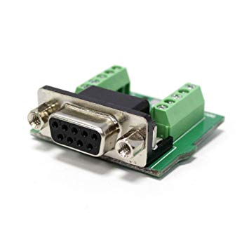
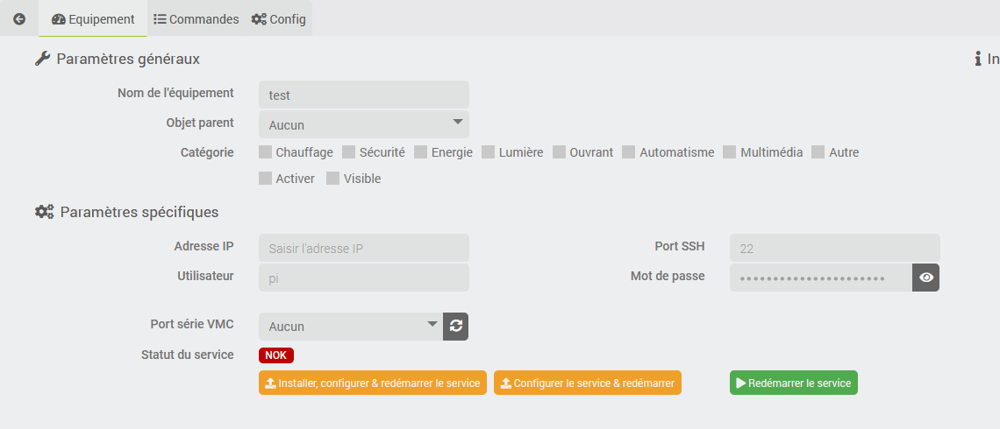
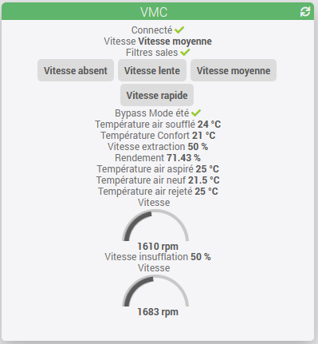

# Description

Plugin to interface a Zehnder HRV-ERC - also known as Storkair, Comfo Air, Wernig - via the serial port (RS-232) used by the CCEase/ComfoSense.
The following models should be compatible but they have not all been tested:

- ComfoAir 180, 200, SL 330, 350
- ComfoD 250/350/450/550
- WHR 920/930/950/960

# Hardware installation

## Prerequisites

You will need a Raspberry pi (no need for a powerful model, a zero w is enough, or an old model if you have one) or any other system running under Debian Buster minimum (not tested with others distributions).
If your Jeedom is close to the HRV, you can use it but I advise to separate the 2 roles.
The rest of the documentation assumes that you have a pi, different from Jeedom.

You must install your Raspberry pi, connect it to the network with a fixed IP and enable ssh.
This Raspberry will host a daemon that will provide a connection between the HRV-ERV (via its serial interface, see below) and the plugin (via TCP). The SSH connection is used to install and configure the daemon.

The plugin requires a functional installation of the “MQTT Manager (MQTT2)” plugin, if this plugin is not yet present on your system, it will be installed automatically but you will have to finalize its configuration (see*MQTT Manager* documentation).

At this point, it is recommended to update your pi (apt-get update, apt-get upgrade) in order to speed up the installation of the daemon later (see below).

> **Important**
>
> sudo must be installed on the machine connected to the VMC, the user used for the plugin must be in the group sudoers and have the right to execute a sudo command without confirming his password.

## Connecting the HRV

The plugin will communicate with the HRV via the RS232 interface. On the HRV, this interface is available:

- either via a terminal block (4 wires) on which the CCEase may be connected if you have one,
- a DB9 port,
- or a RJ45 port.

You will need to connect this interface to the Raspberry Pi.
There are DB9-USB adapters, it's the simplest if the DB9 port is present on your HRV

If the db9 port is not present, there are also terminal block adapters to DB9 and then connect a DB9-USB adapter, up to you connect the wires to the terminal block of the HRV or to the RJ45 port.

# Plugin installation

> **Tip**
>
> In order to use the plugin you have to download,install and activate it as any other Jeedom plugin.

There is no additional configuration to do here.

# Devices configuration

## Creating the device in Jeedom

- Navigate to devices management available under menu "Plugins", "Comfort" and "VMC (Zehnder/Storkair)".
- Click "Add" and choose a name.
- You will land on the configuration of your newly created device on witch you can setup usual Jeedom options (don't forget to activate your new device).

## Connectivity between plugin and pi (ssh configuration)

You must then enter the IP address of the Raspberry previously installed and connected to the HRV, the port ssh (if different from the default port), the user (if other than "pi") and its password.

**Save** the change and if the configuration is correct you can proceed to next step.

## Daemon installation & configuration

# Première installation

En principe, après la sauvegarde de l'équipement, la liste déroulante *Port série VMC* devrait contenir la liste des périphérique USB détecté sur le pi. Si ce n'est pas le cas:

- Vérifiez les informations de connexion: ip, utilisateur, mot de passe
- Vérifiez que vous avez correctement branché l'adaptateur USB sur le pi.

Sélectionnez le port correcte et **sauvegardez** l'équipement.

Vous pouvez à présent cliquer sur le bouton **Installer, configurer & redémarrer le service**. Cela va prendre un peu de temps donc patientez, vous allez recevoir régulièrement des notifications sur l'avancement.

The installation will:

- copy the necessary files to the pi (via SSH)
- install the dependencies
- démarrer le service distant

Si tout se passe correctement, le démon/service va commencer à envoyer les informations sur la VMC et le *statut* passera à *OK*

# Changement de configuration

Si vous changez le port série à utiliser, vous devez, après avoir sauvegardé l'équipement, renvoyer la configuration. Pour ce faire, vous pouvez cliquer sur le bouton **Configurer le service & redémarrer**

# HRV configuration

L'action recharger la configuration permet de lire la configuration depuis la VMC qui peut ensuite être consultée via l'onglet *Configuration*.
Il n'est normalement pas nécessaire d'effectuer cette action, la config est mise à jour automatiquement à chaque démarrage du service.

L'écran présente un résumé des information de la VMC, les compteurs d'utilisation ainsi que la configuration des vitesses de ventilation.

# Commands

Toutes les commandes créées se trouvent évidemment dans l'onglet *Commandes*.
Vous y trouverez un bouton pour recréer les commandes manquantes sur votre équipement. Il n'y a aucun risque à effectuer cette actions, une commande existante ne sera jamais remplacée ni écrasée.

On top of the information commands (current fan speed, measured temperature, etc.) and the refresh command for these information, there are:

- a command for each fan speed (0-absent, 1-low, 2-medium, 3-high) to set the corresponding speed.
You can use these commands in your scenarios for example to reduce speed in case of absence, vacation or at night or increase it in case of increased humidity in the bathroom and/or kitchen ( via separate sensors).
- une commande pour définir la température de confort, acceptant une valeur entre 12°C et 28°C. La température de confort détermine l'utilisation ou non du bypass par la VMC (afin de refroidir la maison en cas de surchauffe, cf. manuel de la VMC). Il n'est pas recommandé de changer souvent cette valeur, la VMC se chargera de la gestion une fois la température définie et cette température est probablement déjà définie correctement dans votre installation.

The *Connected* command corresponds to the status of the remote daemon.

# Efficiency

The plugin calculates the efficiency of the system via the formula of the efficiency on fresh air: ηt = (T ° C Air insufflated - T ° C New Air) / (T ° C Air Extract - T ° C Air New)

The result gives an indication of the clogging of your filters: dirty filters will reduce the efficiency of the HRV.

# Widget

# Changelog

[See the changelog](./changelog)

# Support

If you have a problem, start by reading the latest plugin-related topics on [community]({{site.forum}}/tags/plugin-{{page.pluginId}}).

If despite this you do not find an answer to your question, do not hesitate to create a new topic, with the tag of the plugin ([plugin-{{page.pluginId}}]({{site.forum}}/tags/plugin-{{page.pluginId}})).

At a minimum, you will need to provide:

- a screenshot of the Jeedom health page
- all available plugin logs
- depending on the case, a screenshot of the error encountered, a screenshot of the configuration causing the problem...
