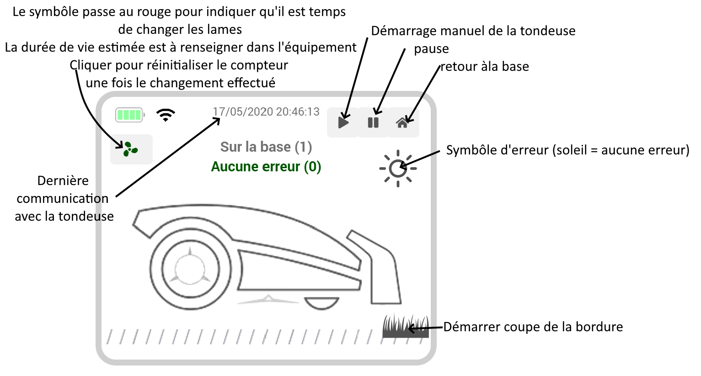

# Descripción

Este complemento permite conectarse a los cortacéspedes Worx Landroid con conexión Wi-Fi.

# Versiones compatibles

| Componente | Versión                     |
|-----------|-----------------------------|
| Debian    | Bullseye(11) & Bookworm(12) |
| Jeedom    | >= 4.5                      |

# Instalación

Para utilizar el plugin, debes descargarlo, instalarlo y activarlo como cualquier otro plugin de Jeedom.

# Configuración del complemento

La conexión con el cortacésped se realiza desde un servidor en la nube utilizando la cuenta empleada al registrar el cortacésped.

Los datos de acceso son los mismos que los de la aplicación móvil.
Debes esperar a que finalice la instalación de los componentes necesarios para permitir la comunicación con el cortacésped.

Una vez guardadas las credenciales, el servicio se iniciará y detectará automáticamente tus cortacéspedes. Para cada uno de ellos, se creará automáticamente un nuevo dispositivo.

Al detener el daemon se interrumpe la conexión con el cortacésped.
En caso de que el cortacésped vaya a estar inactivo durante un periodo prolongado, por ejemplo, durante el invierno, puedes desactivar el demonio (y la gestión automática) o desactivar por completo el complemento.

# Uso

Nombre por defecto = Nombre del cortacésped en la aplicación móvil

El panel de control muestra:

- Estado de la batería
- botón de «Volver a casa»
- botón de inicio
- botón de pausa
- Actualización de la información habitual
- la fecha y la hora de la última comunicación
- Distancia y duración total de funcionamiento
- Número de ciclos de recarga
- Tiempo en minutos tras la lluvia
- cambio en el plazo de lluvia
- Estado del cortacésped con el código correspondiente
- Descripción del error con el código correspondiente
- La programación diaria con la hora de inicio y de fin
- «Bord.» significa que está previsto cortar los bordes

Puedes elegir entre mostrar u ocultar la información a través de la lista de comandos del equipo.

# Widget

En el complemento hay disponible un widget preconfigurado; puedes activar este widget en la página de configuración del dispositivo.

# Anexos

## Lista de códigos de error

- 1: Bloqueada
- 2: Levantada
- 3: No se ha encontrado el cable
- 4: Más allá de los límites
- 5: Retardo por lluvia
- 6: Cierra la cubierta para cortar el césped
- 7: Cierra la tapa para volver a la base
- 8: Motor de las lamas atascado
- 9: Motor de las ruedas bloqueado
- 10: Tiempo de espera tras un bloqueo
- 11: Invertida
- 12: Batería baja
- 13: Cable invertido
- 14: Error en la carga de la batería
- 15: Se ha superado el tiempo de búsqueda de la emisora
- 16: Bloqueada
- 17: Error de temperatura de la batería
- 18: Modelo ficticio
- 19: Se ha superado el tiempo máximo para abrir el compartimento de la batería
- 20: Búsqueda del cable
- 21: número de mensaje
- 100: Error al acoplarse a la estación de recarga
- 101: Error hbi
- 102: Error OTA
- 103: Error en la tarjeta
- 104: Pendiente excesiva
- 105: Zona inaccesible
- 106: Estación de recarga inaccesible
- 108: Datos de los sensores insuficientes
- 109: Inicio del entrenamiento rechazado
- 110: Error de la cámara
- 111: Se requiere exploración cartográfica
- 112: La exploración cartográfica ha fallado
- 113: Error del lector RFID
- 114: Error en los faros
- 115: Falta la estación de recarga
- 116: Ajustar la altura de la hoja bloqueada

## Lista de códigos de estado

- 0: Inactivo
- 1: Basándose en
- 2: Secuencia de arranque
- 3: Sale de la base
- 4: Sigue el cable
- 5: Búsqueda en la base de datos
- 6: Búsqueda del cable
- 7: Se está cortando el césped
- 8: Levantada
- 9: Bloqueada
- 10: Lamas atascadas
- 11: Depuración
- 12: Control remoto
- 13: Salida de valla digital
- 30: Vuelta a lo básico
- 31: Creación de zonas de corte
- 32: Corta el borde
- 33: Salida hacia la zona de corte
- 34: Pausa
- 103: Búsqueda de la zona
- 104: Búsqueda en la base de datos
- 110: Superación de límite
- 111: Descubriendo el césped

# Preguntas frecuentes

> ¿Con qué frecuencia se actualizan los datos?

Los datos están disponibles en tiempo real. No hay un plazo fijo, por lo que depende de si el cortacésped envía información o no;
Esto ocurrirá varias veces por minuto durante el corte del césped y es posible que no haya actualizaciones durante la noche...

> ¿Qué modelos son compatibles?

No es posible enumerar todos los modelos compatibles; en principio, todos los modelos equipados con conexión wifi y compatibles con la nube de Worx serán compatibles con el complemento.

# Registro de cambios

[Ver el registro de cambios](./changelog)

# Asistencia

Si tienes algún problema, empieza por leer los últimos temas relacionados con el plugin en [community]({{site.forum}}/tag/plugin-{{page.pluginId}}).

Si, a pesar de todo, no encuentras respuesta a tu pregunta, no dudes en crear un nuevo tema sin olvidar incluir la etiqueta del plugin ([plugin-{{page.pluginId}}]({{site.forum}}/tag/plugin-{{page.pluginId}})).

Como mínimo, habrá que presentar:

- una captura de pantalla de la página de estado de Jeedom
- una captura de pantalla de la página de configuración del complemento
- Todos los registros disponibles del complemento, con nivel *INFO*, pegados en un `Texto preformateado` (botón `</>` en la comunidad), ¡sin archivos!
- según el caso, una captura de pantalla del error que se ha producido, una captura de pantalla de la configuración que da problemas...

# ¿Te gusta el plugin?

